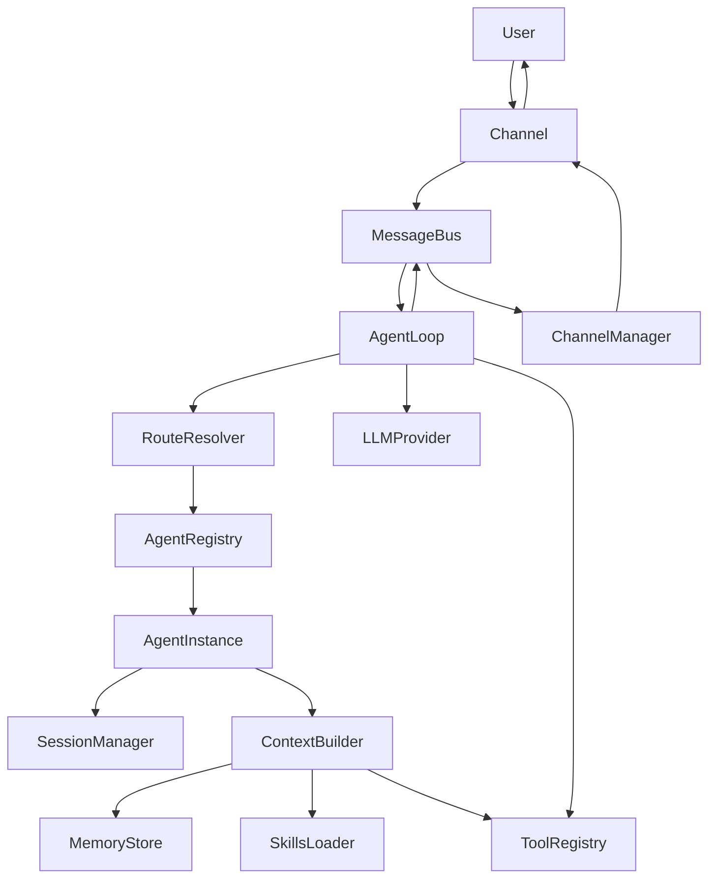
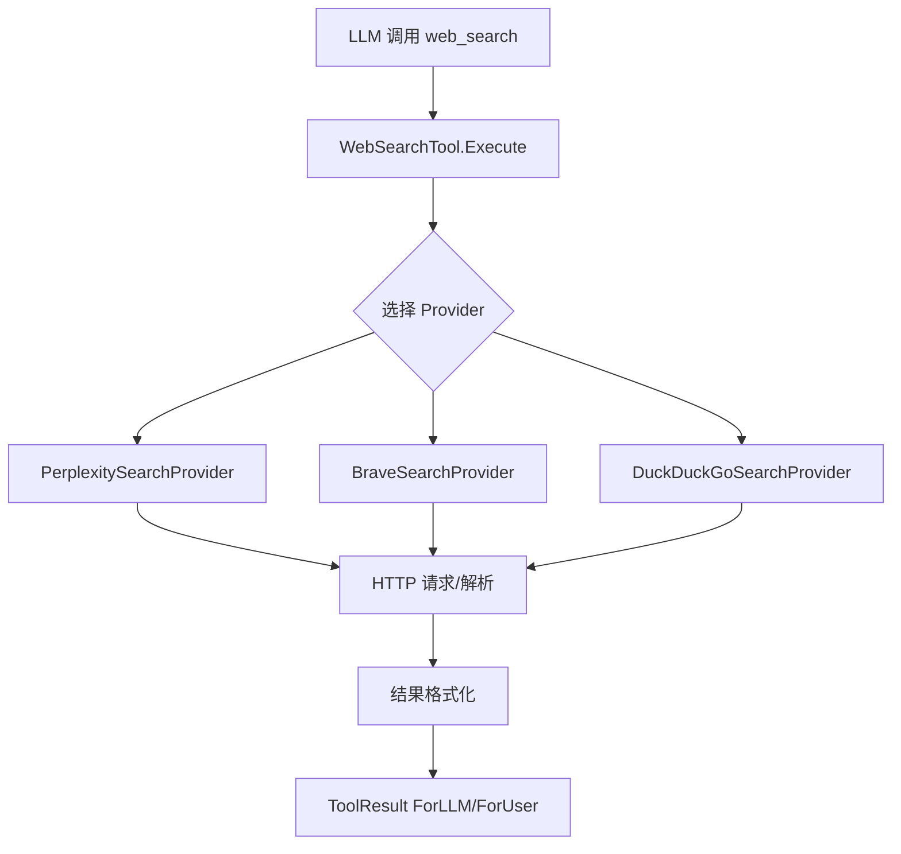
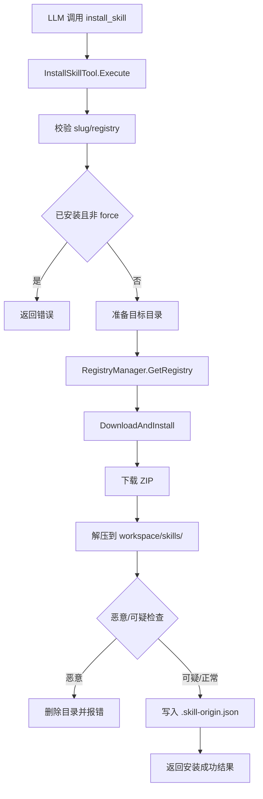
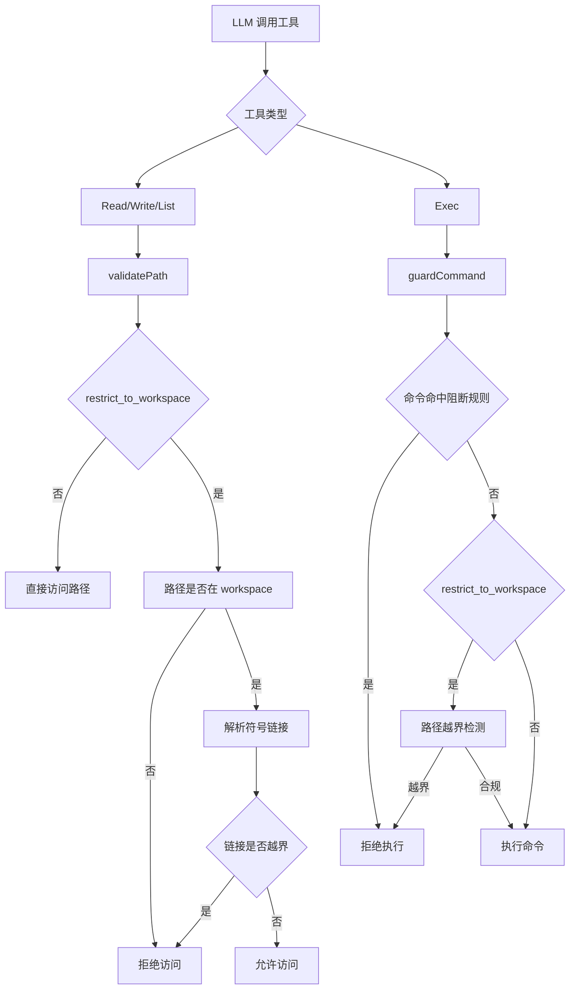
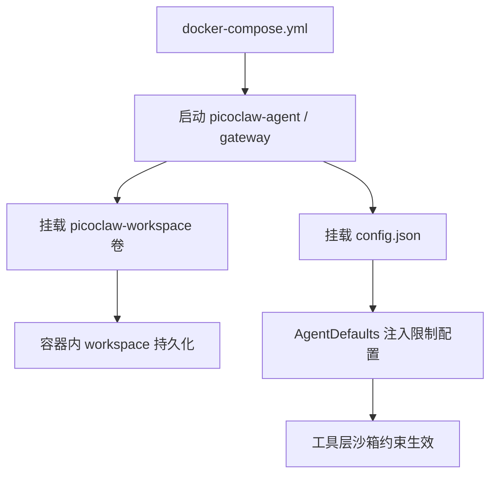
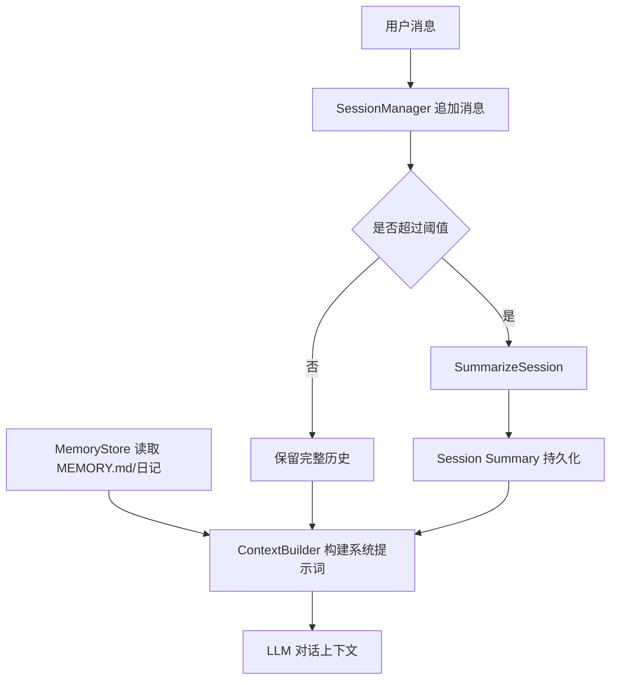
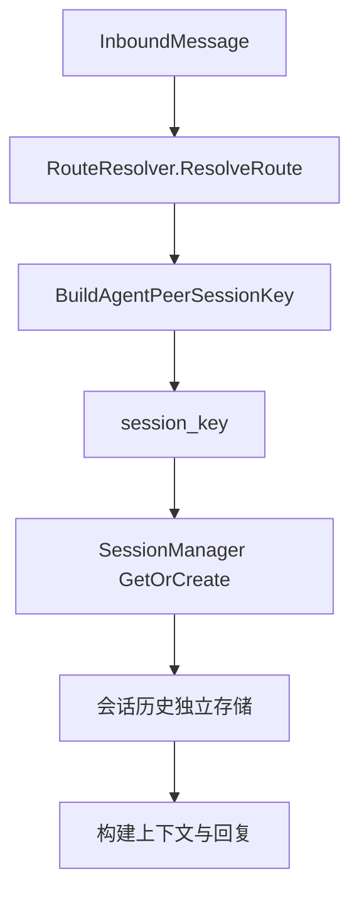
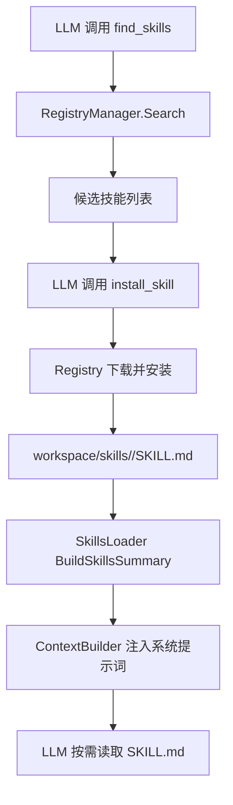

# PicoClaw 架构与能力机制

本文聚焦四个核心能力：通信、记忆、会话隔离、能力进化，并用 Mermaid 描述其运行机制。引用的关键实现文件便于快速定位。

## 总览

PicoClaw 的核心闭环是：通道接入 → 总线分发 → 路由与会话 → LLM/工具调用 → 回写通道。主要组件如下：

- 消息总线与通道管理：[bus.go](pkg/bus/bus.go)、[manager.go](pkg/channels/manager.go)、[base.go](pkg/channels/base.go)
- Agent 主循环与路由：[loop.go](pkg/agent/loop.go)、[route.go](pkg/routing/route.go)
- 会话与记忆：[manager.go](pkg/session/manager.go)、[memory.go](pkg/agent/memory.go)、[context.go](pkg/agent/context.go)
- 技能系统：[loader.go](pkg/skills/loader.go)、[skills_search.go](pkg/tools/skills_search.go)、[skills_install.go](pkg/tools/skills_install.go)、[registry.go](pkg/skills/registry.go)

## 核心模块交互图

核心模块协作关系如下（省略部分错误处理与日志）：



## 核心模块基类

- 工具基类接口：Tool / ContextualTool / AsyncTool（[base.go](pkg/tools/base.go#L5-L70)）
- 通道基类接口与基类实现：Channel / BaseChannel（[base.go](pkg/channels/base.go#L10-L66)）
- LLM 提供方接口：LLMProvider（[types.go](pkg/providers/types.go#L11-L23)）
- 技能注册源接口：SkillRegistry（[registry.go](pkg/skills/registry.go#L42-L71)）

## 拓展方式与改动点

- 新增 Tool：实现 Tool/ContextualTool/AsyncTool（[base.go](pkg/tools/base.go#L5-L70)），并在工具注册处追加 Register 调用（[loop.go](pkg/agent/loop.go#L81-L151)、[registry.go](pkg/tools/registry.go#L14-L60)）
- 新增 Channel：实现 Channel 或复用 BaseChannel（[base.go](pkg/channels/base.go#L10-L66)），在通道初始化处注册（[manager.go](pkg/channels/manager.go#L33-L210)），并补充对应配置结构体（[config.go](pkg/config/config.go#L181-L262)）
- 新增 LLM Provider：实现 LLMProvider（[types.go](pkg/providers/types.go#L11-L23)），在工厂路由中挂接协议分支（[factory_provider.go](pkg/providers/factory_provider.go#L54-L156)）
- 新增 Skill Registry：实现 SkillRegistry（[registry.go](pkg/skills/registry.go#L42-L71)），在 NewRegistryManagerFromConfig 中注入（[registry.go](pkg/skills/registry.go#L103-L113)）并扩展配置（[config.go](pkg/config/config.go#L446-L470)）
- 新增 Skill 包：在 workspace/skills/<slug>/SKILL.md 落盘，SkillsLoader 自动加载并注入提示词（[loader.go](pkg/skills/loader.go#L184-L250)、[context.go](pkg/agent/context.go#L111-L140)）

## 搜索工具实现

Web 搜索工具由 WebSearchTool 统一入口，内部选择具体 Provider：Perplexity → Brave → DuckDuckGo。未启用任何 Provider 时不注册工具。

关键路径参考：
- WebSearchTool 与 Provider 实现：[web.go](pkg/tools/web.go#L19-L345)
- WebFetchTool 抓取与抽取：[web.go](pkg/tools/web.go#L347-L517)
- Web 工具配置：[config.go](pkg/config/config.go#L414-L458)



## install skill 执行流程

install_skill 工具负责技能落盘与元数据记录，具体流程如下。

关键路径参考：
- install_skill 工具流程：[skills_install.go](pkg/tools/skills_install.go#L70-L201)
- ClawHub registry 下载与解压：[clawhub_registry.go](pkg/skills/clawhub_registry.go#L214-L281)
- Registry 选择与管理：[registry.go](pkg/skills/registry.go#L79-L126)



## 沙箱与容器机制

沙箱约束覆盖文件与命令执行两条路径：文件类工具在访问前做路径校验与符号链接解析；命令执行工具在运行前做危险模式阻断与工作区路径限制。容器部署通过 Docker Compose 固定配置与工作区卷映射，形成运行时隔离与持久化基础。

关键路径参考：
- 文件路径校验与工作区限制：[filesystem.go](pkg/tools/filesystem.go#L20-L143)
- 命令防护与路径限制：[shell.go](pkg/tools/shell.go#L36-L152)
- 默认限制开关配置：[config.go](pkg/config/config.go#L201-L220)
- Agent 实例注入限制配置：[instance.go](pkg/agent/instance.go#L31-L90)
- 容器编排与卷挂载：[docker-compose.yml](docker-compose.yml)





## 通信机制

通信通过 MessageBus 连接多通道与 AgentLoop。Channel 将入站消息发布到总线；AgentLoop 消费入站消息并完成路由、推理、工具调用，再将响应发布到出站队列，由 ChannelManager 分发回具体通道。

关键路径参考：
- 消息总线：[bus.go](pkg/bus/bus.go)
- 通道入站与权限：[base.go](pkg/channels/base.go)
- 出站分发：[manager.go](pkg/channels/manager.go#L212-L309)
- Agent 主循环与处理：[loop.go](pkg/agent/loop.go#L152-L455)

```mermaid
sequenceDiagram
    participant User as User
    participant Channel as Channel
    participant Bus as MessageBus
    participant Loop as AgentLoop
    participant Router as RouteResolver
    participant Agent as AgentInstance
    participant Tools as ToolRegistry
    participant LLM as Provider
    participant Dispatch as ChannelManager

    User->>Channel: 发送消息
    Channel->>Bus: PublishInbound
    Loop->>Bus: ConsumeInbound
    Loop->>Router: ResolveRoute
    Router-->>Loop: agentID + sessionKey
    Loop->>Agent: runAgentLoop
    Loop->>Tools: Execute tool calls (可选)
    Loop->>LLM: Chat / Fallback
    Loop->>Bus: PublishOutbound
    Dispatch->>Bus: SubscribeOutbound
    Dispatch->>Channel: Send
    Channel->>User: 返回响应
```

补充说明：
- message 工具可直接发送响应，避免重复推送：[message.go](pkg/tools/message.go)
- subagent 的结果通过 system 通道回流，再由主循环决定转发：[subagent.go](pkg/tools/subagent.go#L218-L227)、[loop.go](pkg/agent/loop.go#L333-L386)

## 记忆机制

记忆由三部分构成：

1. **长期记忆**：`memory/MEMORY.md` 持久化用户信息与偏好
2. **日记笔记**：`memory/YYYYMM/YYYYMMDD.md` 记录短期上下文
3. **会话摘要**：当上下文过长时自动总结，降低 token 压力

系统提示词由 ContextBuilder 生成，将长期记忆与最近日记合并进系统上下文。

关键路径参考：
- MemoryStore 与记忆文件：[memory.go](pkg/agent/memory.go)
- 系统提示词拼装：[context.go](pkg/agent/context.go#L111-L140)
- 会话摘要机制：[loop.go](pkg/agent/loop.go#L745-L1017)



## 会话隔离机制

会话隔离依赖 **SessionKey**。路由层基于 agent、channel、peer、DMScope 与 IdentityLinks 构建会话键，实现不同来源的对话隔离或聚合。

关键路径参考：
- SessionKey 构建与 DMScope：[session_key.go](pkg/routing/session_key.go)
- 路由与会话键选择：[route.go](pkg/routing/route.go#L36-L120)
- 会话存储与文件隔离：[manager.go](pkg/session/manager.go#L157-L234)
- 心跳独立会话：`NoHistory` 禁用历史加载：[loop.go](pkg/agent/loop.go#L252-L266)



隔离策略要点：
- **DMScope** 控制私聊粒度，支持按主会话、按 peer、按 channel+peer 等层级隔离
- **IdentityLinks** 可跨平台合并同一用户身份
- **Session 文件名** 经过安全转义，防止跨路径写入

## 能力进化机制（Skills）

PicoClaw 通过技能系统实现“能力进化”。技能可以来自内置、全局、或 workspace 安装目录，并通过系统提示词暴露给 LLM。运行中可使用 find_skills + install_skill 动态安装新技能，实现能力扩展。

关键路径参考：
- 技能加载与优先级：[loader.go](pkg/skills/loader.go#L184-L250)
- 技能搜索：[skills_search.go](pkg/tools/skills_search.go)
- 技能安装与落盘：[skills_install.go](pkg/tools/skills_install.go#L21-L176)
- Registry 协议：[registry.go](pkg/skills/registry.go)
- 技能注入系统提示词：[context.go](pkg/agent/context.go#L123-L131)



能力进化的关键特性：
- **多来源合并**：workspace 优先于 global，再到内置
- **按需加载**：系统提示词仅包含技能摘要，具体内容需读取 SKILL.md
- **可审计**：安装过程保留来源与版本元数据，便于治理
