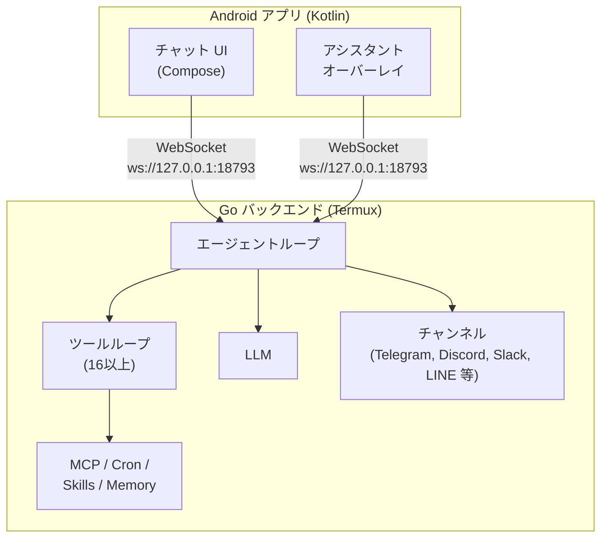

<p align="center">
  
</p>

# ClawDroid

Android 向け超軽量パーソナル AI アシスタント。Go バックエンドが Termux 上で動作し、ネイティブ Kotlin/Jetpack Compose アプリがチャット UI、音声アシスタント、デバイス自動操作を提供します。

[PicoClaw](https://github.com/sipeed/picoclaw) からフォークしたプロジェクトです。

## アーキテクチャ



- **Go バックエンド** (`cmd/clawdroid/`): シングルバイナリ。エージェントループ、ツール実行、LLM 呼び出し、メッセージングチャンネル、Cron、ハートビート
- **Android アプリ** (`android/`): チャット UI、フローティングアシスタントオーバーレイ、アクセシビリティベースのデバイス制御、音声モード

## クイックスタート

### 前提条件

- [Termux](https://termux.dev) がインストールされた Android デバイス
- LLM API キー（OpenAI、Anthropic、Gemini 等）

### 1. ダウンロード

[GitHub Releases](https://github.com/KarakuriAgent/clawdroid/releases) から最新の Go バックエンドバイナリと Android アプリ APK をダウンロードします。

デバイスのアーキテクチャに合ったバイナリを選択してください:

| アーキテクチャ | バイナリ |
|-------------|---------|
| 64-bit ARM（最近のデバイスの大半） | `clawdroid-linux-arm64` |
| 32-bit ARM | `clawdroid-linux-arm` |

Termux で `uname -m` を実行するとアーキテクチャを確認できます。

### 2. Go バックエンドのインストール

Termux で:

```bash
# バイナリを配置して実行権限を付与（arm64 の例）
cp ~/storage/downloads/clawdroid-linux-arm64 ~/.local/bin/clawdroid
chmod +x ~/.local/bin/clawdroid
```

### 3. 初期セットアップ

```bash
clawdroid onboard
```

`~/.clawdroid/config.json` とワークスペーステンプレートが作成されます。

設定ファイルを編集して API キーを追加:

```bash
vi ~/.clawdroid/config.json
```

### 4. Android アプリのインストール

ダウンロードした APK を同じデバイスにインストールします。

### 5. 実行

```bash
# ゲートウェイサーバーを起動（Android アプリ + メッセージングチャンネルに接続）
clawdroid gateway

# またはターミナルから直接対話
clawdroid agent
clawdroid agent -m "こんにちは！"
```

## CLI コマンド

| コマンド | 説明 |
|---------|------|
| `clawdroid gateway` | フルサーバー起動（チャンネル、Cron、ハートビート、HTTP ゲートウェイ） |
| `clawdroid agent` | 対話型 REPL モード |
| `clawdroid agent -m "..."` | 単発メッセージ送信 |
| `clawdroid onboard` | 初回セットアップウィザード |
| `clawdroid status` | 設定と接続状態の表示 |
| `clawdroid cron list\|add\|remove\|enable\|disable` | スケジュールタスクの管理 |
| `clawdroid skills list\|show\|remove` | スキルの管理 |
| `clawdroid version` | バージョン情報の表示 |

`gateway` または `agent` に `--debug` / `-d` を付けると詳細ログが有効になります。

## 設定

設定ファイル: `~/.clawdroid/config.json`

すべての設定は `CLAWDROID_` プレフィックスの環境変数で上書きできます（例: `CLAWDROID_LLM_API_KEY`）。環境変数名は JSON パスを大文字・`_` 区切りにしたものです。

### LLM (`llm`)

| キー | デフォルト | 環境変数 | 説明 |
|-----|----------|---------|------|
| `model` | *(空)* | `CLAWDROID_LLM_MODEL` | `プロバイダー/モデル名` 形式で指定 |
| `api_key` | *(空)* | `CLAWDROID_LLM_API_KEY` | LLM プロバイダーの API キー |
| `base_url` | *(空)* | `CLAWDROID_LLM_BASE_URL` | カスタム API エンドポイント（OpenAI 互換） |

### エージェント (`agents.defaults`)

| キー | デフォルト | 環境変数 | 説明 |
|-----|----------|---------|------|
| `workspace` | `~/.clawdroid/workspace` | `CLAWDROID_AGENTS_DEFAULTS_WORKSPACE` | ワークスペースのパス |
| `data_dir` | `~/.clawdroid/data` | `CLAWDROID_AGENTS_DEFAULTS_DATA_DIR` | データディレクトリ（メモリ、スキル、cron 等） |
| `restrict_to_workspace` | `true` | `CLAWDROID_AGENTS_DEFAULTS_RESTRICT_TO_WORKSPACE` | ファイル操作をワークスペース内に制限 |
| `max_tokens` | `8192` | `CLAWDROID_AGENTS_DEFAULTS_MAX_TOKENS` | LLM 呼び出しあたりの最大出力トークン数 |
| `context_window` | `128000` | `CLAWDROID_AGENTS_DEFAULTS_CONTEXT_WINDOW` | コンテキストウィンドウサイズ（トークン） |
| `temperature` | `0` | `CLAWDROID_AGENTS_DEFAULTS_TEMPERATURE` | LLM のサンプリング温度 |
| `max_tool_iterations` | `10` | `CLAWDROID_AGENTS_DEFAULTS_MAX_TOOL_ITERATIONS` | 1リクエストあたりのツール呼び出し最大ループ数 |

### ゲートウェイ (`gateway`)

| キー | デフォルト | 環境変数 | 説明 |
|-----|----------|---------|------|
| `host` | `127.0.0.1` | `CLAWDROID_GATEWAY_HOST` | HTTP ゲートウェイのバインドアドレス |
| `port` | `18790` | `CLAWDROID_GATEWAY_PORT` | HTTP ゲートウェイのポート |

### チャンネル (`channels`)

#### WebSocket (`channels.websocket`)

| キー | デフォルト | 環境変数 | 説明 |
|-----|----------|---------|------|
| `enabled` | `true` | `CLAWDROID_CHANNELS_WEBSOCKET_ENABLED` | WebSocket チャンネルを有効化（Android アプリ接続用） |
| `host` | `127.0.0.1` | `CLAWDROID_CHANNELS_WEBSOCKET_HOST` | バインドアドレス |
| `port` | `18793` | `CLAWDROID_CHANNELS_WEBSOCKET_PORT` | ポート |
| `path` | `/ws` | `CLAWDROID_CHANNELS_WEBSOCKET_PATH` | WebSocket パス |
| `allow_from` | `[]` | `CLAWDROID_CHANNELS_WEBSOCKET_ALLOW_FROM` | 許可するユーザー ID（空 = 全員許可） |

#### Telegram (`channels.telegram`)

| キー | デフォルト | 環境変数 | 説明 |
|-----|----------|---------|------|
| `enabled` | `false` | `CLAWDROID_CHANNELS_TELEGRAM_ENABLED` | Telegram ボットを有効化 |
| `token` | *(空)* | `CLAWDROID_CHANNELS_TELEGRAM_TOKEN` | BotFather から取得したボットトークン |
| `proxy` | *(空)* | `CLAWDROID_CHANNELS_TELEGRAM_PROXY` | SOCKS5/HTTP プロキシ URL |
| `allow_from` | `[]` | `CLAWDROID_CHANNELS_TELEGRAM_ALLOW_FROM` | 許可するユーザー/チャット ID |

#### Discord (`channels.discord`)

| キー | デフォルト | 環境変数 | 説明 |
|-----|----------|---------|------|
| `enabled` | `false` | `CLAWDROID_CHANNELS_DISCORD_ENABLED` | Discord ボットを有効化 |
| `token` | *(空)* | `CLAWDROID_CHANNELS_DISCORD_TOKEN` | ボットトークン |
| `allow_from` | `[]` | `CLAWDROID_CHANNELS_DISCORD_ALLOW_FROM` | 許可するユーザー ID |

#### Slack (`channels.slack`)

| キー | デフォルト | 環境変数 | 説明 |
|-----|----------|---------|------|
| `enabled` | `false` | `CLAWDROID_CHANNELS_SLACK_ENABLED` | Slack ボットを有効化 |
| `bot_token` | *(空)* | `CLAWDROID_CHANNELS_SLACK_BOT_TOKEN` | ボットトークン（`xoxb-...`） |
| `app_token` | *(空)* | `CLAWDROID_CHANNELS_SLACK_APP_TOKEN` | Socket Mode 用アプリレベルトークン（`xapp-...`） |
| `allow_from` | `[]` | `CLAWDROID_CHANNELS_SLACK_ALLOW_FROM` | 許可するユーザー ID |

#### WhatsApp (`channels.whatsapp`)

| キー | デフォルト | 環境変数 | 説明 |
|-----|----------|---------|------|
| `enabled` | `false` | `CLAWDROID_CHANNELS_WHATSAPP_ENABLED` | WhatsApp ブリッジを有効化 |
| `bridge_url` | `ws://localhost:3001` | `CLAWDROID_CHANNELS_WHATSAPP_BRIDGE_URL` | ブリッジの WebSocket URL |
| `allow_from` | `[]` | `CLAWDROID_CHANNELS_WHATSAPP_ALLOW_FROM` | 許可する電話番号/ID |

#### LINE (`channels.line`)

| キー | デフォルト | 環境変数 | 説明 |
|-----|----------|---------|------|
| `enabled` | `false` | `CLAWDROID_CHANNELS_LINE_ENABLED` | LINE ボットを有効化 |
| `channel_secret` | *(空)* | `CLAWDROID_CHANNELS_LINE_CHANNEL_SECRET` | チャンネルシークレット |
| `channel_access_token` | *(空)* | `CLAWDROID_CHANNELS_LINE_CHANNEL_ACCESS_TOKEN` | チャンネルアクセストークン |
| `webhook_host` | `127.0.0.1` | `CLAWDROID_CHANNELS_LINE_WEBHOOK_HOST` | Webhook サーバーのバインドアドレス |
| `webhook_port` | `18791` | `CLAWDROID_CHANNELS_LINE_WEBHOOK_PORT` | Webhook サーバーのポート |
| `webhook_path` | `/webhook/line` | `CLAWDROID_CHANNELS_LINE_WEBHOOK_PATH` | Webhook パス |
| `allow_from` | `[]` | `CLAWDROID_CHANNELS_LINE_ALLOW_FROM` | 許可するユーザー ID |

### ツール (`tools`)

| キー | デフォルト | 環境変数 | 説明 |
|-----|----------|---------|------|
| `exec.enabled` | `false` | `CLAWDROID_TOOLS_EXEC_ENABLED` | シェルコマンド実行（安全のためデフォルト無効） |
| `android.enabled` | `true` | `CLAWDROID_TOOLS_ANDROID_ENABLED` | Android デバイス自動操作 |
| `memory.enabled` | `true` | `CLAWDROID_TOOLS_MEMORY_ENABLED` | 長期メモリとデイリーノート |

#### Web 検索 (`tools.web`)

| キー | デフォルト | 環境変数 | 説明 |
|-----|----------|---------|------|
| `brave.enabled` | `false` | `CLAWDROID_TOOLS_WEB_BRAVE_ENABLED` | Brave Search API を有効化 |
| `brave.api_key` | *(空)* | `CLAWDROID_TOOLS_WEB_BRAVE_API_KEY` | Brave API キー |
| `brave.max_results` | `5` | `CLAWDROID_TOOLS_WEB_BRAVE_MAX_RESULTS` | 検索結果の最大件数 |
| `duckduckgo.enabled` | `true` | `CLAWDROID_TOOLS_WEB_DUCKDUCKGO_ENABLED` | DuckDuckGo 検索を有効化（API キー不要） |
| `duckduckgo.max_results` | `5` | `CLAWDROID_TOOLS_WEB_DUCKDUCKGO_MAX_RESULTS` | 検索結果の最大件数 |

#### MCP サーバー (`tools.mcp`)

サーバー名をキーとしたエントリで定義。Stdio と HTTP の 2 種類のトランスポートに対応。

**Stdio トランスポート:**

| キー | 説明 |
|-----|------|
| `command` | サーバーの起動コマンド |
| `args` | コマンド引数 |
| `env` | プロセスの環境変数 |

**HTTP トランスポート:**

| キー | 説明 |
|-----|------|
| `url` | サーバー URL |
| `headers` | HTTP ヘッダー（例: Authorization） |

**共通:**

| キー | デフォルト | 説明 |
|-----|----------|------|
| `description` | *(空)* | 人間が読める説明 |
| `enabled` | `false` | このサーバーを有効化 |
| `idle_timeout` | `300` | アイドル時に停止するまでの秒数 |

### ハートビート (`heartbeat`)

| キー | デフォルト | 環境変数 | 説明 |
|-----|----------|---------|------|
| `enabled` | `true` | `CLAWDROID_HEARTBEAT_ENABLED` | 定期ハートビートを有効化 |
| `interval` | `30` | `CLAWDROID_HEARTBEAT_INTERVAL` | 間隔（分、最小 5） |

### レート制限 (`rate_limits`)

| キー | デフォルト | 環境変数 | 説明 |
|-----|----------|---------|------|
| `max_tool_calls_per_minute` | `30` | `CLAWDROID_RATE_LIMITS_MAX_TOOL_CALLS_PER_MINUTE` | 1分あたりのツール呼び出し上限（0 = 無制限） |
| `max_requests_per_minute` | `15` | `CLAWDROID_RATE_LIMITS_MAX_REQUESTS_PER_MINUTE` | 1分あたりの LLM リクエスト上限（0 = 無制限） |

## 対応 LLM プロバイダー

[any-llm-go](https://github.com/mozilla-ai/any-llm-go) を統一アダプターとして使用。

| プロバイダー | モデル指定形式 | 例 |
|------------|-------------|---|
| OpenAI | `openai/model` | `openai/gpt-4o` |
| Anthropic | `anthropic/model` または `claude/model` | `anthropic/claude-3-5-sonnet` |
| Google Gemini | `gemini/model` または `google/model` | `gemini/gemini-2.0-flash` |
| DeepSeek | `deepseek/model` | `deepseek/deepseek-chat` |
| Groq | `groq/model` | `groq/llama-3.3-70b` |
| Mistral | `mistral/model` | `mistral/mistral-large-latest` |
| Ollama | `ollama/model` | `ollama/llama3` |
| LlamaCpp | `llamacpp/model` | `llamacpp/local` |
| Llamafile | `llamafile/model` | `llamafile/local` |
| ZhiPu | `zhipu/model` | `zhipu/glm-4.7` |

`base_url` で任意の OpenAI 互換エンドポイント（OpenRouter、ローカルプロキシ等）を指定できます。

## ツール

ClawDroid は 16 以上の組み込みツールを提供し、AI エージェントが自律的に使用します。

### ファイル操作

| ツール | 説明 |
|-------|------|
| `read_file` | ファイル内容の読み取り |
| `write_file` | ファイルへの書き込み |
| `edit_file` | 検索置換による編集 |
| `append_file` | ファイルへの追記 |
| `copy_file` | ファイルのコピー |
| `list_dir` | ディレクトリ内容の一覧 |

`restrict_to_workspace` 有効時はワークスペース内のみに制限されます。

### Android デバイス自動操作

| アクション | 説明 |
|-----------|------|
| `screenshot` | 画面キャプチャ（JPEG） |
| `get_ui_tree` | アクセシビリティツリーの取得 |
| `tap` | 座標をタップ |
| `swipe` | スワイプ操作 |
| `text` | テキスト入力 |
| `keyevent` | キーイベント送信（戻る、ホーム等） |
| `search_apps` | インストール済みアプリの検索 |
| `launch_app` | パッケージ名でアプリを起動 |
| `app_info` | アプリ情報の取得 |
| `broadcast` | Android ブロードキャストの送信 |
| `intent` | Android インテントの送信 |

UI 自動操作（`screenshot`、`tap`、`swipe` 等）はアシスタントオーバーレイからのみ利用可能です。メインのチャット UI からは使用できません。

### Web

| ツール | 説明 |
|-------|------|
| `web_search` | Web 検索（Brave API または DuckDuckGo） |
| `web_fetch` | URL からテキストを取得・抽出 |

### エージェント・タスク管理

| ツール | 説明 |
|-------|------|
| `subagent` | 同期的なサブタスク委譲 |
| `spawn` | 非同期的なサブタスク委譲 |
| `cron` | タスクのスケジュール（単発、繰り返し、cron 式） |
| `memory` | 長期メモリとデイリーノート |
| `message` | クロスチャンネルメッセージング |
| `skill` | スキルの一覧表示・読み込み |
| `exec` | シェルコマンド実行（デフォルト無効） |
| `exit` | アシスタント/音声セッションの終了 |

### MCP（Model Context Protocol）

外部 MCP サーバーをツールプロバイダーとして接続できます。

```json
{
  "tools": {
    "mcp": {
      "my-local-server": {
        "command": "npx",
        "args": ["-y", "@example/mcp-server"],
        "description": "ローカル MCP サーバー",
        "enabled": true
      },
      "my-remote-server": {
        "url": "https://mcp.example.com/mcp",
        "headers": { "Authorization": "Bearer token" },
        "description": "リモート MCP サーバー",
        "enabled": true,
        "idle_timeout": 300
      }
    }
  }
}
```

**stdio**（ローカルプロセス）と **HTTP/Streamable**（リモート）の両方のトランスポートに対応。アイドル状態のサーバーは 5 分後に自動停止します（`idle_timeout` で変更可能）。

## Android アプリ

### 機能

- **チャット UI** - Jetpack Compose で構築されたフルチャットインターフェース
- **フローティングアシスタントオーバーレイ** - 常時アクセス可能なピルバー型オーバーレイ（`SYSTEM_ALERT_WINDOW`）
- **音声モード** - 継続的な音声会話ループ（聞く → 送信 → 思考 → 話す）
- **Google アシスタントの代替** - `android.intent.action.ASSIST` として登録。ホームボタン長押しで起動
- **デバイス自動操作** - AccessibilityService ベースのタップ、スワイプ、テキスト入力、スクリーンショット
- **カメラ撮影** - 音声モード中に写真を撮影し視覚的コンテキストとして利用
- **メッセージ永続化** - Room データベースによるチャット履歴の保存

### パーミッション

| パーミッション | 用途 |
|-------------|------|
| `INTERNET` | LLM API 呼び出し、Web ツール |
| `SYSTEM_ALERT_WINDOW` | フローティングアシスタントオーバーレイ |
| `RECORD_AUDIO` | 音声モード（音声認識） |
| `CAMERA` | 写真撮影 |
| `QUERY_ALL_PACKAGES` | アプリ検索・起動 |
| `POST_NOTIFICATIONS` | フォアグラウンドサービスの通知 |

### 音声モード

音声モードは継続的な会話ループで動作します:

1. **聞き取り** - Android SpeechRecognizer が音声をキャプチャ
2. **送信** - 文字起こしされたテキストを Go バックエンドに送信
3. **思考** - エージェントが処理しツールを呼び出す
4. **読み上げ** - TextToSpeech でレスポンスを読み上げ

レスポンスは短く（1〜3 文）、自然な話し言葉で返されます。30 秒間無音が続くと自動的にタイムアウトします。

## メッセージングチャンネル

複数のメッセージングプラットフォームから同時にアクセスできます。

| チャンネル | トランスポート | 設定 |
|-----------|-------------|------|
| WebSocket | ローカル WebSocket | デフォルト有効、`127.0.0.1:18793` |
| Telegram | Bot API | Bot トークンが必要 |
| Discord | Bot API | Bot トークンが必要 |
| Slack | Socket Mode | Bot トークン + App トークンが必要 |
| WhatsApp | Bridge WebSocket | ブリッジ URL が必要 |
| LINE | Webhook | チャンネルシークレット + アクセストークンが必要 |

各チャンネルは `allow_from` でアクセスを許可するユーザーを制限できます。

## メモリシステム

- **長期メモリ** (`memory/MEMORY.md`) - 永続的なナレッジベース。エージェントが重要な情報を保存します。
- **デイリーノート** (`memory/YYYYMM/YYYYMMDD.md`) - 日ごとのジャーナル。直近 3 日分がシステムプロンプトに含まれます。

## ハートビート

有効時、ワークスペースの `HEARTBEAT.md` に基づいてエージェントが定期的にチェックインします。デフォルト間隔: 30 分。リマインダーやバックグラウンドタスクなどのプロアクティブなアクションをトリガーできます。

## スキル

スキルは `SKILL.md` ファイルとして定義され、3 つのディレクトリから読み込まれます:

1. ワークスペーススキル (`~/.clawdroid/data/skills/`)
2. グローバルスキル (`~/.clawdroid/skills/`)
3. ビルトインスキル

```bash
clawdroid skills list            # インストール済みスキルの一覧
clawdroid skills show <name>     # スキルの詳細表示
clawdroid skills remove <name>   # スキルの削除
```

## ワークスペースファイル

ワークスペース (`~/.clawdroid/data/`) にはエージェントの振る舞いを定義するテンプレートファイルが含まれます:

| ファイル | 用途 |
|--------|------|
| `IDENTITY.md` | ボット名、バージョン、機能 |
| `SOUL.md` | 性格と価値観 |
| `AGENT.md` | 運用ガイドライン |
| `USER.md` | ユーザーの好みとコンテキスト |
| `HEARTBEAT.md` | ハートビートチェックのテンプレート |

## ソースからビルド

### Go バックエンド

Go バックエンドは Termux 上で直接修正・ビルドできます。PC 等の別の開発環境がなくても、Android デバイス上でコードを変更して拡張することが可能です。

```bash
# Termux に Go をインストール
pkg install golang make git

# クローンしてビルド
git clone https://github.com/KarakuriAgent/clawdroid.git
cd clawdroid
make build && make install
```

| Make ターゲット | 説明 |
|---------------|------|
| `make build` | 現在のプラットフォーム向けにビルド |
| `make build-all` | linux/amd64, arm64, arm 向けにビルド |
| `make install` | `~/.local/bin` にインストール |
| `make test` | テスト実行 |
| `make check` | deps + fmt + vet + test |
| `make clean` | ビルド成果物を削除 |
| `make uninstall` | バイナリを削除 |
| `make uninstall-all` | バイナリ + 全データ (`~/.clawdroid/`) を削除 |

静的バイナリ（CGO_ENABLED=0）。ビルドターゲット: `linux/amd64`、`linux/arm64`、`linux/arm`。

### Android アプリ

Android Studio で `android/` を開くか、Gradle でビルド:

```bash
cd android
./gradlew assembleDebug
```

パッケージ名: `io.clawdroid`

## プロジェクト構成

```
clawdroid/
├── cmd/clawdroid/           # Go CLI エントリーポイント
├── pkg/
│   ├── agent/               # エージェントループ、コンテキストビルダー、メモリ、セッション、音声プロンプト
│   ├── bus/                  # メッセージバス（受信/送信チャンネル）
│   ├── channels/             # メッセージングチャンネルアダプター
│   ├── config/               # 設定の読み込みと構造体
│   ├── cron/                 # スケジュールタスクサービス
│   ├── gateway/              # HTTP ゲートウェイサーバー
│   ├── heartbeat/            # 定期ハートビートサービス
│   ├── logger/               # 構造化ロギング
│   ├── mcp/                  # MCP クライアントマネージャー
│   ├── providers/            # LLM プロバイダーアダプター (any-llm-go)
│   ├── skills/               # スキルローダー (SKILL.md)
│   ├── state/                # 状態の永続化
│   └── tools/                # 全ツール実装
├── android/
│   ├── app/                  # メインアプリ (AssistantService, AccessibilityService, DeviceController)
│   ├── core/                 # 共有コア (data, domain, model, ui)
│   └── feature/              # 機能モジュール (chat, settings)
├── workspace/                # テンプレートファイル (IDENTITY.md, SOUL.md 等)
├── config/                   # config.example.json
├── Makefile
├── go.mod
└── .goreleaser.yaml
```

## ライセンス

[MIT License](LICENSE)。[PicoClaw](https://github.com/sipeed/picoclaw) からフォーク。
