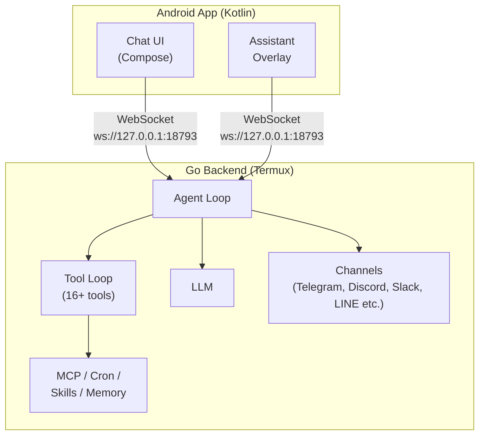

<p align="center">
  
</p>

# ClawDroid

**[日本語版](README.ja.md)**

Ultra-lightweight personal AI assistant for Android. A Go backend runs in Termux while a native Kotlin/Jetpack Compose app provides the chat UI, voice assistant, and device automation.

Forked from [PicoClaw](https://github.com/sipeed/picoclaw).

## Architecture



- **Go backend** (`cmd/clawdroid/`): Single binary. Agent loop, tool execution, LLM calls, messaging channels, cron, heartbeat
- **Android app** (`android/`): Chat UI, floating assistant overlay, accessibility-based device control, voice mode

## Quick Start

### Prerequisites

- Android device with [Termux](https://termux.dev) installed
- LLM API key (OpenAI, Anthropic, Gemini, etc.)

### 1. Download

Download the latest Go backend binary and Android app APK from [GitHub Releases](https://github.com/KarakuriAgent/clawdroid/releases).

Choose the binary matching your device architecture:

| Architecture | Binary |
|-------------|--------|
| 64-bit ARM (most modern devices) | `clawdroid-linux-arm64` |
| 32-bit ARM | `clawdroid-linux-arm` |

You can check your architecture in Termux with `uname -m`.

### 2. Install the Go Backend

In Termux:

```bash
# Place the binary and make it executable (example for arm64)
cp ~/storage/downloads/clawdroid-linux-arm64 ~/.local/bin/clawdroid
chmod +x ~/.local/bin/clawdroid
```

### 3. Initial Setup

```bash
clawdroid onboard
```

This creates `~/.clawdroid/config.json` and workspace templates.

Edit the config to add your API key:

```bash
vi ~/.clawdroid/config.json
```

### 4. Install the Android App

Install the downloaded APK on the same device.

### 5. Run

```bash
# Start the gateway server (connects to Android app + messaging channels)
clawdroid gateway

# Or interact directly from the terminal
clawdroid agent
clawdroid agent -m "Hello!"
```

## CLI Commands

| Command | Description |
|---------|-------------|
| `clawdroid gateway` | Start the full server (channels, cron, heartbeat, HTTP gateway) |
| `clawdroid agent` | Interactive REPL mode |
| `clawdroid agent -m "..."` | Send a single message |
| `clawdroid onboard` | First-time setup wizard |
| `clawdroid status` | Show config and connection status |
| `clawdroid cron list\|add\|remove\|enable\|disable` | Manage scheduled tasks |
| `clawdroid skills list\|show\|remove` | Manage skills |
| `clawdroid version` | Print version info |

Use `--debug` / `-d` with `gateway` or `agent` for verbose logging.

## Configuration

Configuration file: `~/.clawdroid/config.json`

All settings can be overridden by environment variables with the `CLAWDROID_` prefix (e.g. `CLAWDROID_LLM_API_KEY`). The env var name corresponds to the JSON path in uppercase with `_` separators.

### LLM (`llm`)

| Key | Default | Env | Description |
|-----|---------|-----|-------------|
| `model` | *(empty)* | `CLAWDROID_LLM_MODEL` | LLM model in `provider/model` format |
| `api_key` | *(empty)* | `CLAWDROID_LLM_API_KEY` | API key for the LLM provider |
| `base_url` | *(empty)* | `CLAWDROID_LLM_BASE_URL` | Custom API endpoint (OpenAI-compatible) |

### Agent Defaults (`agents.defaults`)

| Key | Default | Env | Description |
|-----|---------|-----|-------------|
| `workspace` | `~/.clawdroid/workspace` | `CLAWDROID_AGENTS_DEFAULTS_WORKSPACE` | Workspace directory path |
| `data_dir` | `~/.clawdroid/data` | `CLAWDROID_AGENTS_DEFAULTS_DATA_DIR` | Data directory (memory, skills, cron, etc.) |
| `restrict_to_workspace` | `true` | `CLAWDROID_AGENTS_DEFAULTS_RESTRICT_TO_WORKSPACE` | Restrict file operations to workspace |
| `max_tokens` | `8192` | `CLAWDROID_AGENTS_DEFAULTS_MAX_TOKENS` | Max output tokens per LLM call |
| `context_window` | `128000` | `CLAWDROID_AGENTS_DEFAULTS_CONTEXT_WINDOW` | Context window size (tokens) |
| `temperature` | `0` | `CLAWDROID_AGENTS_DEFAULTS_TEMPERATURE` | LLM sampling temperature |
| `max_tool_iterations` | `10` | `CLAWDROID_AGENTS_DEFAULTS_MAX_TOOL_ITERATIONS` | Max tool call loops per request |

### Gateway (`gateway`)

| Key | Default | Env | Description |
|-----|---------|-----|-------------|
| `host` | `127.0.0.1` | `CLAWDROID_GATEWAY_HOST` | HTTP gateway bind address |
| `port` | `18790` | `CLAWDROID_GATEWAY_PORT` | HTTP gateway port |

### Channels (`channels`)

#### WebSocket (`channels.websocket`)

| Key | Default | Env | Description |
|-----|---------|-----|-------------|
| `enabled` | `true` | `CLAWDROID_CHANNELS_WEBSOCKET_ENABLED` | Enable WebSocket channel (Android app connection) |
| `host` | `127.0.0.1` | `CLAWDROID_CHANNELS_WEBSOCKET_HOST` | Bind address |
| `port` | `18793` | `CLAWDROID_CHANNELS_WEBSOCKET_PORT` | Port |
| `path` | `/ws` | `CLAWDROID_CHANNELS_WEBSOCKET_PATH` | WebSocket path |
| `allow_from` | `[]` | `CLAWDROID_CHANNELS_WEBSOCKET_ALLOW_FROM` | Allowed user IDs (empty = all) |

#### Telegram (`channels.telegram`)

| Key | Default | Env | Description |
|-----|---------|-----|-------------|
| `enabled` | `false` | `CLAWDROID_CHANNELS_TELEGRAM_ENABLED` | Enable Telegram bot |
| `token` | *(empty)* | `CLAWDROID_CHANNELS_TELEGRAM_TOKEN` | Bot token from BotFather |
| `proxy` | *(empty)* | `CLAWDROID_CHANNELS_TELEGRAM_PROXY` | SOCKS5/HTTP proxy URL |
| `allow_from` | `[]` | `CLAWDROID_CHANNELS_TELEGRAM_ALLOW_FROM` | Allowed user/chat IDs |

#### Discord (`channels.discord`)

| Key | Default | Env | Description |
|-----|---------|-----|-------------|
| `enabled` | `false` | `CLAWDROID_CHANNELS_DISCORD_ENABLED` | Enable Discord bot |
| `token` | *(empty)* | `CLAWDROID_CHANNELS_DISCORD_TOKEN` | Bot token |
| `allow_from` | `[]` | `CLAWDROID_CHANNELS_DISCORD_ALLOW_FROM` | Allowed user IDs |

#### Slack (`channels.slack`)

| Key | Default | Env | Description |
|-----|---------|-----|-------------|
| `enabled` | `false` | `CLAWDROID_CHANNELS_SLACK_ENABLED` | Enable Slack bot |
| `bot_token` | *(empty)* | `CLAWDROID_CHANNELS_SLACK_BOT_TOKEN` | Bot token (`xoxb-...`) |
| `app_token` | *(empty)* | `CLAWDROID_CHANNELS_SLACK_APP_TOKEN` | App-level token (`xapp-...`) for Socket Mode |
| `allow_from` | `[]` | `CLAWDROID_CHANNELS_SLACK_ALLOW_FROM` | Allowed user IDs |

#### WhatsApp (`channels.whatsapp`)

| Key | Default | Env | Description |
|-----|---------|-----|-------------|
| `enabled` | `false` | `CLAWDROID_CHANNELS_WHATSAPP_ENABLED` | Enable WhatsApp bridge |
| `bridge_url` | `ws://localhost:3001` | `CLAWDROID_CHANNELS_WHATSAPP_BRIDGE_URL` | Bridge WebSocket URL |
| `allow_from` | `[]` | `CLAWDROID_CHANNELS_WHATSAPP_ALLOW_FROM` | Allowed phone numbers/IDs |

#### LINE (`channels.line`)

| Key | Default | Env | Description |
|-----|---------|-----|-------------|
| `enabled` | `false` | `CLAWDROID_CHANNELS_LINE_ENABLED` | Enable LINE bot |
| `channel_secret` | *(empty)* | `CLAWDROID_CHANNELS_LINE_CHANNEL_SECRET` | Channel secret |
| `channel_access_token` | *(empty)* | `CLAWDROID_CHANNELS_LINE_CHANNEL_ACCESS_TOKEN` | Channel access token |
| `webhook_host` | `127.0.0.1` | `CLAWDROID_CHANNELS_LINE_WEBHOOK_HOST` | Webhook server bind address |
| `webhook_port` | `18791` | `CLAWDROID_CHANNELS_LINE_WEBHOOK_PORT` | Webhook server port |
| `webhook_path` | `/webhook/line` | `CLAWDROID_CHANNELS_LINE_WEBHOOK_PATH` | Webhook path |
| `allow_from` | `[]` | `CLAWDROID_CHANNELS_LINE_ALLOW_FROM` | Allowed user IDs |

### Tools (`tools`)

| Key | Default | Env | Description |
|-----|---------|-----|-------------|
| `exec.enabled` | `false` | `CLAWDROID_TOOLS_EXEC_ENABLED` | Shell command execution (disabled for safety) |
| `android.enabled` | `true` | `CLAWDROID_TOOLS_ANDROID_ENABLED` | Android device automation |
| `memory.enabled` | `true` | `CLAWDROID_TOOLS_MEMORY_ENABLED` | Long-term memory and daily notes |

#### Web Search (`tools.web`)

| Key | Default | Env | Description |
|-----|---------|-----|-------------|
| `brave.enabled` | `false` | `CLAWDROID_TOOLS_WEB_BRAVE_ENABLED` | Enable Brave Search API |
| `brave.api_key` | *(empty)* | `CLAWDROID_TOOLS_WEB_BRAVE_API_KEY` | Brave API key |
| `brave.max_results` | `5` | `CLAWDROID_TOOLS_WEB_BRAVE_MAX_RESULTS` | Max search results |
| `duckduckgo.enabled` | `true` | `CLAWDROID_TOOLS_WEB_DUCKDUCKGO_ENABLED` | Enable DuckDuckGo search (no API key needed) |
| `duckduckgo.max_results` | `5` | `CLAWDROID_TOOLS_WEB_DUCKDUCKGO_MAX_RESULTS` | Max search results |

#### MCP Servers (`tools.mcp`)

Each entry is keyed by server name. Stdio and HTTP transports are supported.

**Stdio transport:**

| Key | Description |
|-----|-------------|
| `command` | Command to launch the server |
| `args` | Command arguments |
| `env` | Environment variables for the process |

**HTTP transport:**

| Key | Description |
|-----|-------------|
| `url` | Server URL |
| `headers` | HTTP headers (e.g. Authorization) |

**Common:**

| Key | Default | Description |
|-----|---------|-------------|
| `description` | *(empty)* | Human-readable description |
| `enabled` | `false` | Enable this server |
| `idle_timeout` | `300` | Seconds before idle shutdown |

### Heartbeat (`heartbeat`)

| Key | Default | Env | Description |
|-----|---------|-----|-------------|
| `enabled` | `true` | `CLAWDROID_HEARTBEAT_ENABLED` | Enable periodic heartbeat |
| `interval` | `30` | `CLAWDROID_HEARTBEAT_INTERVAL` | Interval in minutes (min 5) |

### Rate Limits (`rate_limits`)

| Key | Default | Env | Description |
|-----|---------|-----|-------------|
| `max_tool_calls_per_minute` | `30` | `CLAWDROID_RATE_LIMITS_MAX_TOOL_CALLS_PER_MINUTE` | Max tool calls per minute (0 = unlimited) |
| `max_requests_per_minute` | `15` | `CLAWDROID_RATE_LIMITS_MAX_REQUESTS_PER_MINUTE` | Max LLM requests per minute (0 = unlimited) |

## Supported LLM Providers

Uses [any-llm-go](https://github.com/mozilla-ai/any-llm-go) as a unified adapter.

| Provider | Model Format | Example |
|----------|-------------|---------|
| OpenAI | `openai/model` | `openai/gpt-4o` |
| Anthropic | `anthropic/model` or `claude/model` | `anthropic/claude-3-5-sonnet` |
| Google Gemini | `gemini/model` or `google/model` | `gemini/gemini-2.0-flash` |
| DeepSeek | `deepseek/model` | `deepseek/deepseek-chat` |
| Groq | `groq/model` | `groq/llama-3.3-70b` |
| Mistral | `mistral/model` | `mistral/mistral-large-latest` |
| Ollama | `ollama/model` | `ollama/llama3` |
| LlamaCpp | `llamacpp/model` | `llamacpp/local` |
| Llamafile | `llamafile/model` | `llamafile/local` |
| ZhiPu | `zhipu/model` | `zhipu/glm-4.7` |

`base_url` can point to any OpenAI-compatible endpoint (OpenRouter, local proxies, etc.).

## Tools

ClawDroid provides 16+ built-in tools that the AI agent can use autonomously.

### File Operations

| Tool | Description |
|------|-------------|
| `read_file` | Read file contents |
| `write_file` | Write content to a file |
| `edit_file` | Search-and-replace editing |
| `append_file` | Append content to a file |
| `copy_file` | Copy files |
| `list_dir` | List directory contents |

File operations respect `restrict_to_workspace` when enabled.

### Android Device Automation

| Action | Description |
|--------|-------------|
| `screenshot` | Capture screen as JPEG |
| `get_ui_tree` | Dump accessibility tree |
| `tap` | Tap at coordinates |
| `swipe` | Swipe gesture |
| `text` | Input text |
| `keyevent` | Send key event (back, home, etc.) |
| `search_apps` | Search installed apps |
| `launch_app` | Launch app by package name |
| `app_info` | Get app details |
| `broadcast` | Send Android broadcast |
| `intent` | Send Android intent |

UI automation actions (`screenshot`, `tap`, `swipe`, etc.) are only available from the assistant overlay, not the main chat UI.

### Web

| Tool | Description |
|------|-------------|
| `web_search` | Search the web (Brave API or DuckDuckGo) |
| `web_fetch` | Fetch and extract text from a URL |

### Agent & Task Management

| Tool | Description |
|------|-------------|
| `subagent` | Synchronous sub-task delegation |
| `spawn` | Asynchronous sub-task delegation |
| `cron` | Schedule tasks (one-time, recurring, cron expressions) |
| `memory` | Long-term memory and daily notes |
| `message` | Cross-channel messaging |
| `skill` | List and read skills |
| `exec` | Shell command execution (disabled by default) |
| `exit` | End assistant/voice session |

### MCP (Model Context Protocol)

ClawDroid can connect to external MCP servers as tool providers.

```json
{
  "tools": {
    "mcp": {
      "my-local-server": {
        "command": "npx",
        "args": ["-y", "@example/mcp-server"],
        "description": "Local MCP server",
        "enabled": true
      },
      "my-remote-server": {
        "url": "https://mcp.example.com/mcp",
        "headers": { "Authorization": "Bearer token" },
        "description": "Remote MCP server",
        "enabled": true,
        "idle_timeout": 300
      }
    }
  }
}
```

Supports both **stdio** (local process) and **HTTP/Streamable** (remote) transports. Idle servers are automatically stopped after 5 minutes (configurable).

## Android App

### Features

- **Chat UI** - Full chat interface built with Jetpack Compose
- **Floating Assistant Overlay** - Always-accessible pill bar overlay (`SYSTEM_ALERT_WINDOW`)
- **Voice Mode** - Continuous voice conversation loop (listen -> send -> think -> speak)
- **Replace Google Assistant** - Registered as `android.intent.action.ASSIST`; long-press home to activate
- **Device Automation** - AccessibilityService-based tap, swipe, text input, screenshot capture
- **Camera Capture** - Take photos during voice mode for visual context
- **Message Persistence** - Local Room database for chat history

### Permissions

| Permission | Purpose |
|-----------|---------|
| `INTERNET` | LLM API calls, web tools |
| `SYSTEM_ALERT_WINDOW` | Floating assistant overlay |
| `RECORD_AUDIO` | Voice mode (STT) |
| `CAMERA` | Photo capture |
| `QUERY_ALL_PACKAGES` | App search and launch |
| `POST_NOTIFICATIONS` | Foreground service notification |

### Voice Mode

Voice mode runs a continuous conversation loop:

1. **Listening** - Android SpeechRecognizer captures speech
2. **Sending** - Transcribed text sent to Go backend
3. **Thinking** - Agent processes and calls tools
4. **Speaking** - Response read aloud via TextToSpeech

Responses are kept short (1-3 sentences) with natural spoken language. 30-second silence timeout.

## Messaging Channels

ClawDroid can be reached through multiple messaging platforms simultaneously.

| Channel | Transport | Configuration |
|---------|-----------|---------------|
| WebSocket | Local WebSocket | Default on, `127.0.0.1:18793` |
| Telegram | Bot API | Bot token required |
| Discord | Bot API | Bot token required |
| Slack | Socket Mode | Bot token + App token required |
| WhatsApp | Bridge WebSocket | Bridge URL required |
| LINE | Webhook | Channel secret + access token required |

Each channel supports `allow_from` access control to restrict which users can interact.

## Memory System

- **Long-term memory** (`memory/MEMORY.md`) - Persistent knowledge base. The agent stores important facts here.
- **Daily notes** (`memory/YYYYMM/YYYYMMDD.md`) - Daily journal entries. The last 3 days are included in the system prompt.

## Heartbeat

When enabled, the agent periodically checks in based on `HEARTBEAT.md` in the workspace. Default interval: 30 minutes. The heartbeat can trigger proactive actions like reminders or background tasks.

## Skills

Skills are defined as `SKILL.md` files and loaded from three directories:

1. Workspace skills (`~/.clawdroid/data/skills/`)
2. Global skills (`~/.clawdroid/skills/`)
3. Built-in skills

```bash
clawdroid skills list            # List installed skills
clawdroid skills show <name>     # Show skill details
clawdroid skills remove <name>   # Remove a skill
```

## Workspace Files

The workspace (`~/.clawdroid/data/`) contains template files that shape the agent's behavior:

| File | Purpose |
|------|---------|
| `IDENTITY.md` | Bot name, version, capabilities |
| `SOUL.md` | Personality and values |
| `AGENT.md` | Operational guidelines |
| `USER.md` | User preferences and context |
| `HEARTBEAT.md` | Heartbeat check template |

## Build from Source

### Go Backend

The Go backend can be built and modified directly on Android within Termux. This means you can customize, extend, and rebuild on the device itself without a separate development machine.

```bash
# Install Go in Termux
pkg install golang make git

# Clone and build
git clone https://github.com/KarakuriAgent/clawdroid.git
cd clawdroid
make build && make install
```

| Make Target | Description |
|-------------|-------------|
| `make build` | Build for current platform |
| `make build-all` | Build for linux/amd64, arm64, arm |
| `make install` | Install to `~/.local/bin` |
| `make test` | Run tests |
| `make check` | deps + fmt + vet + test |
| `make clean` | Remove build artifacts |
| `make uninstall` | Remove binary |
| `make uninstall-all` | Remove binary + all data (`~/.clawdroid/`) |

Static binaries (CGO_ENABLED=0). Build targets: `linux/amd64`, `linux/arm64`, `linux/arm`.

### Android App

Open `android/` in Android Studio or build with Gradle:

```bash
cd android
./gradlew assembleDebug
```

Package name: `io.clawdroid`

## Project Structure

```
clawdroid/
├── cmd/clawdroid/           # Go CLI entry point
├── pkg/
│   ├── agent/               # Agent loop, context builder, memory, sessions, voice prompt
│   ├── bus/                  # Message bus (inbound/outbound channels)
│   ├── channels/             # Messaging channel adapters
│   ├── config/               # Configuration loading and structs
│   ├── cron/                 # Scheduled task service
│   ├── gateway/              # HTTP gateway server
│   ├── heartbeat/            # Periodic heartbeat service
│   ├── logger/               # Structured logging
│   ├── mcp/                  # MCP client manager
│   ├── providers/            # LLM provider adapter (any-llm-go)
│   ├── skills/               # Skills loader (SKILL.md)
│   ├── state/                # State persistence
│   └── tools/                # All tool implementations
├── android/
│   ├── app/                  # Main app (AssistantService, AccessibilityService, DeviceController)
│   ├── core/                 # Shared core (data, domain, model, ui)
│   └── feature/              # Feature modules (chat, settings)
├── workspace/                # Template files (IDENTITY.md, SOUL.md, etc.)
├── Makefile
├── go.mod
└── .goreleaser.yaml
```

## License

[MIT License](LICENSE). Forked from [PicoClaw](https://github.com/sipeed/picoclaw).
