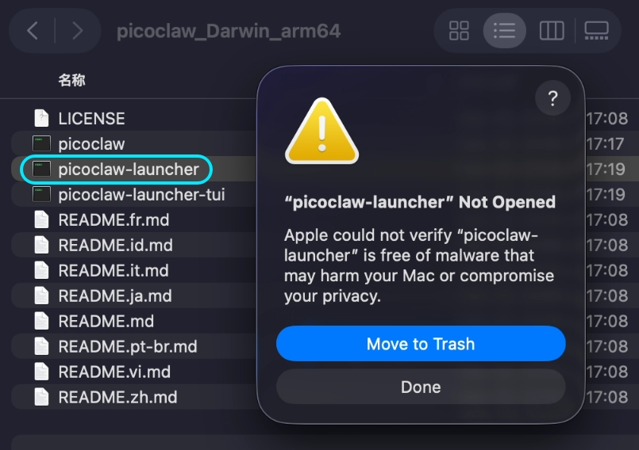
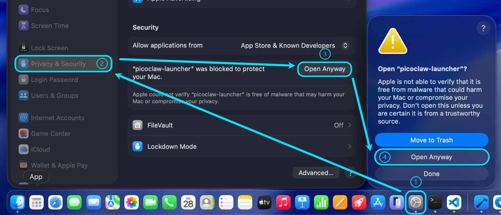
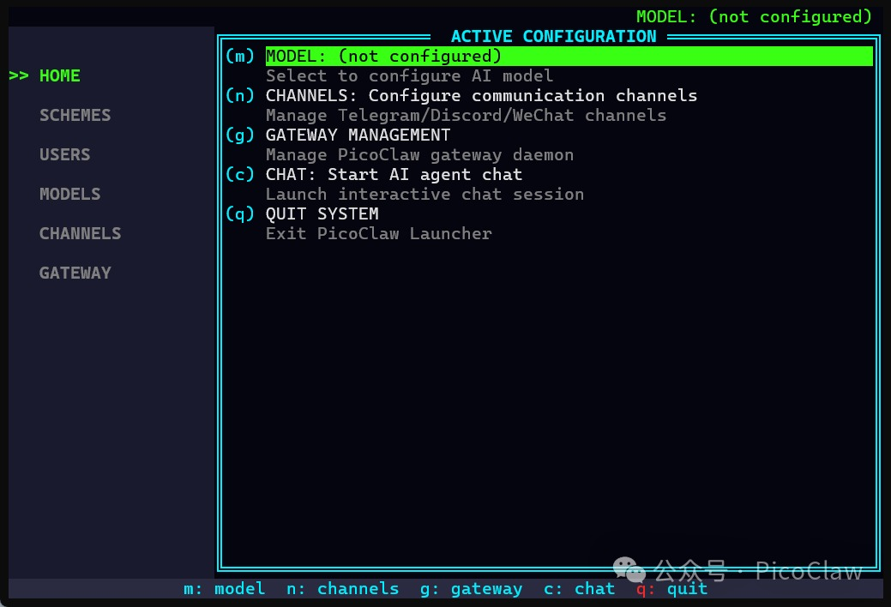
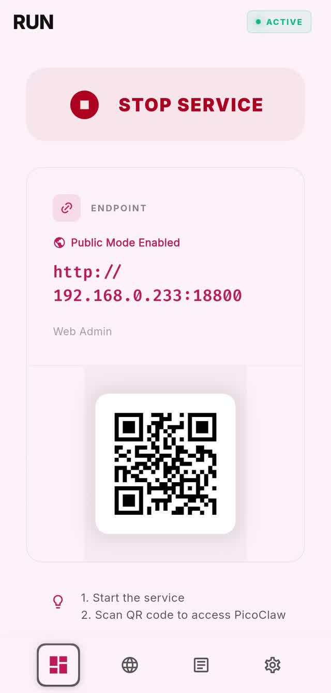
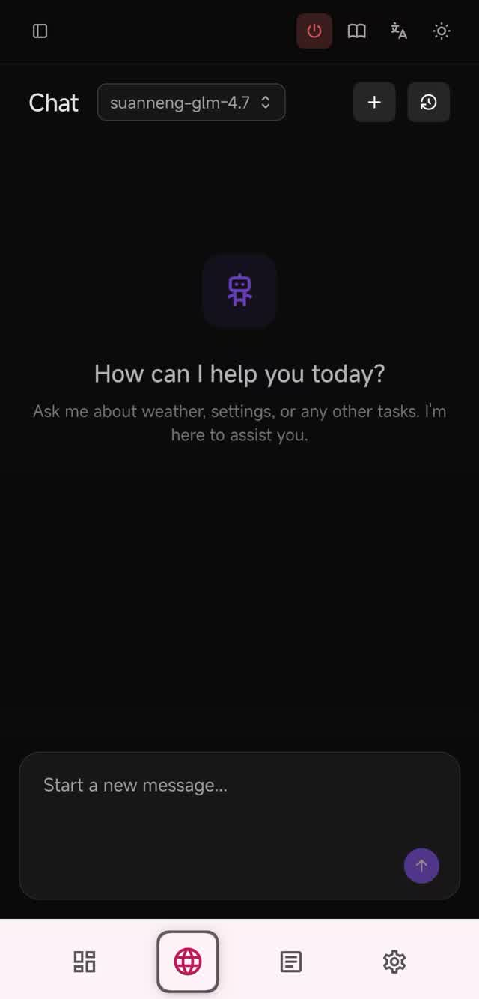
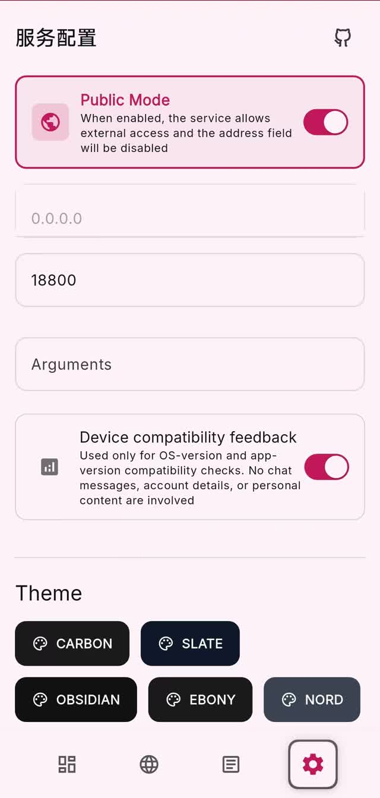

<div align="center">


<h1>PicoClaw: Ultra-Efficient AI Assistant in Go</h1>

<h3>$10 Hardware · 10MB RAM · ms Boot · Let's Go, PicoClaw!</h3>
  <p>
    
    
    
    <br>
    <a href="https://picoclaw.io"></a>
    <a href="https://docs.picoclaw.io/"></a>
    <a href="https://deepwiki.com/sipeed/picoclaw"></a>
    <br>
    <a href="https://x.com/SipeedIO"></a>
    <a href="./assets/wechat.png"></a>
    <a href="https://discord.gg/V4sAZ9XWpN"></a>
  </p>

[中文](README.zh.md) | [日本語](README.ja.md) | [Português](README.pt-br.md) | [Tiếng Việt](README.vi.md) | [Français](README.fr.md) | [Italiano](README.it.md) | [Bahasa Indonesia](README.id.md) | [Malay](README.my.md) | **English**

</div>

---

> **PicoClaw** is an independent open-source project initiated by [Sipeed](https://sipeed.com), written entirely in **Go** from scratch — not a fork of OpenClaw, NanoBot, or any other project.

**PicoClaw** is an ultra-lightweight personal AI assistant inspired by [NanoBot](https://github.com/HKUDS/nanobot). It was rebuilt from the ground up in **Go** through a "self-bootstrapping" process — the AI Agent itself drove the architecture migration and code optimization.

**Runs on $10 hardware with <10MB RAM** — that's 99% less memory than OpenClaw and 98% cheaper than a Mac mini!

<table align="center">
<tr align="center">
<td align="center" valign="top">
<p align="center">

</p>
</td>
<td align="center" valign="top">
<p align="center">

</p>
</td>
</tr>
</table>

> [!CAUTION]
> **Security Notice**
>
> * **NO CRYPTO:** PicoClaw has **not** issued any official tokens or cryptocurrency. All claims on `pump.fun` or other trading platforms are **scams**.
> * **OFFICIAL DOMAIN:** The **ONLY** official website is **[picoclaw.io](https://picoclaw.io)**, and company website is **[sipeed.com](https://sipeed.com)**
> * **BEWARE:** Many `.ai/.org/.com/.net/...` domains have been registered by third parties. Do not trust them.
> * **NOTE:** PicoClaw is in early rapid development. There may be unresolved security issues. Do not deploy to production before v1.0.
> * **NOTE:** PicoClaw has recently merged many PRs. Recent builds may use 10-20MB RAM. Resource optimization is planned after feature stabilization.

## 📢 News

2026-03-31 📱 **Android Support!** PicoClaw now runs on Android! Download the APK at [picoclaw.io](https://picoclaw.io/download)

2026-03-25 🚀 **v0.2.4 Released!** Agent architecture overhaul (SubTurn, Hooks, Steering, EventBus), WeChat/WeCom integration, security hardening (.security.yml, sensitive data filtering), new providers (AWS Bedrock, Azure, Xiaomi MiMo), and 35 bug fixes. PicoClaw has reached **26K Stars**!

2026-03-17 🚀 **v0.2.3 Released!** System tray UI (Windows & Linux), sub-agent status query (`spawn_status`), experimental Gateway hot-reload, Cron security gating, and 2 security fixes. PicoClaw has reached **25K Stars**!

2026-03-09 🎉 **v0.2.1 — Biggest update yet!** MCP protocol support, 4 new channels (Matrix/IRC/WeCom/Discord Proxy), 3 new providers (Kimi/Minimax/Avian), vision pipeline, JSONL memory store, model routing.

2026-02-28 📦 **v0.2.0** released with Docker Compose and Web UI Launcher support.

<details>
<summary>Earlier news...</summary>

2026-02-26 🎉 PicoClaw hits **20K Stars** in just 17 days! Channel auto-orchestration and capability interfaces are live.

2026-02-16 🎉 PicoClaw breaks 12K Stars in one week! Community maintainer roles and [Roadmap](ROADMAP.md) officially launched.

2026-02-13 🎉 PicoClaw breaks 5000 Stars in 4 days! Project roadmap and developer groups in progress.

2026-02-09 🎉 **PicoClaw Released!** Built in 1 day to bring AI Agents to $10 hardware with <10MB RAM. Let's Go, PicoClaw!

</details>

## ✨ Features

🪶 **Ultra-lightweight**: Core memory footprint <10MB — 99% smaller than OpenClaw.*

💰 **Minimal cost**: Efficient enough to run on $10 hardware — 98% cheaper than a Mac mini.

⚡️ **Lightning-fast boot**: 400x faster startup. Boots in <1s even on a 0.6GHz single-core processor.

🌍 **Truly portable**: Single binary across RISC-V, ARM, MIPS, and x86 architectures. One binary, runs everywhere!

🤖 **AI-bootstrapped**: Pure Go native implementation — 95% of core code was generated by an Agent and fine-tuned through human-in-the-loop review.

🔌 **MCP support**: Native [Model Context Protocol](https://modelcontextprotocol.io/) integration — connect any MCP server to extend Agent capabilities.

👁️ **Vision pipeline**: Send images and files directly to the Agent — automatic base64 encoding for multimodal LLMs.

🧠 **Smart routing**: Rule-based model routing — simple queries go to lightweight models, saving API costs.

_*Recent builds may use 10-20MB due to rapid PR merges. Resource optimization is planned. Boot speed comparison based on 0.8GHz single-core benchmarks (see table below)._

<div align="center">

|                                | OpenClaw      | NanoBot                  | **PicoClaw**                           |
| ------------------------------ | ------------- | ------------------------ | -------------------------------------- |
| **Language**                   | TypeScript    | Python                   | **Go**                                 |
| **RAM**                        | >1GB          | >100MB                   | **< 10MB***                            |
| **Boot time**</br>(0.8GHz core) | >500s         | >30s                     | **<1s**                                |
| **Cost**                       | Mac Mini $599 | Most Linux boards ~$50   | **Any Linux board**</br>**from $10**   |


</div>

> **[Hardware Compatibility List](docs/hardware-compatibility.md)** — See all tested boards, from $5 RISC-V to Raspberry Pi to Android phones. Your board not listed? Submit a PR!

<p align="center">

</p>

## 🦾 Demonstration

### 🛠️ Standard Assistant Workflows

<table align="center">
<tr align="center">
<th><p align="center">Full-Stack Engineer Mode</p></th>
<th><p align="center">Logging & Planning</p></th>
<th><p align="center">Web Search & Learning</p></th>
</tr>
<tr>
<td align="center"><p align="center"></p></td>
<td align="center"><p align="center"></p></td>
<td align="center"><p align="center"></p></td>
</tr>
<tr>
<td align="center">Develop · Deploy · Scale</td>
<td align="center">Schedule · Automate · Remember</td>
<td align="center">Discover · Insights · Trends</td>
</tr>
</table>

### 🐜 Innovative Low-Footprint Deployment

PicoClaw can be deployed on virtually any Linux device!

- $9.9 [LicheeRV-Nano](https://www.aliexpress.com/item/1005006519668532.html) E(Ethernet) or W(WiFi6) edition, for a minimal home assistant
- $30~50 [NanoKVM](https://www.aliexpress.com/item/1005007369816019.html), or $100 [NanoKVM-Pro](https://www.aliexpress.com/item/1005010048471263.html), for automated server operations
- $50 [MaixCAM](https://www.aliexpress.com/item/1005008053333693.html) or $100 [MaixCAM2](https://www.kickstarter.com/projects/zepan/maixcam2-build-your-next-gen-4k-ai-camera), for smart surveillance

<https://private-user-images.githubusercontent.com/83055338/547056448-e7b031ff-d6f5-4468-bcca-5726b6fecb5c.mp4>

🌟 More Deployment Cases Await!

## 📦 Install

### Download from picoclaw.io (Recommended)

Visit **[picoclaw.io](https://picoclaw.io)** — the official website auto-detects your platform and provides one-click download. No need to manually pick an architecture.

### Download precompiled binary

Alternatively, download the binary for your platform from the [GitHub Releases](https://github.com/sipeed/picoclaw/releases) page.

### Build from source (for development)

```bash
git clone https://github.com/sipeed/picoclaw.git

cd picoclaw
make deps

# Build core binary
make build

# Build Web UI Launcher (required for WebUI mode)
make build-launcher

# Build for multiple platforms
make build-all

# Build for Raspberry Pi Zero 2 W (32-bit: make build-linux-arm; 64-bit: make build-linux-arm64)
make build-pi-zero

# Build and install
make install
```

**Raspberry Pi Zero 2 W:** Use the binary that matches your OS: 32-bit Raspberry Pi OS -> `make build-linux-arm`; 64-bit -> `make build-linux-arm64`. Or run `make build-pi-zero` to build both.

## 🚀 Quick Start Guide

### 🌐 WebUI Launcher (Recommended for Desktop)

The WebUI Launcher provides a browser-based interface for configuration and chat. This is the easiest way to get started — no command-line knowledge required.

**Option 1: Double-click (Desktop)**

After downloading from [picoclaw.io](https://picoclaw.io), double-click `picoclaw-launcher` (or `picoclaw-launcher.exe` on Windows). Your browser will open automatically at `http://localhost:18800`.

**Option 2: Command line**

```bash
picoclaw-launcher
# Open http://localhost:18800 in your browser
```

> [!TIP]
> **Remote access / Docker / VM:** Add the `-public` flag to listen on all interfaces:
> ```bash
> picoclaw-launcher -public
> ```

<p align="center">

</p>

**Getting started:** 

Open the WebUI, then: **1)** Configure a Provider (add your LLM API key) -> **2)** Configure a Channel (e.g., Telegram) -> **3)** Start the Gateway -> **4)** Chat!

For detailed WebUI documentation, see [docs.picoclaw.io](https://docs.picoclaw.io).

<details>
<summary><b>Docker (alternative)</b></summary>

```bash
# 1. Clone this repo
git clone https://github.com/sipeed/picoclaw.git
cd picoclaw

# 2. First run — auto-generates docker/data/config.json then exits
#    (only triggers when both config.json and workspace/ are missing)
docker compose -f docker/docker-compose.yml --profile launcher up
# The container prints "First-run setup complete." and stops.

# 3. Set your API keys
vim docker/data/config.json

# 4. Start
docker compose -f docker/docker-compose.yml --profile launcher up -d
# Open http://localhost:18800
```

> **Docker / VM users:** The Gateway listens on `127.0.0.1` by default. Set `PICOCLAW_GATEWAY_HOST=0.0.0.0` or use the `-public` flag to make it accessible from the host.

```bash
# Check logs
docker compose -f docker/docker-compose.yml logs -f

# Stop
docker compose -f docker/docker-compose.yml --profile launcher down

# Update
docker compose -f docker/docker-compose.yml pull
docker compose -f docker/docker-compose.yml --profile launcher up -d
```

</details>

<details>
<summary><b>macOS — First Launch Security Warning</b></summary>

macOS may block `picoclaw-launcher` on first launch because it is downloaded from the internet and not notarized through the Mac App Store.

**Step 1:** Double-click `picoclaw-launcher`. You will see a security warning:

<p align="center">

</p>

> *"picoclaw-launcher" Not Opened — Apple could not verify "picoclaw-launcher" is free of malware that may harm your Mac or compromise your privacy.*

**Step 2:** Open **System Settings** → **Privacy & Security** → scroll down to the **Security** section → click **Open Anyway** → confirm by clicking **Open Anyway** in the dialog.

<p align="center">

</p>

After this one-time step, `picoclaw-launcher` will open normally on subsequent launches.

</details>

### 💻 TUI Launcher (Recommended for Headless / SSH)

The TUI (Terminal UI) Launcher provides a full-featured terminal interface for configuration and management. Ideal for servers, Raspberry Pi, and other headless environments.

```bash
picoclaw-launcher-tui
```

<p align="center">

</p>

**Getting started:** 

Use the TUI menus to: **1)** Configure a Provider -> **2)** Configure a Channel -> **3)** Start the Gateway -> **4)** Chat!

For detailed TUI documentation, see [docs.picoclaw.io](https://docs.picoclaw.io).

### 📱 Android

Give your decade-old phone a second life! Turn it into a smart AI Assistant with PicoClaw.

**Option 1: APK Install**

Preview:

<table>
  <tr>
    <td></td>
    <td></td>
    <td></td>
    <td></td>
  </tr>
</table>

Download the APK from [picoclaw.io](https://picoclaw.io/download/) and install directly. No Termux required!

**Option 2: Termux**

<details>
<summary><b>Terminal Launcher (for resource-constrained environments)</b></summary>

1. Install [Termux](https://github.com/termux/termux-app) (download from [GitHub Releases](https://github.com/termux/termux-app/releases), or search in F-Droid / Google Play)
2. Run the following commands:

```bash
# Download the latest release
wget https://github.com/sipeed/picoclaw/releases/latest/download/picoclaw_Linux_arm64.tar.gz
tar xzf picoclaw_Linux_arm64.tar.gz
pkg install proot
termux-chroot ./picoclaw onboard   # chroot provides a standard Linux filesystem layout
```

Then follow the Terminal Launcher section below to complete configuration.


For minimal environments where only the `picoclaw` core binary is available (no Launcher UI), you can configure everything via the command line and a JSON config file.

**1. Initialize**

```bash
picoclaw onboard
```

This creates `~/.picoclaw/config.json` and the workspace directory.

**2. Configure** (`~/.picoclaw/config.json`)

```json
{
  "agents": {
    "defaults": {
      "model_name": "gpt-5.4"
    }
  },
  "model_list": [
    {
      "model_name": "gpt-5.4",
      "model": "openai/gpt-5.4"
      // api_key is now loaded from .security.yml
    }
  ]
}
```

> **New**: The `model_list` configuration format allows zero-code provider addition. See [Model Configuration](#model-configuration-model_list) for details.
> `request_timeout` is optional and uses seconds. If omitted or set to `<= 0`, PicoClaw uses the default timeout (120s).

**3. Get API Keys**

* **LLM Provider**: [OpenRouter](https://openrouter.ai/keys) · [Zhipu](https://open.bigmodel.cn/usercenter/proj-mgmt/apikeys) · [Anthropic](https://console.anthropic.com) · [OpenAI](https://platform.openai.com) · [Gemini](https://aistudio.google.com/api-keys)
* **Web Search** (optional):
  * [Brave Search](https://brave.com/search/api) - Paid ($5/1000 queries, ~$5-6/month)
  * [Perplexity](https://www.perplexity.ai) - AI-powered search with chat interface
  * [SearXNG](https://github.com/searxng/searxng) - Self-hosted metasearch engine (free, no API key needed)
  * [Tavily](https://tavily.com) - Optimized for AI Agents (1000 requests/month)
  * DuckDuckGo - Built-in fallback (no API key required)

> **Note**: See `config.example.json` for a complete configuration template.

**4. Chat**

```bash
picoclaw agent -m "What is 2+2?"
```

That's it! You have a working AI assistant in 2 minutes.

---

## 💬 Chat Apps

Talk to your picoclaw through Telegram, Discord, WhatsApp, Mattermost, Matrix, QQ, DingTalk, LINE, or WeCom

> **Note**: All webhook-based channels (LINE, WeCom, etc.) are served on a single shared Gateway HTTP server (`gateway.host`:`gateway.port`, default `127.0.0.1:18790`). There are no per-channel ports to configure. Note: Feishu uses WebSocket/SDK mode and does not use the shared HTTP webhook server.

| Channel      | Setup                              |
| ------------ | ---------------------------------- |
| **Telegram** | Easy (just a token)                |
| **Discord**  | Easy (bot token + intents)         |
| **WhatsApp** | Easy (native: QR scan; or bridge URL) |
| **Mattermost** | Easy (server URL + bot token)    |
| **Matrix**   | Medium (homeserver + bot access token) |
| **QQ**       | Easy (AppID + AppSecret)           |
| **DingTalk** | Medium (app credentials)           |
| **LINE**     | Medium (credentials + webhook URL) |
| **WeCom AI Bot** | Medium (Token + AES key)       |

<details>
<summary><b>Telegram</b> (Recommended)</summary>

**1. Create a bot**

* Open Telegram, search `@BotFather`
* Send `/newbot`, follow prompts
* Copy the token

**2. Configure**

```json
{
  "channels": {
    "telegram": {
      "enabled": true,
      "token": "YOUR_BOT_TOKEN",
      "allow_from": ["YOUR_USER_ID"]
    }
  }
}
```

> Get your user ID from `@userinfobot` on Telegram.

**3. Run**

```bash
picoclaw gateway
```

**4. Telegram command menu (auto-registered at startup)**

PicoClaw now keeps command definitions in one shared registry. On startup, Telegram will automatically register supported bot commands (for example `/start`, `/help`, `/show`, `/list`) so command menu and runtime behavior stay in sync.
Telegram command menu registration remains channel-local discovery UX; generic command execution is handled centrally in the agent loop via the commands executor.

If command registration fails (network/API transient errors), the channel still starts and PicoClaw retries registration in the background.

</details>

<details>
<summary><b>Discord</b></summary>

**1. Create a bot**

* Go to <https://discord.com/developers/applications>
* Create an application → Bot → Add Bot
* Copy the bot token

**2. Enable intents**

* In the Bot settings, enable **MESSAGE CONTENT INTENT**
* (Optional) Enable **SERVER MEMBERS INTENT** if you plan to use allow lists based on member data

**3. Get your User ID**
* Discord Settings → Advanced → enable **Developer Mode**
* Right-click your avatar → **Copy User ID**

**4. Configure**

```json
{
  "channels": {
    "discord": {
      "enabled": true,
      "token": "YOUR_BOT_TOKEN",
      "allow_from": ["YOUR_USER_ID"]
    }
  }
}
```

**5. Invite the bot**

* OAuth2 → URL Generator
* Scopes: `bot`
* Bot Permissions: `Send Messages`, `Read Message History`
* Open the generated invite URL and add the bot to your server

**Optional: Group trigger mode**

By default the bot responds to all messages in a server channel. To restrict responses to @-mentions only, add:

```json
{
  "channels": {
    "discord": {
      "group_trigger": { "mention_only": true }
    }
  }
}
```

You can also trigger by keyword prefixes (e.g. `!bot`):

```json
{
  "channels": {
    "discord": {
      "group_trigger": { "prefixes": ["!bot"] }
    }
  }
}
```

**6. Run**

```bash
picoclaw gateway
```

</details>

<details>
<summary><b>WhatsApp</b> (native via whatsmeow)</summary>

PicoClaw can connect to WhatsApp in two ways:

- **Native (recommended):** In-process using [whatsmeow](https://github.com/tulir/whatsmeow). No separate bridge. Set `"use_native": true` and leave `bridge_url` empty. On first run, scan the QR code with WhatsApp (Linked Devices). Session is stored under your workspace (e.g. `workspace/whatsapp/`). The native channel is **optional** to keep the default binary small; build with `-tags whatsapp_native` (e.g. `make build-whatsapp-native` or `go build -tags whatsapp_native ./cmd/...`).
- **Bridge:** Connect to an external WebSocket bridge. Set `bridge_url` (e.g. `ws://localhost:3001`) and keep `use_native` false.

**Configure (native)**

```json
{
  "channels": {
    "whatsapp": {
      "enabled": true,
      "use_native": true,
      "session_store_path": "",
      "allow_from": []
    }
  }
}
```

If `session_store_path` is empty, the session is stored in `&lt;workspace&gt;/whatsapp/`. Run `picoclaw gateway`; on first run, scan the QR code printed in the terminal with WhatsApp → Linked Devices.

</details>

<details>
<summary><b>QQ</b></summary>

**1. Create a bot**

- Go to [QQ Open Platform](https://q.qq.com/#)
- Create an application → Get **AppID** and **AppSecret**

**2. Configure**

```json
{
  "channels": {
    "qq": {
      "enabled": true,
      "app_id": "YOUR_APP_ID",
      "app_secret": "YOUR_APP_SECRET",
      "allow_from": []
    }
  }
}
```

> Set `allow_from` to empty to allow all users, or specify QQ numbers to restrict access.

**3. Run**

```bash
picoclaw gateway
```

</details>

<details>
<summary><b>DingTalk</b></summary>

**1. Create a bot**

* Go to [Open Platform](https://open.dingtalk.com/)
* Create an internal app
* Copy Client ID and Client Secret

**2. Configure**

```json
{
  "channels": {
    "dingtalk": {
      "enabled": true,
      "client_id": "YOUR_CLIENT_ID",
      "client_secret": "YOUR_CLIENT_SECRET",
      "allow_from": []
    }
  }
}
```

> Set `allow_from` to empty to allow all users, or specify DingTalk user IDs to restrict access.

**3. Run**

```bash
picoclaw gateway
```
</details>

<details>
<summary><b>Mattermost</b></summary>

**1. Create a bot account**

- In Mattermost, go to **System Console** -> **Integrations** -> **Bot Accounts**
- Create a bot account and copy its access token
- Ensure the bot is added to channels where it should respond

**2. Configure**

```json
{
  "channels": {
    "mattermost": {
      "enabled": true,
      "url": "https://your-mattermost.example.com",
      "bot_token": "YOUR_MATTERMOST_BOT_TOKEN",
      "allow_from": []
    }
  }
}
```

> Set `allow_from` empty to allow all users, or use Mattermost user IDs to restrict access.

**3. Optional group trigger**

By default, group/channel messages are processed. To require mention:

```json
{
  "channels": {
    "mattermost": {
      "group_trigger": { "mention_only": true }
    }
  }
}
```

**4. Run**

```bash
picoclaw gateway
```

For full options (`typing`, `placeholder`, `reasoning_channel_id`), see [Mattermost Channel Configuration Guide](docs/channels/mattermost/README.zh.md).

</details>

<details>
<summary><b>Matrix</b></summary>

**1. Prepare bot account**

* Use your preferred homeserver (e.g. `https://matrix.org` or self-hosted)
* Create a bot user and obtain its access token

**2. Configure**

```json
{
  "channels": {
    "matrix": {
      "enabled": true,
      "homeserver": "https://matrix.org",
      "user_id": "@your-bot:matrix.org",
      "access_token": "YOUR_MATRIX_ACCESS_TOKEN",
      "allow_from": []
    }
  }
}
```

**3. Run**

```bash
picoclaw gateway
```

For full options (`device_id`, `join_on_invite`, `group_trigger`, `placeholder`, `reasoning_channel_id`), see [Matrix Channel Configuration Guide](docs/channels/matrix/README.md).

</details>

<details>
<summary><b>LINE</b></summary>

**1. Create a LINE Official Account**

- Go to [LINE Developers Console](https://developers.line.biz/)
- Create a provider → Create a Messaging API channel
- Copy **Channel Secret** and **Channel Access Token**

**2. Configure**

```json
{
  "channels": {
    "line": {
      "enabled": true,
      "channel_secret": "YOUR_CHANNEL_SECRET",
      "channel_access_token": "YOUR_CHANNEL_ACCESS_TOKEN",
      "webhook_path": "/webhook/line",
      "allow_from": []
    }
  }
}
```

> LINE webhook is served on the shared Gateway server (`gateway.host`:`gateway.port`, default `127.0.0.1:18790`).

**3. Set up Webhook URL**

LINE requires HTTPS for webhooks. Use a reverse proxy or tunnel:

```bash
# Example with ngrok (gateway default port is 18790)
ngrok http 18790
```

Then set the Webhook URL in LINE Developers Console to `https://your-domain/webhook/line` and enable **Use webhook**.

**4. Run**

```bash
picoclaw gateway
```

> In group chats, the bot responds only when @mentioned. Replies quote the original message.

</details>

<details>
<summary><b>WeCom (企业微信)</b></summary>

PicoClaw supports three types of WeCom integration:

**Option 1: WeCom Bot (Bot)** - Easier setup, supports group chats
**Option 2: WeCom App (Custom App)** - More features, proactive messaging, private chat only
**Option 3: WeCom AI Bot (AI Bot)** - Official AI Bot, streaming replies, supports group & private chat

See [WeCom AI Bot Configuration Guide](docs/channels/wecom/wecom_aibot/README.zh.md) for detailed setup instructions.

**Quick Setup - WeCom Bot:**

**1. Create a bot**

* Go to WeCom Admin Console → Group Chat → Add Group Bot
* Copy the webhook URL (format: `https://qyapi.weixin.qq.com/cgi-bin/webhook/send?key=xxx`)

**2. Configure**

```json
{
  "channels": {
    "wecom": {
      "enabled": true,
      "token": "YOUR_TOKEN",
      "encoding_aes_key": "YOUR_ENCODING_AES_KEY",
      "webhook_url": "https://qyapi.weixin.qq.com/cgi-bin/webhook/send?key=YOUR_KEY",
      "webhook_path": "/webhook/wecom",
      "allow_from": []
    }
  }
}
```

> WeCom webhook is served on the shared Gateway server (`gateway.host`:`gateway.port`, default `127.0.0.1:18790`).

**Quick Setup - WeCom App:**

**1. Create an app**

* Go to WeCom Admin Console → App Management → Create App
* Copy **AgentId** and **Secret**
* Go to "My Company" page, copy **CorpID**

**2. Configure receive message**

* In App details, click "Receive Message" → "Set API"
* Set URL to `http://your-server:18790/webhook/wecom-app`
* Generate **Token** and **EncodingAESKey**

**3. Configure**

```json
{
  "channels": {
    "wecom_app": {
      "enabled": true,
      "corp_id": "wwxxxxxxxxxxxxxxxx",
      "corp_secret": "YOUR_CORP_SECRET",
      "agent_id": 1000002,
      "token": "YOUR_TOKEN",
      "encoding_aes_key": "YOUR_ENCODING_AES_KEY",
      "webhook_path": "/webhook/wecom-app",
      "allow_from": []
    }
  }
}
```

**4. Run**

```bash
picoclaw gateway
```

> **Note**: WeCom webhook callbacks are served on the Gateway port (default 18790). Use a reverse proxy for HTTPS.

**Quick Setup - WeCom AI Bot:**

**1. Create an AI Bot**

* Go to WeCom Admin Console → App Management → AI Bot
* In the AI Bot settings, configure callback URL: `http://your-server:18791/webhook/wecom-aibot`
* Copy **Token** and click "Random Generate" for **EncodingAESKey**

**2. Configure**

```json
{
  "channels": {
    "wecom_aibot": {
      "enabled": true,
      "token": "YOUR_TOKEN",
      "encoding_aes_key": "YOUR_43_CHAR_ENCODING_AES_KEY",
      "webhook_path": "/webhook/wecom-aibot",
      "allow_from": [],
      "welcome_message": "Hello! How can I help you?"
    }
  }
}
```

**3. Run**

```bash
picoclaw gateway
```

> **Note**: WeCom AI Bot uses streaming pull protocol — no reply timeout concerns. Long tasks (>30 seconds) automatically switch to `response_url` push delivery.

</details>

##  Join the Agent Social Network

Connect Picoclaw to the Agent Social Network simply by sending a single message via the CLI or any integrated Chat App.

**Read `https://clawdchat.ai/skill.md` and follow the instructions to join [ClawdChat.ai](https://clawdchat.ai)**

## ⚙️ Configuration

Config file: `~/.picoclaw/config.json`

### Environment Variables

You can override default paths using environment variables. This is useful for portable installations, containerized deployments, or running picoclaw as a system service. These variables are independent and control different paths.

| Variable          | Description                                                                                                                             | Default Path              |
|-------------------|-----------------------------------------------------------------------------------------------------------------------------------------|---------------------------|
| `PICOCLAW_CONFIG` | Overrides the path to the configuration file. This directly tells picoclaw which `config.json` to load, ignoring all other locations. | `~/.picoclaw/config.json` |
| `PICOCLAW_HOME`   | Overrides the root directory for picoclaw data. This changes the default location of the `workspace` and other data directories.          | `~/.picoclaw`             |

**Examples:**

```bash
# Run picoclaw using a specific config file
# The workspace path will be read from within that config file
PICOCLAW_CONFIG=/etc/picoclaw/production.json picoclaw gateway

# Run picoclaw with all its data stored in /opt/picoclaw
# Config will be loaded from the default ~/.picoclaw/config.json
# Workspace will be created at /opt/picoclaw/workspace
PICOCLAW_HOME=/opt/picoclaw picoclaw agent

# Use both for a fully customized setup
PICOCLAW_HOME=/srv/picoclaw PICOCLAW_CONFIG=/srv/picoclaw/main.json picoclaw gateway
```

### Workspace Layout

PicoClaw stores data in your configured workspace (default: `~/.picoclaw/workspace`):

```
~/.picoclaw/workspace/
├── sessions/          # Conversation sessions and history
├── memory/           # Long-term memory (MEMORY.md)
├── state/            # Persistent state (last channel, etc.)
├── cron/             # Scheduled jobs database
├── skills/           # Custom skills
├── AGENTS.md         # Agent behavior guide
├── HEARTBEAT.md      # Periodic task prompts (checked every 30 min)
├── IDENTITY.md       # Agent identity
├── SOUL.md           # Agent soul
└── USER.md           # User preferences
```

### Skill Sources

By default, skills are loaded from:

1. `~/.picoclaw/workspace/skills` (workspace)
2. `~/.picoclaw/skills` (global)
3. `<current-working-directory>/skills` (builtin)

For advanced/test setups, you can override the builtin skills root with:

```bash
export PICOCLAW_BUILTIN_SKILLS=/path/to/skills
```

### Unified Command Execution Policy

- Generic slash commands are executed through a single path in `pkg/agent/loop.go` via `commands.Executor`.
- Channel adapters no longer consume generic commands locally; they forward inbound text to the bus/agent path. Telegram still auto-registers supported commands at startup.
- Unknown slash command (for example `/foo`) passes through to normal LLM processing.
- Registered but unsupported command on the current channel (for example `/show` on WhatsApp) returns an explicit user-facing error and stops further processing.
### 🔒 Security Sandbox

PicoClaw runs in a sandboxed environment by default. The agent can only access files and execute commands within the configured workspace.

#### Default Configuration

```json
{
  "agents": {
    "defaults": {
      "workspace": "~/.picoclaw/workspace",
      "restrict_to_workspace": true
    }
  }
}
```

| Option                  | Default                 | Description                               |
| ----------------------- | ----------------------- | ----------------------------------------- |
| `workspace`             | `~/.picoclaw/workspace` | Working directory for the agent           |
| `restrict_to_workspace` | `true`                  | Restrict file/command access to workspace |

#### Protected Tools

When `restrict_to_workspace: true`, the following tools are sandboxed:

| Tool          | Function         | Restriction                            |
| ------------- | ---------------- | -------------------------------------- |
| `read_file`   | Read files       | Only files within workspace            |
| `write_file`  | Write files      | Only files within workspace            |
| `list_dir`    | List directories | Only directories within workspace      |
| `edit_file`   | Edit files       | Only files within workspace            |
| `append_file` | Append to files  | Only files within workspace            |
| `exec`        | Execute commands | Command paths must be within workspace |

#### Additional Exec Protection

Even with `restrict_to_workspace: false`, the `exec` tool blocks these dangerous commands:

* `rm -rf`, `del /f`, `rmdir /s` — Bulk deletion
* `format`, `mkfs`, `diskpart` — Disk formatting
* `dd if=` — Disk imaging
* Writing to `/dev/sd[a-z]` — Direct disk writes
* `shutdown`, `reboot`, `poweroff` — System shutdown
* Fork bomb `:(){ :|:& };:`

#### Known Limitation: Child Processes From Build Tools

The exec safety guard only inspects the command line PicoClaw launches directly. It does not recursively inspect child
processes spawned by allowed developer tools such as `make`, `go run`, `cargo`, `npm run`, or custom build scripts.

That means a top-level command can still compile or launch other binaries after it passes the initial guard check. In
practice, treat build scripts, Makefiles, package scripts, and generated binaries as executable code that needs the same
level of review as a direct shell command.

For higher-risk environments:

* Review build scripts before execution.
* Prefer approval/manual review for compile-and-run workflows.
* Run PicoClaw inside a container or VM if you need stronger isolation than the built-in guard provides.

#### Error Examples

```
[ERROR] tool: Tool execution failed
{tool=exec, error=Command blocked by safety guard (path outside working dir)}
```

```
[ERROR] tool: Tool execution failed
{tool=exec, error=Command blocked by safety guard (dangerous pattern detected)}
```

#### Disabling Restrictions (Security Risk)

If you need the agent to access paths outside the workspace:

**Method 1: Config file**

```json
{
  "agents": {
    "defaults": {
      "restrict_to_workspace": false
    }
  }
}
```

**Method 2: Environment variable**

```bash
export PICOCLAW_AGENTS_DEFAULTS_RESTRICT_TO_WORKSPACE=false
```

> ⚠️ **Warning**: Disabling this restriction allows the agent to access any path on your system. Use with caution in controlled environments only.

#### Security Boundary Consistency

The `restrict_to_workspace` setting applies consistently across all execution paths:

| Execution Path   | Security Boundary            |
| ---------------- | ---------------------------- |
| Main Agent       | `restrict_to_workspace` ✅   |
| Subagent / Spawn | Inherits same restriction ✅ |
| Heartbeat tasks  | Inherits same restriction ✅ |

All paths share the same workspace restriction — there's no way to bypass the security boundary through subagents or scheduled tasks.

### Heartbeat (Periodic Tasks)

PicoClaw can perform periodic tasks automatically. Create a `HEARTBEAT.md` file in your workspace:

```markdown
# Periodic Tasks

- Check my email for important messages
- Review my calendar for upcoming events
- Check the weather forecast
```

The agent will read this file every 30 minutes (configurable) and execute any tasks using available tools.

#### Async Tasks with Spawn

For long-running tasks (web search, API calls), use the `spawn` tool to create a **subagent**:

```markdown
# Periodic Tasks

## Quick Tasks (respond directly)

- Report current time

## Long Tasks (use spawn for async)

- Search the web for AI news and summarize
- Check email and report important messages
```

**Key behaviors:**

| Feature                 | Description                                               |
| ----------------------- | --------------------------------------------------------- |
| **spawn**               | Creates async subagent, doesn't block heartbeat           |
| **Independent context** | Subagent has its own context, no session history          |
| **message tool**        | Subagent communicates with user directly via message tool |
| **Non-blocking**        | After spawning, heartbeat continues to next task          |

#### How Subagent Communication Works

```
Heartbeat triggers
    ↓
Agent reads HEARTBEAT.md
    ↓
For long task: spawn subagent
    ↓                           ↓
Continue to next task      Subagent works independently
    ↓                           ↓
All tasks done            Subagent uses "message" tool
    ↓                           ↓
Respond HEARTBEAT_OK      User receives result directly
```

The subagent has access to tools (message, web_search, etc.) and can communicate with the user independently without going through the main agent.

**Configuration:**

```json
{
  "heartbeat": {
    "enabled": true,
    "interval": 30
  }
}
```

| Option     | Default | Description                        |
| ---------- | ------- | ---------------------------------- |
| `enabled`  | `true`  | Enable/disable heartbeat           |
| `interval` | `30`    | Check interval in minutes (min: 5) |

**Environment variables:**

* `PICOCLAW_HEARTBEAT_ENABLED=false` to disable
* `PICOCLAW_HEARTBEAT_INTERVAL=60` to change interval

### Providers

> [!NOTE]
> Groq provides free voice transcription via Whisper. If configured, audio messages from any channel will be automatically transcribed at the agent level.

| Provider     | Purpose                                 | Get API Key                                                  |
| ------------ | --------------------------------------- | ------------------------------------------------------------ |
| `gemini`     | LLM (Gemini direct)                     | [aistudio.google.com](https://aistudio.google.com)           |
| `zhipu`      | LLM (Zhipu direct)                      | [bigmodel.cn](https://bigmodel.cn)                           |
| `volcengine` | LLM(Volcengine direct)                  | [volcengine.com](https://www.volcengine.com/activity/codingplan?utm_campaign=PicoClaw&utm_content=PicoClaw&utm_medium=devrel&utm_source=OWO&utm_term=PicoClaw)                 |
| `openrouter` | LLM (recommended, access to all models) | [openrouter.ai](https://openrouter.ai)                       |
| `anthropic`  | LLM (Claude direct)                     | [console.anthropic.com](https://console.anthropic.com)       |
| `openai`     | LLM (GPT direct)                        | [platform.openai.com](https://platform.openai.com)           |
| `deepseek`   | LLM (DeepSeek direct)                   | [platform.deepseek.com](https://platform.deepseek.com)       |
| `qwen`       | LLM (Qwen direct)                       | [dashscope.console.aliyun.com](https://dashscope.console.aliyun.com) |
| `groq`       | LLM + **Voice transcription** (Whisper) | [console.groq.com](https://console.groq.com)                 |
| `cerebras`   | LLM (Cerebras direct)                   | [cerebras.ai](https://cerebras.ai)                           |
| `vivgrid`    | LLM (Vivgrid direct)                    | [vivgrid.com](https://vivgrid.com)                           |
| `azure`      | LLM (Azure OpenAI)                      | [portal.azure.com](https://portal.azure.com)                 |

### Model Configuration (model_list)

> **What's New?** PicoClaw now uses a **model-centric** configuration approach. Simply specify `vendor/model` format (e.g., `zhipu/glm-4.7`) to add new providers—**zero code changes required!**

This design also enables **multi-agent support** with flexible provider selection:

- **Different agents, different providers**: Each agent can use its own LLM provider
- **Model fallbacks**: Configure primary and fallback models for resilience
- **Load balancing**: Distribute requests across multiple endpoints
- **Centralized configuration**: Manage all providers in one place

#### 📋 All Supported Vendors

| Vendor              | `model` Prefix    | Default API Base                                    | Protocol  | API Key                                                          |
| ------------------- | ----------------- |-----------------------------------------------------| --------- | ---------------------------------------------------------------- |
| **OpenAI**          | `openai/`         | `https://api.openai.com/v1`                         | OpenAI    | [Get Key](https://platform.openai.com)                           |
| **Anthropic**       | `anthropic/`      | `https://api.anthropic.com/v1`                      | Anthropic | [Get Key](https://console.anthropic.com)                         |
| **智谱 AI (GLM)**   | `zhipu/`          | `https://open.bigmodel.cn/api/paas/v4`              | OpenAI    | [Get Key](https://open.bigmodel.cn/usercenter/proj-mgmt/apikeys) |
| **DeepSeek**        | `deepseek/`       | `https://api.deepseek.com/v1`                       | OpenAI    | [Get Key](https://platform.deepseek.com)                         |
| **Google Gemini**   | `gemini/`         | `https://generativelanguage.googleapis.com/v1beta`  | OpenAI    | [Get Key](https://aistudio.google.com/api-keys)                  |
| **Groq**            | `groq/`           | `https://api.groq.com/openai/v1`                    | OpenAI    | [Get Key](https://console.groq.com)                              |
| **Moonshot**        | `moonshot/`       | `https://api.moonshot.cn/v1`                        | OpenAI    | [Get Key](https://platform.moonshot.cn)                          |
| **通义千问 (Qwen)** | `qwen/`           | `https://dashscope.aliyuncs.com/compatible-mode/v1` | OpenAI    | [Get Key](https://dashscope.console.aliyun.com)                  |
| **NVIDIA**          | `nvidia/`         | `https://integrate.api.nvidia.com/v1`               | OpenAI    | [Get Key](https://build.nvidia.com)                              |
| **Ollama**          | `ollama/`         | `http://localhost:11434/v1`                         | OpenAI    | Local (no key needed)                                            |
| **OpenRouter**      | `openrouter/`     | `https://openrouter.ai/api/v1`                      | OpenAI    | [Get Key](https://openrouter.ai/keys)                            |
| **LiteLLM Proxy**   | `litellm/`        | `http://localhost:4000/v1`                          | OpenAI    | Your LiteLLM proxy key                                            |
| **VLLM**            | `vllm/`           | `http://localhost:8000/v1`                          | OpenAI    | Local                                                            |
| **Cerebras**        | `cerebras/`       | `https://api.cerebras.ai/v1`                        | OpenAI    | [Get Key](https://cerebras.ai)                                   |
| **VolcEngine (Doubao)** | `volcengine/`     | `https://ark.cn-beijing.volces.com/api/v3`          | OpenAI    | [Get Key](https://www.volcengine.com/activity/codingplan?utm_campaign=PicoClaw&utm_content=PicoClaw&utm_medium=devrel&utm_source=OWO&utm_term=PicoClaw)                        |
| **神算云**          | `shengsuanyun/`   | `https://router.shengsuanyun.com/api/v1`            | OpenAI    | -                                                                |
| **BytePlus**        | `byteplus/`       | `https://ark.ap-southeast.bytepluses.com/api/v3`    | OpenAI    | [Get Key](https://www.byteplus.com)                        |
| **Vivgrid**         | `vivgrid/`        | `https://api.vivgrid.com/v1`                        | OpenAI    | [Get Key](https://vivgrid.com)                                   |
| **LongCat**         | `longcat/`        | `https://api.longcat.chat/openai`                   | OpenAI    | [Get Key](https://longcat.chat/platform)                         |
| **ModelScope (魔搭)**| `modelscope/`    | `https://api-inference.modelscope.cn/v1`            | OpenAI    | [Get Token](https://modelscope.cn/my/tokens)                     |
| **Azure OpenAI**    | `azure/`          | `https://{resource}.openai.azure.com`               | Azure     | [Get Key](https://portal.azure.com)                              |
| **Antigravity**     | `antigravity/`    | Google Cloud                                        | Custom    | OAuth only                                                       |
| **GitHub Copilot**  | `github-copilot/` | `localhost:4321`                                    | gRPC      | -                                                                |

#### Basic Configuration

```json
{
  "model_list": [
    {
      "model_name": "ark-code-latest",
      "model": "volcengine/ark-code-latest",
      "api_key": "sk-your-api-key"
    },
    {
      "model_name": "gpt-5.4",
      "model": "openai/gpt-5.4",
      "api_key": "sk-your-openai-key"
    },
    {
      "model_name": "claude-sonnet-4.6",
      "model": "anthropic/claude-sonnet-4.6",
      "api_key": "sk-ant-your-key"
    },
    {
      "model_name": "glm-4.7",
      "model": "zhipu/glm-4.7",
      "api_key": "your-zhipu-key"
    }
  ],
  "agents": {
    "defaults": {
      "model": "gpt-5.4"
    }
  }
}
```

#### Vendor-Specific Examples

**OpenAI**

```json
{
  "model_name": "gpt-5.4",
  "model": "openai/gpt-5.4",
  "api_key": "sk-..."
}
```

**VolcEngine (Doubao)**

```json
{
  "model_name": "ark-code-latest",
  "model": "volcengine/ark-code-latest",
  "api_key": "sk-..."
}
```

**智谱 AI (GLM)**

```json
{
  "model_name": "glm-4.7",
  "model": "zhipu/glm-4.7",
  "api_key": "your-key"
}
```

**DeepSeek**

```json
{
  "model_name": "deepseek-chat",
  "model": "deepseek/deepseek-chat",
  "api_key": "sk-..."
}
```

**Anthropic (with API key)**

```json
{
  "model_name": "claude-sonnet-4.6",
  "model": "anthropic/claude-sonnet-4.6",
  "api_key": "sk-ant-your-key"
}
```

> Run `picoclaw auth login --provider anthropic` to paste your API token.

**Anthropic Messages API (native format)**

For direct Anthropic API access or custom endpoints that only support Anthropic's native message format:

```json
{
  "model_name": "claude-opus-4-6",
  "model": "anthropic-messages/claude-opus-4-6",
  "api_key": "sk-ant-your-key",
  "api_base": "https://api.anthropic.com"
}
```

> Use `anthropic-messages` protocol when:
> - Using third-party proxies that only support Anthropic's native `/v1/messages` endpoint (not OpenAI-compatible `/v1/chat/completions`)
> - Connecting to services like MiniMax, Synthetic that require Anthropic's native message format
> - The existing `anthropic` protocol returns 404 errors (indicating the endpoint doesn't support OpenAI-compatible format)
>
> **Note:** The `anthropic` protocol uses OpenAI-compatible format (`/v1/chat/completions`), while `anthropic-messages` uses Anthropic's native format (`/v1/messages`). Choose based on your endpoint's supported format.

**Ollama (local)**

```json
{
  "model_name": "llama3",
  "model": "ollama/llama3"
}
```

**Custom Proxy/API**

```json
{
  "model_name": "my-custom-model",
  "model": "openai/custom-model",
  "api_base": "https://my-proxy.com/v1",
  "api_key": "sk-...",
  "request_timeout": 300
}
```

**LiteLLM Proxy**

```json
{
  "model_name": "lite-gpt4",
  "model": "litellm/lite-gpt4",
  "api_base": "http://localhost:4000/v1",
  "api_key": "sk-..."
}
```

PicoClaw strips only the outer `litellm/` prefix before sending the request, so proxy aliases like `litellm/lite-gpt4` send `lite-gpt4`, while `litellm/openai/gpt-4o` sends `openai/gpt-4o`.

#### Load Balancing

Configure multiple endpoints for the same model name—PicoClaw will automatically round-robin between them:

```json
{
  "model_list": [
    {
      "model_name": "gpt-5.4",
      "model": "openai/gpt-5.4",
      "api_base": "https://api1.example.com/v1",
      "api_key": "sk-key1"
    },
    {
      "model_name": "gpt-5.4",
      "model": "openai/gpt-5.4",
      "api_base": "https://api2.example.com/v1",
      "api_key": "sk-key2"
    }
  ]
}
```

> See `config/config.example.json` in the repo for a complete configuration template with all available options.
> 
> Please note: config.example.json format is version 0, with sensitive codes in it, and will be auto migrated to version 1+, then, the config.json will only store insensitive data, the sensitive codes will be stored in .security.yml, if you need manually modify the codes, please see `docs/security_configuration.md` for more details.


**3. Chat**

```bash
# One-shot question
picoclaw agent -m "What is 2+2?"

# Interactive mode
picoclaw agent

# Start gateway for chat app integration
picoclaw gateway
```

</details>

## 🔌 Providers (LLM)

PicoClaw supports 30+ LLM providers through the `model_list` configuration. Use the `protocol/model` format:

| Provider | Protocol | API Key | Notes |
|----------|----------|---------|-------|
| [OpenAI](https://platform.openai.com/api-keys) | `openai/` | Required | GPT-5.4, GPT-4o, o3, etc. |
| [Anthropic](https://console.anthropic.com/settings/keys) | `anthropic/` | Required | Claude Opus 4.6, Sonnet 4.6, etc. |
| [Google Gemini](https://aistudio.google.com/apikey) | `gemini/` | Required | Gemini 3 Flash, 2.5 Pro, etc. |
| [OpenRouter](https://openrouter.ai/keys) | `openrouter/` | Required | 200+ models, unified API |
| [Zhipu (GLM)](https://open.bigmodel.cn/usercenter/proj-mgmt/apikeys) | `zhipu/` | Required | GLM-4.7, GLM-5, etc. |
| [DeepSeek](https://platform.deepseek.com/api_keys) | `deepseek/` | Required | DeepSeek-V3, DeepSeek-R1 |
| [Volcengine](https://console.volcengine.com) | `volcengine/` | Required | Doubao, Ark models |
| [Qwen](https://dashscope.console.aliyun.com/apiKey) | `qwen/` | Required | Qwen3, Qwen-Max, etc. |
| [Groq](https://console.groq.com/keys) | `groq/` | Required | Fast inference (Llama, Mixtral) |
| [Moonshot (Kimi)](https://platform.moonshot.cn/console/api-keys) | `moonshot/` | Required | Kimi models |
| [Minimax](https://platform.minimaxi.com/user-center/basic-information/interface-key) | `minimax/` | Required | MiniMax models |
| [Mistral](https://console.mistral.ai/api-keys) | `mistral/` | Required | Mistral Large, Codestral |
| [NVIDIA NIM](https://build.nvidia.com/) | `nvidia/` | Required | NVIDIA hosted models |
| [Cerebras](https://cloud.cerebras.ai/) | `cerebras/` | Required | Fast inference |
| [Novita AI](https://novita.ai/) | `novita/` | Required | Various open models |
| [Xiaomi MiMo](https://platform.xiaomimimo.com/) | `mimo/` | Required | MiMo models |
| [Ollama](https://ollama.com/) | `ollama/` | Not needed | Local models, self-hosted |
| [vLLM](https://docs.vllm.ai/) | `vllm/` | Not needed | Local deployment, OpenAI-compatible |
| [LiteLLM](https://docs.litellm.ai/) | `litellm/` | Varies | Proxy for 100+ providers |
| [Azure OpenAI](https://portal.azure.com/) | `azure/` | Required | Enterprise Azure deployment |
| [GitHub Copilot](https://github.com/features/copilot) | `github-copilot/` | OAuth | Device code login |
| [Antigravity](https://console.cloud.google.com/) | `antigravity/` | OAuth | Google Cloud AI |
| [AWS Bedrock](https://console.aws.amazon.com/bedrock)* | `bedrock/` | AWS credentials | Claude, Llama, Mistral on AWS |

> \* AWS Bedrock requires build tag: `go build -tags bedrock`. Set `api_base` to a region name (e.g., `us-east-1`) for automatic endpoint resolution across all AWS partitions (aws, aws-cn, aws-us-gov). When using a full endpoint URL instead, you must also configure `AWS_REGION` via environment variable or AWS config/profile.

<details>
<summary><b>Local deployment (Ollama, vLLM, etc.)</b></summary>

**Ollama:**
```json
{
  "model_list": [
    {
      "model_name": "local-llama",
      "model": "ollama/llama3.1:8b",
      "api_base": "http://localhost:11434/v1"
    }
  ]
}
```

**vLLM:**
```json
{
  "model_list": [
    {
      "model_name": "local-vllm",
      "model": "vllm/your-model",
      "api_base": "http://localhost:8000/v1"
    }
  ]
}
```

For full provider configuration details, see [Providers & Models](docs/providers.md).

</details>

## 💬 Channels (Chat Apps)

Talk to your PicoClaw through 18+ messaging platforms:

| Channel | Setup | Protocol | Docs |
|---------|-------|----------|------|
| **Telegram** | Easy (bot token) | Long polling | [Guide](docs/channels/telegram/README.md) |
| **Discord** | Easy (bot token + intents) | WebSocket | [Guide](docs/channels/discord/README.md) |
| **WhatsApp** | Easy (QR scan or bridge URL) | Native / Bridge | [Guide](docs/chat-apps.md#whatsapp) |
| **Weixin** | Easy (Native QR scan) | iLink API | [Guide](docs/chat-apps.md#weixin) |
| **QQ** | Easy (AppID + AppSecret) | WebSocket | [Guide](docs/channels/qq/README.md) |
| **Slack** | Easy (bot + app token) | Socket Mode | [Guide](docs/channels/slack/README.md) |
| **Matrix** | Medium (homeserver + token) | Sync API | [Guide](docs/channels/matrix/README.md) |
| **DingTalk** | Medium (client credentials) | Stream | [Guide](docs/channels/dingtalk/README.md) |
| **Feishu / Lark** | Medium (App ID + Secret) | WebSocket/SDK | [Guide](docs/channels/feishu/README.md) |
| **LINE** | Medium (credentials + webhook) | Webhook | [Guide](docs/channels/line/README.md) |
| **WeCom** | Easy (QR login or manual) | WebSocket | [Guide](docs/channels/wecom/README.md) |
| **VK** | Easy (group token) | Long Poll | [Guide](docs/channels/vk/README.md) |
| **IRC** | Medium (server + nick) | IRC protocol | [Guide](docs/chat-apps.md#irc) |
| **OneBot** | Medium (WebSocket URL) | OneBot v11 | [Guide](docs/channels/onebot/README.md) |
| **MaixCam** | Easy (enable) | TCP socket | [Guide](docs/channels/maixcam/README.md) |
| **Pico** | Easy (enable) | Native protocol | Built-in |
| **Pico Client** | Easy (WebSocket URL) | WebSocket | Built-in |

> All webhook-based channels share a single Gateway HTTP server (`gateway.host`:`gateway.port`, default `127.0.0.1:18790`). Feishu uses WebSocket/SDK mode and does not use the shared HTTP server.

> Log verbosity is controlled by `gateway.log_level` (default: `warn`). Supported values: `debug`, `info`, `warn`, `error`, `fatal`. Can also be set via `PICOCLAW_LOG_LEVEL`. See [Configuration](docs/configuration.md#gateway-log-level) for details.

For detailed channel setup instructions, see [Chat Apps Configuration](docs/chat-apps.md).

## 🔧 Tools

### 🔍 Web Search

PicoClaw can search the web to provide up-to-date information. Configure in `tools.web`:

| Search Engine | API Key | Free Tier | Link |
|--------------|---------|-----------|------|
| DuckDuckGo | Not needed | Unlimited | Built-in fallback |
| [Baidu Search](https://cloud.baidu.com/doc/qianfan-api/s/Wmbq4z7e5) | Required | 1000 queries/day | AI-powered, China-optimized |
| [Tavily](https://tavily.com) | Required | 1000 queries/month | Optimized for AI Agents |
| [Brave Search](https://brave.com/search/api) | Required | 2000 queries/month | Fast and private |
| [Perplexity](https://www.perplexity.ai) | Required | Paid | AI-powered search |
| [SearXNG](https://github.com/searxng/searxng) | Not needed | Self-hosted | Free metasearch engine |
| [GLM Search](https://open.bigmodel.cn/) | Required | Varies | Zhipu web search |

### ⚙️ Other Tools

PicoClaw includes built-in tools for file operations, code execution, scheduling, and more. See [Tools Configuration](docs/tools_configuration.md) for details.

## 🎯 Skills

Skills are modular capabilities that extend your Agent. They are loaded from `SKILL.md` files in your workspace.

**Install skills from ClawHub:**

```bash
picoclaw skills search "web scraping"
picoclaw skills install <skill-name>
```

**Configure ClawHub token** (optional, for higher rate limits):

Add to your `config.json`:
```json
{
  "tools": {
    "skills": {
      "registries": {
        "clawhub": {
          "auth_token": "your-clawhub-token"
        }
      }
    }
  }
}
```

For more details, see [Tools Configuration - Skills](docs/tools_configuration.md#skills-tool).

## 🔗 MCP (Model Context Protocol)

PicoClaw natively supports [MCP](https://modelcontextprotocol.io/) — connect any MCP server to extend your Agent's capabilities with external tools and data sources.

```json
{
  "tools": {
    "mcp": {
      "enabled": true,
      "servers": {
        "filesystem": {
          "enabled": true,
          "command": "npx",
          "args": ["-y", "@modelcontextprotocol/server-filesystem", "/tmp"]
        }
      }
    }
  }
}
```

For full MCP configuration (stdio, SSE, HTTP transports, Tool Discovery), see [Tools Configuration - MCP](docs/tools_configuration.md#mcp-tool).

##  Join the Agent Social Network

Connect PicoClaw to the Agent Social Network simply by sending a single message via the CLI or any integrated Chat App.

**Read `https://clawdchat.ai/skill.md` and follow the instructions to join [ClawdChat.ai](https://clawdchat.ai)**

## 🖥️ CLI Reference

| Command                   | Description                      |
| ------------------------- | -------------------------------- |
| `picoclaw onboard`        | Initialize config & workspace    |
| `picoclaw auth weixin` | Connect WeChat account via QR |
| `picoclaw agent -m "..."` | Chat with the agent              |
| `picoclaw agent`          | Interactive chat mode            |
| `picoclaw gateway`        | Start the gateway                |
| `picoclaw status`         | Show status                      |
| `picoclaw version`        | Show version info                |
| `picoclaw model`          | View or switch the default model |
| `picoclaw cron list`      | List all scheduled jobs          |
| `picoclaw cron add ...`   | Add a scheduled job              |
| `picoclaw cron disable`   | Disable a scheduled job          |
| `picoclaw cron remove`    | Remove a scheduled job           |
| `picoclaw skills list`    | List installed skills            |
| `picoclaw skills install` | Install a skill                  |
| `picoclaw migrate`        | Migrate data from older versions |
| `picoclaw auth login`     | Authenticate with providers      |

### ⏰ Scheduled Tasks / Reminders

PicoClaw supports scheduled reminders and recurring tasks through the `cron` tool:

* **One-time reminders**: "Remind me in 10 minutes" -> triggers once after 10min
* **Recurring tasks**: "Remind me every 2 hours" -> triggers every 2 hours
* **Cron expressions**: "Remind me at 9am daily" -> uses cron expression

See [docs/cron.md](docs/cron.md) for current schedule types, execution modes, command-job gates, and persistence details.

## 📚 Documentation

For detailed guides beyond this README:

| Topic | Description |
|-------|-------------|
| [Docker & Quick Start](docs/docker.md) | Docker Compose setup, Launcher/Agent modes |
| [Chat Apps](docs/chat-apps.md) | All 17+ channel setup guides |
| [Configuration](docs/configuration.md) | Environment variables, workspace layout, security sandbox |
| [Scheduled Tasks and Cron Jobs](docs/cron.md) | Cron schedule types, deliver modes, command gates, job storage |
| [Providers & Models](docs/providers.md) | 30+ LLM providers, model routing, model_list configuration |
| [Spawn & Async Tasks](docs/spawn-tasks.md) | Quick tasks, long tasks with spawn, async sub-agent orchestration |
| [Hooks](docs/hooks/README.md) | Event-driven hook system: observers, interceptors, approval hooks |
| [Steering](docs/steering.md) | Inject messages into a running agent loop between tool calls |
| [SubTurn](docs/subturn.md) | Subagent coordination, concurrency control, lifecycle |
| [Troubleshooting](docs/troubleshooting.md) | Common issues and solutions |
| [Tools Configuration](docs/tools_configuration.md) | Per-tool enable/disable, exec policies, MCP, Skills |
| [Hardware Compatibility](docs/hardware-compatibility.md) | Tested boards, minimum requirements |

## 🤝 Contribute & Roadmap

PRs welcome! The codebase is intentionally small and readable.

See our [Community Roadmap](https://github.com/sipeed/picoclaw/issues/988) and [CONTRIBUTING.md](CONTRIBUTING.md) for guidelines.

Developer group building, join after your first merged PR!

User Groups:

Discord: <https://discord.gg/V4sAZ9XWpN>

WeChat:

