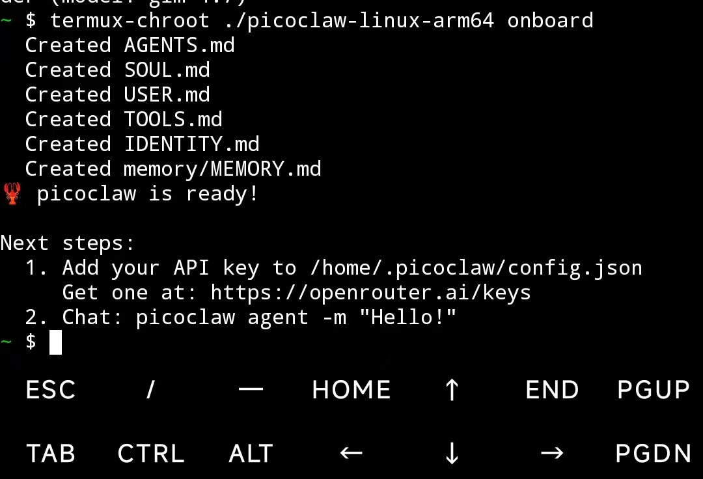

<div align="center">
  

  <h1>PicoClaw: Pembantu AI Sangat Efisien dalam Go</h1>

  <h3>Perkakasan $10 · RAM <10MB · Boot <1s · 皮皮虾，我们走！</h3>
  <p>
    
    
    
    <br>
    <a href="https://picoclaw.io"></a>
    <a href="https://docs.picoclaw.io/"></a>
    <a href="https://deepwiki.com/sipeed/picoclaw"></a>
    <br>
    <a href="https://x.com/SipeedIO"></a>
    <a href="./assets/wechat.png"></a>
    <a href="https://discord.gg/V4sAZ9XWpN"></a>
  </p>

[中文](README.zh.md) | [日本語](README.ja.md) | [Português](README.pt-br.md) | [Tiếng Việt](README.vi.md) | [Français](README.fr.md) | [Italiano](README.it.md) | [English](README.md) | **Bahasa Melayu**

</div>

---

> **PicoClaw** ialah projek sumber terbuka bebas yang dimulakan oleh [Sipeed](https://sipeed.com). Ia ditulis sepenuhnya dalam **Go** — bukan fork OpenClaw, NanoBot, atau mana-mana projek lain.

🦐 PicoClaw ialah Pembantu AI peribadi yang sangat ringan, diinspirasikan oleh [NanoBot](https://github.com/HKUDS/nanobot), dan dibina semula sepenuhnya dalam Go melalui proses bootstrap kendiri, di mana agen AI itu sendiri memacu keseluruhan migrasi seni bina dan pengoptimuman kod.

⚡️ Berjalan pada perkakasan $10 dengan RAM <10MB: Itu 99% kurang penggunaan memori berbanding OpenClaw dan 98% lebih murah berbanding Mac mini!

<table align="center">
  <tr align="center">
    <td align="center" valign="top">
      <p align="center">
        
      </p>
    </td>
    <td align="center" valign="top">
      <p align="center">
        
      </p>
    </td>
  </tr>
</table>

> [!CAUTION]
> **🚨 KESELAMATAN & SALURAN RASMI / 安全声明**
>
> * **TIADA KRIPTO:** PicoClaw **TIADA** token/coin rasmi. Semua dakwaan di `pump.fun` atau platform dagangan lain ialah **PENIPUAN**.
>
> * **DOMAIN RASMI:** Satu-satunya laman web rasmi ialah **[picoclaw.io](https://picoclaw.io)**, dan laman web syarikat ialah **[sipeed.com](https://sipeed.com)**
> * **Amaran:** Banyak domain `.ai/.org/.com/.net/...` didaftarkan oleh pihak ketiga.
> * **Amaran:** picoclaw masih dalam pembangunan awal dan mungkin mempunyai isu keselamatan rangkaian yang belum diselesaikan. Jangan deploy ke persekitaran produksi sebelum keluaran v1.0.
> * **Nota:** picoclaw baru-baru ini telah menggabungkan banyak PR, yang mungkin menyebabkan penggunaan memori lebih besar (10–20MB) dalam versi terkini. Kami bercadang mengutamakan pengoptimuman sumber sebaik sahaja set ciri semasa mencapai keadaan stabil.

## 📢 Berita

2026-03-17 🚀 **v0.2.3 Dikeluarkan!** UI system tray (Windows & Linux), penjejakan status sub-agen (`spawn_status`), hot-reload gateway eksperimen, gerbang keselamatan cron, dan 2 pembaikan keselamatan. PicoClaw kini mencecah **25K ⭐**!

2026-03-09 🎉 **v0.2.1 — Kemas kini terbesar setakat ini!** Sokongan protokol MCP, 4 saluran baharu (Matrix/IRC/WeCom/Discord Proxy), 3 penyedia baharu (Kimi/Minimax/Avian), pipeline vision, stor memori JSONL, dan routing model.

2026-02-28 📦 **v0.2.0** dikeluarkan dengan sokongan Docker Compose dan pelancar Web UI.

2026-02-26 🎉 PicoClaw mencapai **20K stars** dalam hanya 17 hari! Auto-orchestration saluran dan antara muka capability telah tiba.

<details>
<summary>Berita lama...</summary>

2026-02-16 🎉 PicoClaw mencapai 12K stars dalam seminggu! Peranan penyelenggara komuniti dan [roadmap](ROADMAP.md) telah disiarkan secara rasmi.

2026-02-13 🎉 PicoClaw mencapai 5000 stars dalam 4 hari! Roadmap projek dan kumpulan pembangun sedang disusun.

2026-02-09 🎉 **PicoClaw Dilancarkan!** Dibina dalam 1 hari untuk membawa AI Agents ke perkakasan $10 dengan RAM <10MB. 🦐 PicoClaw, jom pergi!

</details>

## ✨ Ciri-ciri

🪶 **Sangat Ringan**: Penggunaan memori <10MB — 99% lebih kecil daripada fungsi teras OpenClaw.*

💰 **Kos Minimum**: Cukup efisien untuk berjalan pada perkakasan $10 — 98% lebih murah daripada Mac mini.

⚡️ **Sangat Pantas**: Masa startup 400X lebih pantas, but dalam <1 saat walaupun pada teras tunggal 0.6GHz.

🌍 **Portabiliti Sebenar**: Satu binari self-contained merentas RISC-V, ARM, MIPS, dan x86, satu klik untuk terus berjalan!

🤖 **Dibootstrapping oleh AI**: Pelaksanaan Go-native autonomi — 95% teras dijana oleh Agent dengan penambahbaikan human-in-the-loop.

🔌 **Sokongan MCP**: Integrasi asli [Model Context Protocol](https://modelcontextprotocol.io/) — sambungkan mana-mana pelayan MCP untuk melanjutkan keupayaan agen.

👁️ **Pipeline Vision**: Hantar imej dan fail terus kepada agen — pengekodan base64 automatik untuk LLM multimodal.

🧠 **Routing Pintar**: Routing model berasaskan peraturan — pertanyaan mudah pergi ke model ringan, menjimatkan kos API.

_*Versi terkini mungkin menggunakan 10–20MB disebabkan banyak gabungan ciri yang pantas. Pengoptimuman sumber dirancang. Perbandingan startup berdasarkan penanda aras teras tunggal 0.8GHz (lihat jadual di bawah)._

|                                | OpenClaw      | NanoBot                        | **PicoClaw**                                   |
| ------------------------------ | ------------- | ------------------------------ | ---------------------------------------------- |
| **Bahasa**                     | TypeScript    | Python                         | **Go**                                         |
| **RAM**                        | >1GB          | >100MB                         | **< 10MB***                                    |
| **Startup**</br>(teras 0.8GHz) | >500s         | >30s                           | **<1s**                                        |
| **Kos**                        | Mac Mini $599 | Kebanyakan Linux SBC </br>~$50 | **Mana-mana papan Linux**</br>**Serendah $10** |


## 🦾 Demonstrasi

### 🛠️ Aliran Kerja Pembantu Standard

<table align="center">
  <tr align="center">
    <th><p align="center">🧩 Jurutera Full-Stack</p></th>
    <th><p align="center">🗂️ Pengurusan Log & Perancangan</p></th>
    <th><p align="center">🔎 Carian Web & Pembelajaran</p></th>
  </tr>
  <tr>
    <td align="center"><p align="center"></p></td>
    <td align="center"><p align="center"></p></td>
    <td align="center"><p align="center"></p></td>
  </tr>
  <tr>
    <td align="center">Bangunkan • Deploy • Skalakan</td>
    <td align="center">Jadual • Automasi • Memori</td>
    <td align="center">Penemuan • Insight • Trend</td>
  </tr>
</table>

### 📱 Jalankan pada Telefon Android Lama

Berikan telefon lama anda hayat kedua! Tukarkannya menjadi Pembantu AI pintar dengan PicoClaw. Permulaan pantas:

1. **Pasang [Termux](https://github.com/termux/termux-app)** (Muat turun dari [GitHub Releases](https://github.com/termux/termux-app/releases), atau cari di F-Droid / Google Play).
2. **Jalankan arahan**

```bash
# Download the latest release from https://github.com/sipeed/picoclaw/releases
wget https://github.com/sipeed/picoclaw/releases/latest/download/picoclaw_Linux_arm64.tar.gz
tar xzf picoclaw_Linux_arm64.tar.gz
pkg install proot
termux-chroot ./picoclaw onboard
```

Selepas itu, ikut arahan dalam bahagian "Quick Start" untuk melengkapkan konfigurasi!



### 🐜 Deploy Jejak Sumber Rendah yang Inovatif

PicoClaw boleh dideploy pada hampir mana-mana peranti Linux!

- $9.9 [LicheeRV-Nano](https://www.aliexpress.com/item/1005006519668532.html) versi E(Ethernet) atau W(WiFi6), untuk pembantu rumah minimum
- $30~50 [NanoKVM](https://www.aliexpress.com/item/1005007369816019.html), atau $100 [NanoKVM-Pro](https://www.aliexpress.com/item/1005010048471263.html) untuk penyelenggaraan pelayan automatik
- $50 [MaixCAM](https://www.aliexpress.com/item/1005008053333693.html) atau $100 [MaixCAM2](https://www.kickstarter.com/projects/zepan/maixcam2-build-your-next-gen-4k-ai-camera) untuk pemantauan pintar

<https://private-user-images.githubusercontent.com/83055338/547056448-e7b031ff-d6f5-4468-bcca-5726b6fecb5c.mp4>

🌟 Lebih banyak senario deployment sedang menanti!

## 📦 Pemasangan

### Pasang dengan binari prabina

Muat turun binari untuk platform anda dari halaman [Releases](https://github.com/sipeed/picoclaw/releases).

### Pasang dari sumber (ciri terkini, disyorkan untuk pembangunan)

```bash
git clone https://github.com/sipeed/picoclaw.git

cd picoclaw
make deps

# Build, no need to install
make build

# Build for multiple platforms
make build-all

# Build for Raspberry Pi Zero 2 W (32-bit: make build-linux-arm; 64-bit: make build-linux-arm64)
make build-pi-zero

# Build And Install
make install
```

**Raspberry Pi Zero 2 W:** Gunakan binari yang sepadan dengan OS anda: Raspberry Pi OS 32-bit → `make build-linux-arm`; 64-bit → `make build-linux-arm64`. Atau jalankan `make build-pi-zero` untuk membina kedua-duanya.

## 📚 Dokumentasi

Untuk panduan terperinci, lihat dokumen di bawah. README hanya meliputi quick start.

| Topik                                                 | Penerangan                                                                                          |
| ----------------------------------------------------- | --------------------------------------------------------------------------------------------------- |
| 🐳 [Docker & Quick Start](docs/my/docker.md)           | Setup Docker Compose, mod Launcher/Agent, konfigurasi Quick Start                                   |
| 💬 [Aplikasi Sembang](docs/my/chat-apps.md)            | Telegram, Discord, WhatsApp, Matrix, QQ, Slack, IRC, DingTalk, LINE, Feishu, WeCom, dan banyak lagi |
| ⚙️ [Konfigurasi](docs/my/configuration.md)             | Pemboleh ubah persekitaran, susun atur workspace, sumber skill, security sandbox, heartbeat         |
| 🔌 [Penyedia & Model](docs/my/providers.md)            | 20+ penyedia LLM, routing model, konfigurasi model_list, seni bina penyedia                         |
| 🔄 [Spawn & Tugasan Async](docs/my/spawn-tasks.md)     | Tugasan cepat, tugasan panjang dengan spawn, orkestrasi sub-agen async                              |
| 🐛 [Penyelesaian Masalah](docs/my/troubleshooting.md)  | Masalah lazim dan penyelesaiannya                                                                   |
| 🔧 [Konfigurasi Tools](docs/my/tools_configuration.md) | Hidup/mati per tool, polisi exec                                                                    |

##  Sertai Rangkaian Sosial Agent

Sambungkan Picoclaw ke Rangkaian Sosial Agent hanya dengan menghantar satu mesej melalui CLI atau mana-mana Aplikasi Sembang yang disepadukan.

**Baca `https://clawdchat.ai/skill.md` dan ikut arahan untuk menyertai [ClawdChat.ai](https://clawdchat.ai)**

## 🖥️ Rujukan CLI

| Arahan                    | Penerangan                      |
| ------------------------- | ------------------------------- |
| `picoclaw onboard`        | Inisialisasi config & workspace |
| `picoclaw agent -m "..."` | Berbual dengan agen             |
| `picoclaw agent`          | Mod sembang interaktif          |
| `picoclaw gateway`        | Mulakan gateway                 |
| `picoclaw status`         | Papar status                    |
| `picoclaw version`        | Papar info versi                |
| `picoclaw cron list`      | Senaraikan semua job berjadual  |
| `picoclaw cron add ...`   | Tambah job berjadual            |
| `picoclaw cron disable`   | Nyahaktifkan job berjadual      |
| `picoclaw cron remove`    | Buang job berjadual             |
| `picoclaw skills list`    | Senaraikan skill yang dipasang  |
| `picoclaw skills install` | Pasang skill                    |
| `picoclaw migrate`        | Migrasi data dari versi lama    |
| `picoclaw auth login`     | Autentikasi dengan penyedia     |

### Tugasan Berjadual / Peringatan

PicoClaw menyokong peringatan berjadual dan tugasan berulang melalui tool `cron`:

* **Peringatan sekali**: "Ingatkan saya dalam 10 minit" → dicetus sekali selepas 10 minit
* **Tugasan berulang**: "Ingatkan saya setiap 2 jam" → dicetus setiap 2 jam
* **Ungkapan cron**: "Ingatkan saya pada 9 pagi setiap hari" → menggunakan ungkapan cron

## 🤝 Sumbangan & Roadmap

PR amat dialu-alukan! Kod asas ini sengaja kecil dan mudah dibaca. 🤗

Lihat [Roadmap Komuniti](https://github.com/sipeed/picoclaw/blob/main/ROADMAP.md) penuh kami.

Kumpulan pembangun sedang dibina, sertai selepas PR pertama anda digabungkan!

Kumpulan pengguna:

discord: <https://discord.gg/V4sAZ9XWpN>

