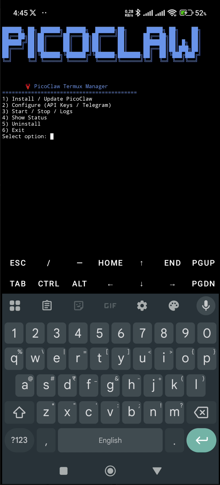
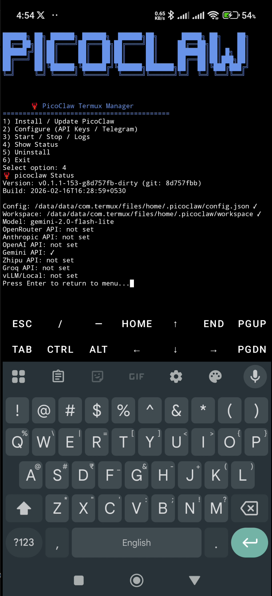

# PicoClaw on Android (Termux) Installation Guide

This guide provides two methods to install and run **PicoClaw** on your Android device.

## 🚀 Recommended: Easy One-Line Manager
We have provided an interactive script to handle installation, configuration, and management automatically.

Run this command in Termux:
```bash
pkg install -y curl && curl -sSL https://raw.githubusercontent.com/sipeed/picoclaw/main/assets/scripts/picoclaw-manager.sh -o picoclaw-manager.sh && chmod +x picoclaw-manager.sh && ./picoclaw-manager.sh
```




---

## 🛠️ Manual Method
If you prefer to set up everything manually, follow these steps:

## Prerequisites
- Android device with **Termux** installed (Download from [F-Droid](https://f-droid.org/en/packages/com.termux/)).
- Working internet connection.

## 1. Environment Setup
Open Termux and install the necessary packages:
```bash
pkg update && pkg upgrade
pkg install -y golang git make jq tmux
```

## 2. Clone and Prepare PicoClaw
```bash
git clone https://github.com/sipeed/picoclaw.git ~/.picoclaw-repo
cd ~/.picoclaw-repo
```

### Fix Go Version Requirement
Termux might have a slightly older version of Go than required by `go.mod`. Use this command to automatically adjust the requirement to match your installed Go version:
```bash
sed -i "s/go 1.25.7/go $(go version | awk '{print $3}' | sed 's/go//' | cut -d. -f1,2,3)/" go.mod
```

### Build and Install PicoClaw
Build the project with CGO disabled for maximum compatibility across different Android architectures, then move it to your system PATH:
```bash
export CGO_ENABLED=0
make deps
make build

# Install to Termux bin directory
cp build/picoclaw-linux-arm64 $PREFIX/bin/picoclaw
chmod +x $PREFIX/bin/picoclaw
```

Now you can run `picoclaw` from anywhere!

## 3. Initial Configuration
Initialise the workspace and generate a default configuration:
```bash
picoclaw onboard
```

This creates the configuration file at `~/.picoclaw/config.json`.

## 4. Connect to LLM and Telegram
Edit your configuration to add your Gemini (or other) API key and Telegram bot token:

### Add API Key (Gemini Example)
```bash
# Replace YOUR_GEMINI_KEY with your actual key
GEMINI_KEY="YOUR_GEMINI_KEY"
jq ".providers.gemini.api_key = \"$GEMINI_KEY\" | .agents.defaults.provider = \"gemini\" | .agents.defaults.model = \"gemini-2.0-flash-lite\"" ~/.picoclaw/config.json > ~/.picoclaw/config.json.tmp && mv ~/.picoclaw/config.json.tmp ~/.picoclaw/config.json
```

### Enable Telegram Bot
```bash
# Replace YOUR_BOT_TOKEN with your Telegram token
TELEGRAM_TOKEN="YOUR_BOT_TOKEN"
jq ".channels.telegram.enabled = true | .channels.telegram.token = \"$TELEGRAM_TOKEN\" | .channels.telegram.allow_from = []" ~/.picoclaw/config.json > ~/.picoclaw/config.json.tmp && mv ~/.picoclaw/config.json.tmp ~/.picoclaw/config.json
```

## 5. Running PicoClaw
It's recommended to run PicoClaw inside a `tmux` session so it keeps running in the background:

```bash
# Start a new tmux session named 'picoclaw'
tmux new -s picoclaw

# Inside tmux, start the gateway
picoclaw gateway
```

To detach from tmux, press `Ctrl+B` then `D`.
To re-attach later: `tmux attach -t picoclaw`.

## 6. Success!
Once the gateway is running, you should see:
`[INFO] telegram: Telegram bot connected {username=...}`

You can now chat with your PicoClaw assistant directly on Telegram!


