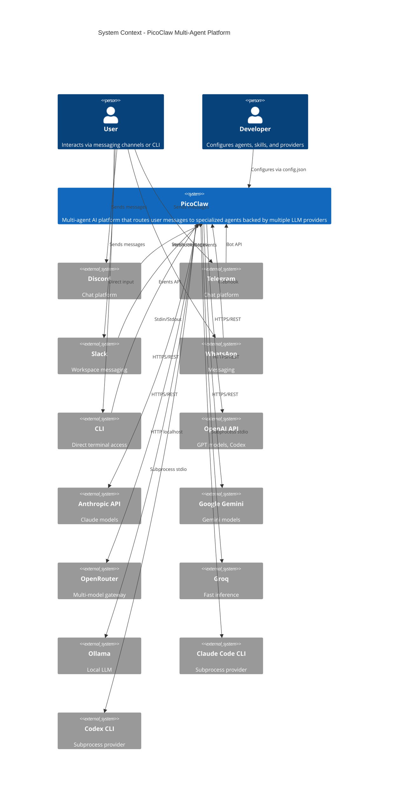

# C1 - System Context Diagram

PicoClaw as a multi-agent platform within its ecosystem.

## Key interactions

| Boundary | Protocol | Direction |
|----------|----------|-----------|
| User -> Channels | Platform-native (Discord bot, Telegram bot, etc.) | Inbound |
| Channels -> PicoClaw | Go channel bus (`pkg/bus`) | Internal |
| PicoClaw -> LLM Providers | HTTPS REST / Subprocess stdio | Outbound |
| Developer -> PicoClaw | `~/.picoclaw/config.json` + workspace files | Config |
