# C2 - Container Diagram

Runtime containers inside PicoClaw.

```mermaid
C4Container
    title Container Diagram - PicoClaw Runtime

    Person(user, "User")

    System_Boundary(picoclaw, "PicoClaw Process") {
        Container(gateway, "Gateway", "Go HTTP server", "Exposes health/ready endpoints, manages lifecycle")
        Container(channel_mgr, "Channel Manager", "pkg/channels", "Manages Discord, Telegram, Slack, WhatsApp, CLI connections")
        Container(msg_bus, "Message Bus", "pkg/bus", "Pub/sub event bus routing messages between channels and agents")
        Container(agent_loop, "Agent Loop", "pkg/agent", "Core orchestrator: routes messages to agents, manages tool loops, sessions")
        Container(registry, "Agent Registry", "pkg/agent", "Stores AgentInstance configs, resolves agent by ID or route")
        Container(router, "Route Resolver", "pkg/routing", "Matches incoming messages to agents based on channel/chat/peer bindings")
        Container(multiagent, "Multi-Agent Framework", "pkg/multiagent", "Blackboard shared context, Handoff mechanism, Agent discovery tools")
        Container(tools, "Tool Registry", "pkg/tools", "Shell, file, web, session, message, spawn, exec tools")
        Container(providers, "Provider Layer", "pkg/providers", "LLM provider abstraction: HTTP, CLI, OAuth, Fallback chain")
        Container(session, "Session Store", "pkg/session", "Per-agent session persistence with conversation history")
        Container(skills, "Skills Engine", "pkg/skills", "Loads SKILL.md files, provides skill tools to agents")
        Container(config, "Config", "pkg/config", "Loads config.json, agent definitions, model_list")
    }

    System_Ext(llm, "LLM Providers", "OpenAI, Anthropic, Gemini, Groq, Ollama, Claude CLI, Codex CLI")
    System_Ext(channels_ext, "Messaging Platforms", "Discord, Telegram, Slack, WhatsApp")

    Rel(user, channels_ext, "Sends message")
    Rel(channels_ext, channel_mgr, "Delivers event")
    Rel(channel_mgr, msg_bus, "Publishes message")
    Rel(msg_bus, agent_loop, "Delivers to agent")
    Rel(agent_loop, router, "Resolves target agent")
    Rel(agent_loop, registry, "Gets AgentInstance")
    Rel(agent_loop, multiagent, "Blackboard sync, Handoff")
    Rel(agent_loop, tools, "Executes tool calls")
    Rel(agent_loop, session, "Load/save history")
    Rel(agent_loop, skills, "Resolves skill tools")
    Rel(agent_loop, providers, "LLM Chat()")
    Rel(providers, llm, "API calls")
    Rel(gateway, agent_loop, "Lifecycle management")
    Rel(config, agent_loop, "Agent definitions")
    Rel(config, providers, "Provider config")
    Rel(config, registry, "AgentConfig list")
```

## Container responsibilities

| Container | Package | Key types |
|-----------|---------|-----------|
| Agent Loop | `pkg/agent` | `AgentLoop`, `RunToolLoop()` |
| Agent Registry | `pkg/agent` | `AgentRegistry`, `AgentInstance` |
| Route Resolver | `pkg/routing` | `RouteResolver`, `SessionKeyBuilder` |
| Multi-Agent | `pkg/multiagent` | `Blackboard`, `HandoffTool`, `ListAgentsTool` |
| Provider Layer | `pkg/providers` | `LLMProvider`, `FallbackChain`, `HTTPProvider` |
| Tool Registry | `pkg/tools` | `Tool`, `ContextualTool`, `AsyncTool` |
| Session Store | `pkg/session` | `SessionStore`, conversation history |
| Config | `pkg/config` | `Config`, `AgentConfig`, `ModelConfig` |
