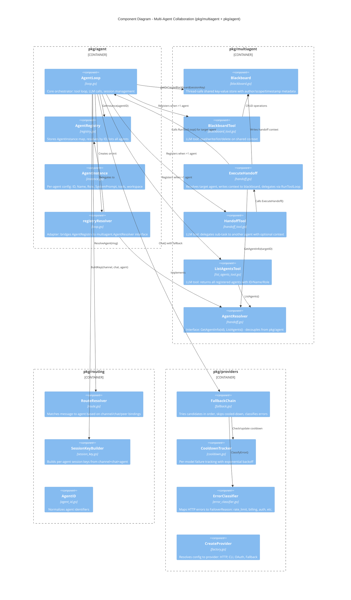
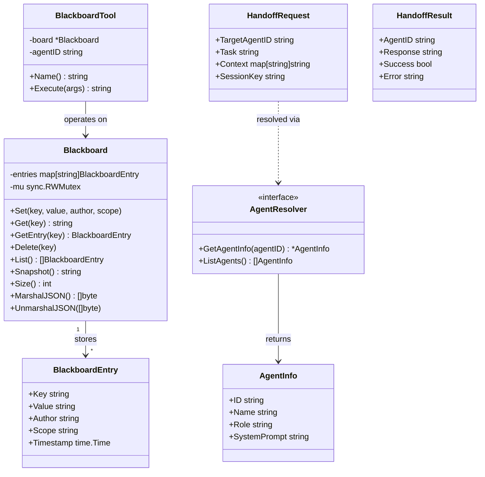
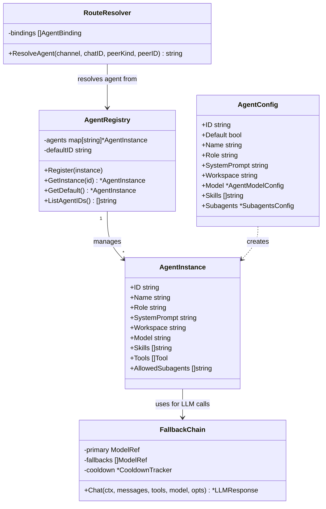
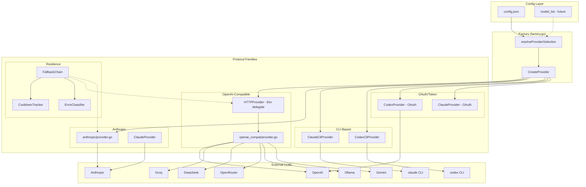

# C3 - Component Diagram: Multi-Agent Framework

Detailed view of the multi-agent collaboration components.

## Core Multi-Agent Components

## Blackboard Data Model

## Agent Registry & Instance Model

## Provider Protocol Architecture (PR #213 + #283)

