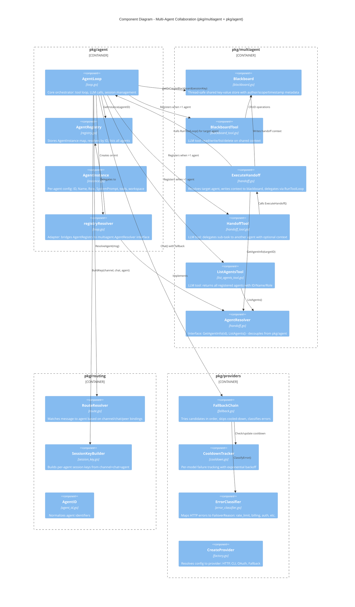
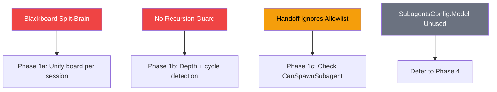
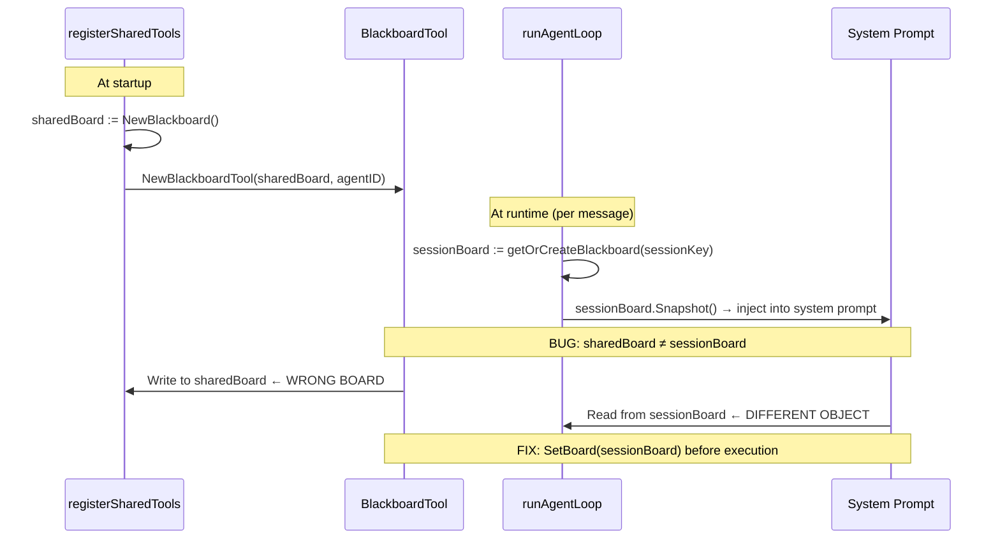
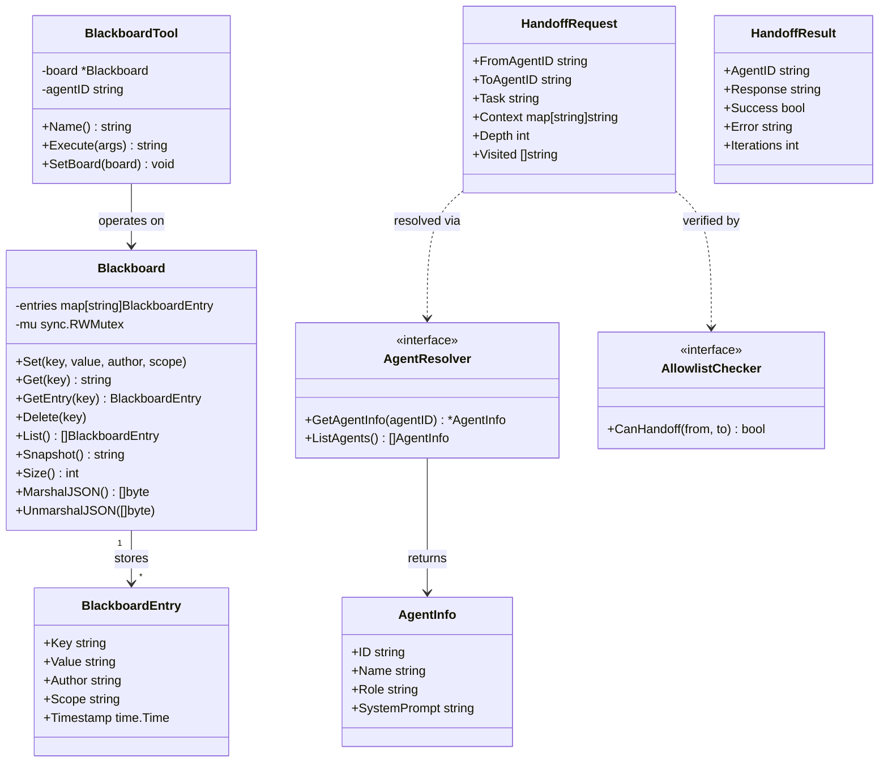
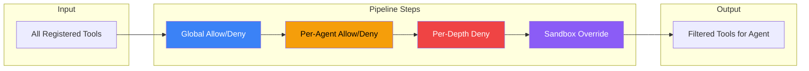
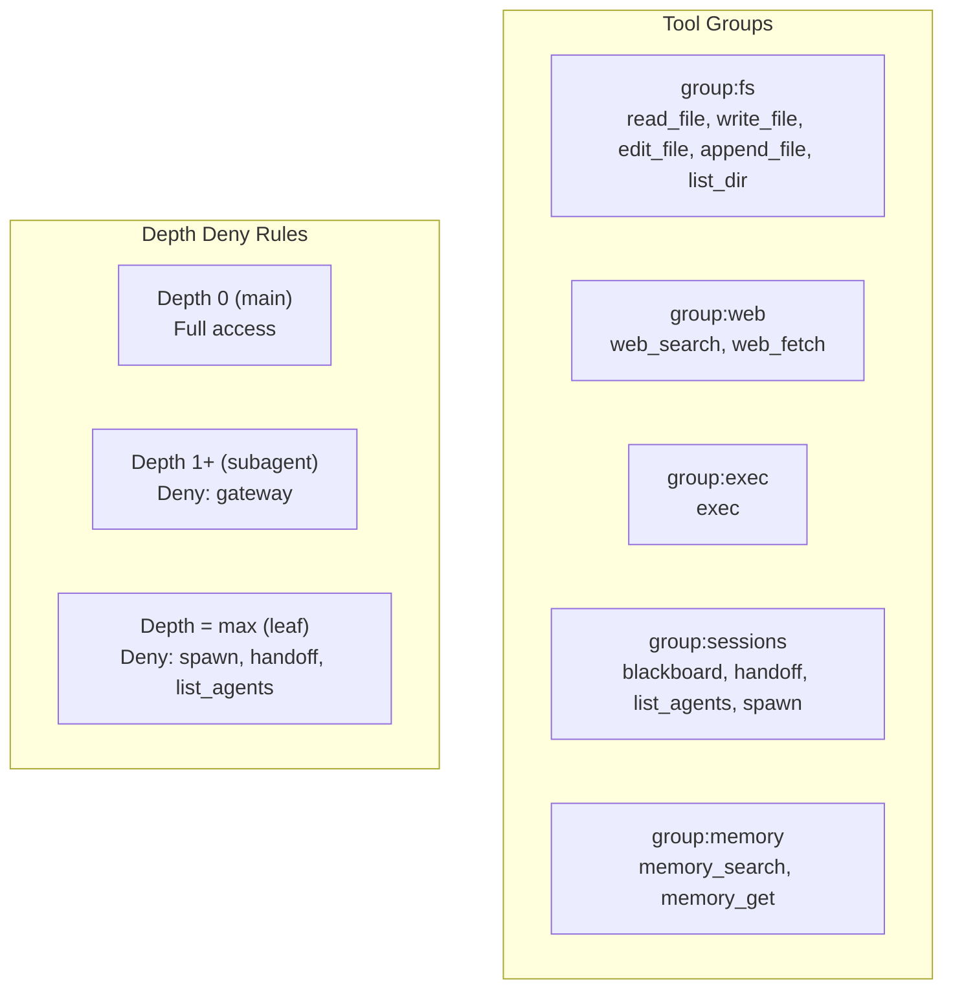
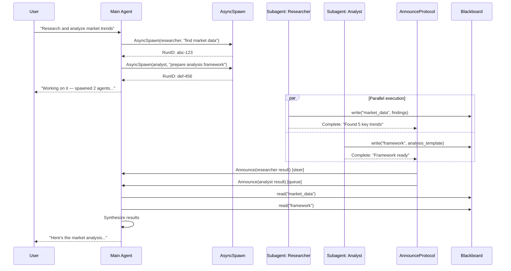
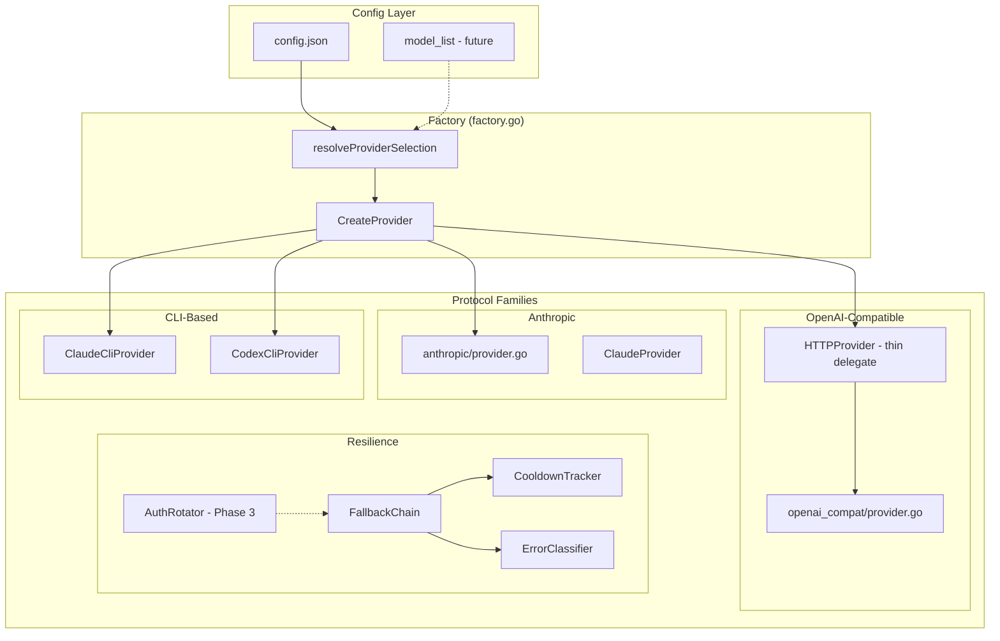

# C3 - Component Diagram: Multi-Agent Framework

Detailed view of the multi-agent collaboration components.
Includes both current (PR #423) and planned (Phases 1-4) components.

## Core Multi-Agent Components (Current)



## Planned Components (Phases 1-4)

```mermaid
C4Component
    title Planned Components - Hardening Phases

    Container_Boundary(tools_pkg, "pkg/tools (Phase 1-3)") {
        Component(hooks, "ToolHook", "hooks.go", "BeforeExecute/AfterExecute interface for tool call interception")
        Component(groups, "ToolGroups", "groups.go", "Named tool groups: fs, web, exec, sessions, memory")
        Component(policy, "PolicyPipeline", "policy.go", "Layered allow/deny: global -> per-agent -> per-depth")
        Component(loop_det, "LoopDetector", "loop_detector.go", "Generic repeat + ping-pong detection with configurable thresholds")
    }

    Container_Boundary(multiagent_new, "pkg/multiagent (Phase 3-4)") {
        Component(cascade, "CascadeStop", "cascade.go", "RunRegistry + recursive context cancellation")
        Component(spawn, "AsyncSpawn", "spawn.go", "Non-blocking agent invocation via goroutines")
        Component(announce, "AnnounceProtocol", "announce.go", "Result delivery: steer/queue/direct modes")
    }

    Container_Boundary(providers_new, "pkg/providers (Phase 3)") {
        Component(auth_rot, "AuthRotator", "auth_rotation.go", "Round-robin profiles + 2-track cooldown (transient + billing)")
    }

    Container_Boundary(gateway_new, "pkg/gateway (Phase 4)") {
        Component(dedup, "DedupCache", "dedup.go", "Idempotency layer with TTL-based deduplication")
    }

    Rel(hooks, loop_det, "AfterExecute feeds detection")
    Rel(hooks, policy, "BeforeExecute applies policy")
    Rel(policy, groups, "Resolves group references")
    Rel(cascade, spawn, "Tracks child runs")
    Rel(spawn, announce, "Delivers results")
    Rel(auth_rot, fallback, "Enhances with profile rotation")
```

## Known Issues (Pre-Phase 1)



### Blackboard Split-Brain Detail



## Blackboard Data Model



## Tool Policy Pipeline (Phase 2)





## Async Multi-Agent Flow (Phase 4)



## Provider Protocol Architecture (PR #213 + #283)


