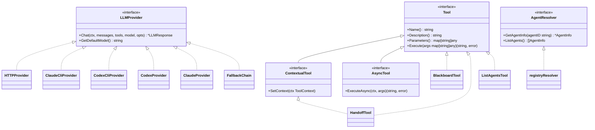
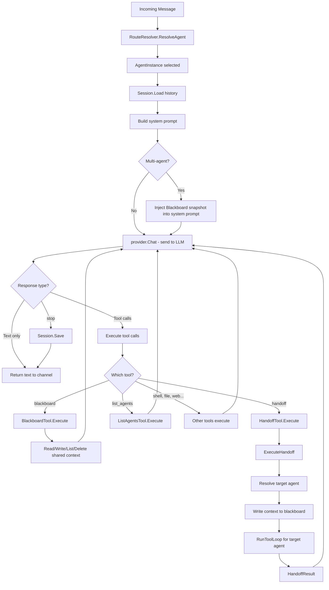
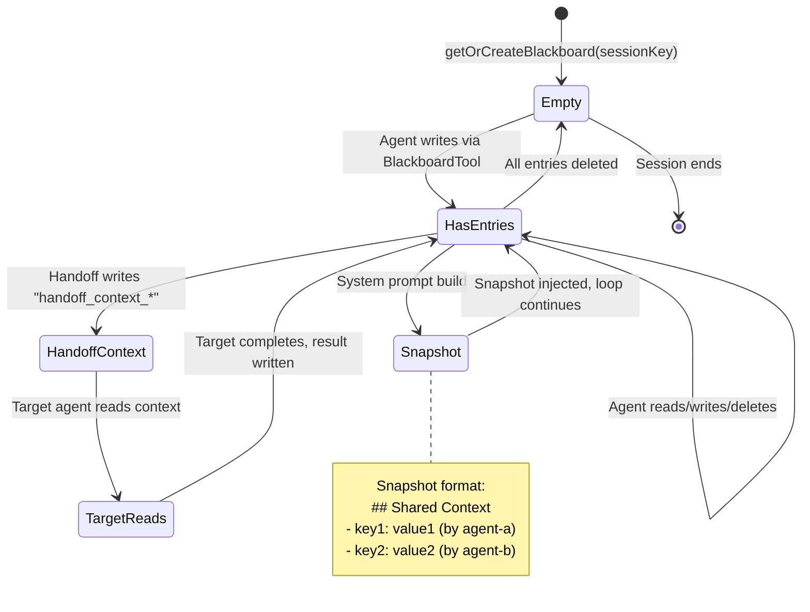
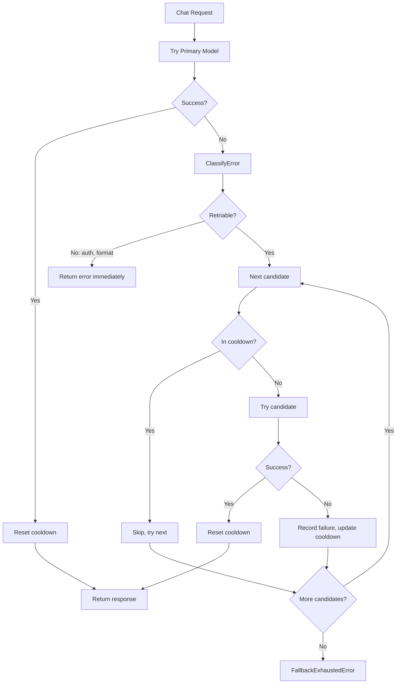

# C4 - Code Detail

Key interfaces, structs, and data flows at the code level.

## Core Interfaces

```mermaid
classDiagram
    class LLMProvider {
        <<interface>>
        +Chat(ctx, messages, tools, model, opts) *LLMResponse
        +GetDefaultModel() string
    }

    class Tool {
        <<interface>>
        +Name() string
        +Description() string
        +Parameters() map[string]any
        +Execute(args map[string]any) (string, error)
    }

    class ContextualTool {
        <<interface>>
        +SetContext(ctx ToolContext)
    }

    class AsyncTool {
        <<interface>>
        +ExecuteAsync(ctx, args) (string, error)
    }

    class AgentResolver {
        <<interface>>
        +GetAgentInfo(agentID string) *AgentInfo
        +ListAgents() []AgentInfo
    }

    Tool <|-- ContextualTool
    Tool <|-- AsyncTool
    LLMProvider <|.. HTTPProvider
    LLMProvider <|.. ClaudeCliProvider
    LLMProvider <|.. CodexCliProvider
    LLMProvider <|.. CodexProvider
    LLMProvider <|.. ClaudeProvider
    LLMProvider <|.. FallbackChain
    Tool <|.. BlackboardTool
    Tool <|.. HandoffTool
    Tool <|.. ListAgentsTool
    ContextualTool <|.. HandoffTool
    AgentResolver <|.. registryResolver
```

## Tool Loop Execution

```mermaid
flowchart TD
    MSG[Incoming Message] --> RR[RouteResolver.ResolveAgent]
    RR --> AI[AgentInstance selected]
    AI --> SL[Session.Load history]
    SL --> SP[Build system prompt]
    SP --> BS{Multi-agent?}

    BS -->|Yes| INJ[Inject Blackboard snapshot into system prompt]
    BS -->|No| LLM

    INJ --> LLM[provider.Chat - send to LLM]
    LLM --> RESP{Response type?}

    RESP -->|Text only| OUT[Return text to channel]
    RESP -->|Tool calls| TC[Execute tool calls]

    TC --> WHICH{Which tool?}

    WHICH -->|blackboard| BB[BlackboardTool.Execute]
    BB --> WL[Read/Write/List/Delete shared context]
    WL --> LLM

    WHICH -->|handoff| HO[HandoffTool.Execute]
    HO --> EH[ExecuteHandoff]
    EH --> TA[Resolve target agent]
    TA --> WC[Write context to blackboard]
    WC --> RTL[RunToolLoop for target agent]
    RTL --> HR[HandoffResult]
    HR --> LLM

    WHICH -->|list_agents| LA[ListAgentsTool.Execute]
    LA --> LLM

    WHICH -->|shell, file, web...| OT[Other tools execute]
    OT --> LLM

    RESP -->|stop| SS[Session.Save]
    SS --> OUT
```

## Blackboard Lifecycle

```mermaid
stateDiagram-v2
    [*] --> Empty: getOrCreateBlackboard(sessionKey)

    Empty --> HasEntries: Agent writes via BlackboardTool
    HasEntries --> HasEntries: Agent reads/writes/deletes
    HasEntries --> Snapshot: System prompt build
    Snapshot --> HasEntries: Snapshot injected, loop continues

    HasEntries --> HandoffContext: Handoff writes "handoff_context_*"
    HandoffContext --> TargetReads: Target agent reads context
    TargetReads --> HasEntries: Target completes, result written

    HasEntries --> Empty: All entries deleted
    Empty --> [*]: Session ends

    note right of Snapshot
        Snapshot format:
        ## Shared Context
        - key1: value1 (by agent-a)
        - key2: value2 (by agent-b)
    end note
```

## Fallback Chain Decision Tree

```mermaid
flowchart TD
    REQ[Chat Request] --> P[Try Primary Model]
    P --> PS{Success?}
    PS -->|Yes| RST[Reset cooldown] --> RET[Return response]
    PS -->|No| CLS[ClassifyError]

    CLS --> RT{Retriable?}
    RT -->|No: auth, format| FAIL[Return error immediately]
    RT -->|Yes| NXT[Next candidate]

    NXT --> CD{In cooldown?}
    CD -->|Yes| SKIP[Skip, try next]
    CD -->|No| TRY[Try candidate]

    SKIP --> MORE{More candidates?}
    TRY --> TS{Success?}
    TS -->|Yes| RST2[Reset cooldown] --> RET
    TS -->|No| REC[Record failure, update cooldown]
    REC --> MORE

    MORE -->|Yes| NXT
    MORE -->|No| EXHAUST[FallbackExhaustedError]
```
