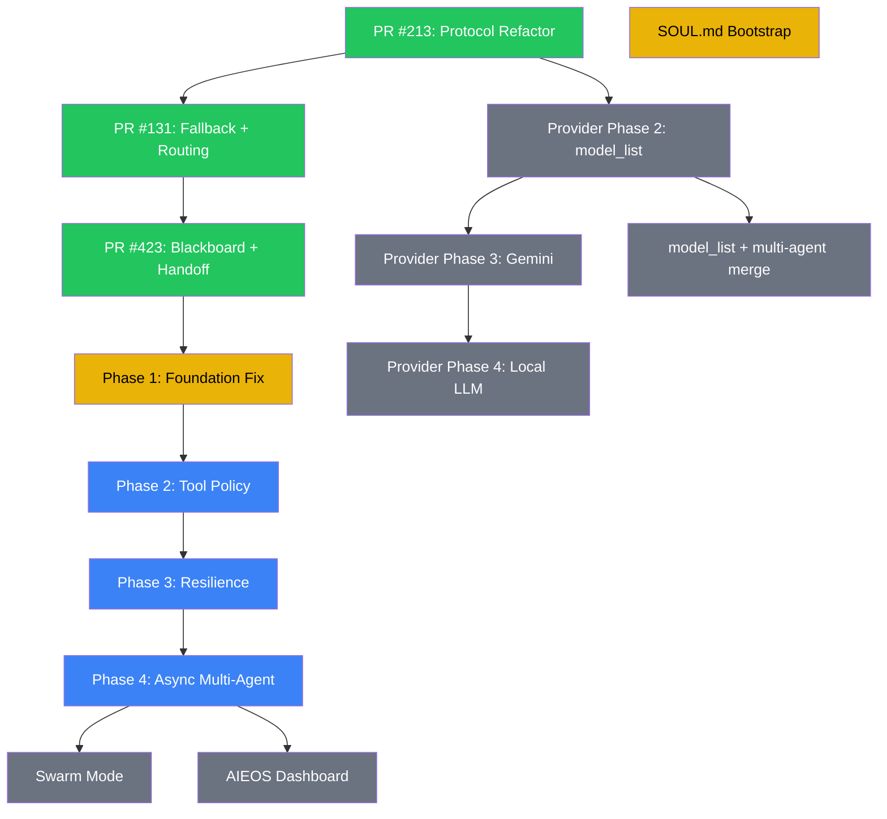

# Multi-Agent Feature Roadmap

Phased implementation plan based on issues #294, #283, and discussion #122.
Updated with OpenClaw (moltbot) gap analysis — patterns validated by OpenAI (founder hired).

## Phase Overview

```mermaid
gantt
    title PicoClaw Multi-Agent Roadmap
    dateFormat YYYY-MM-DD
    axisFormat %b %d

    section Provider Refactor (#283)
    Phase 1: Protocol packages (PR #213)      :done, p1, 2026-02-01, 2026-02-18
    Phase 2: model_list + explicit api_type    :p2, 2026-03-15, 2026-04-01
    Phase 3: Independent Gemini protocol       :p3, after p2, 7d
    Phase 4: Local LLM + cleanup              :p4, after p3, 5d

    section Multi-Agent (#294)
    Fallback chain + routing (PR #131)         :done, ma1, 2026-02-01, 2026-02-18
    Blackboard + Handoff + Discovery (PR #423) :done, ma2, 2026-02-18, 2026-03-01
    Phase 1: Foundation Fix + Guardrails       :active, h1, 2026-02-19, 2026-02-28
    Phase 2: Tool Policy Pipeline              :h2, after h1, 10d
    Phase 3: Resilience                        :h3, after h2, 10d
    Phase 4: Async Multi-Agent                 :h4, after h3, 14d

    section Workspace
    SOUL.md Bootstrap (separate PR)            :active, soul, 2026-02-19, 2026-03-01

    section Integration
    model_list + multi-agent config merge      :int1, after p2, 7d
    Community agent marketplace                :int2, after h4, 21d
```

## Hardening Phases (Based on OpenClaw Gap Analysis)

### Phase 1: Foundation Fix + Guardrails

| Task | Description | OpenClaw Reference |
|------|-------------|-------------------|
| Fix blackboard split-brain | Unify static board and session board | N/A (picoclaw-specific bug) |
| Recursion guard | Depth counter + cycle detection in handoff | `subagent-depth.ts` |
| Handoff allowlist | Enforce CanSpawnSubagent in ExecuteHandoff | `subagent-spawn.ts` (allowlist check) |
| Before-tool-call hooks | ToolHook interface for extensibility | `pi-tools.before-tool-call.ts` |

### Phase 2: Tool Policy Pipeline

| Task | Description | OpenClaw Reference |
|------|-------------|-------------------|
| Tool groups | Named groups: fs, web, exec, sessions, memory | `tool-policy.ts` (TOOL_GROUPS) |
| Per-agent allow/deny | Config-driven tool filtering | `tool-policy-pipeline.ts` |
| Subagent deny-by-depth | Leaf agents can't spawn/handoff | `pi-tools.policy.ts` |
| Pipeline composition | Layered: global → agent → depth | `tool-policy-pipeline.ts` |

### Phase 3: Resilience

| Task | Description | OpenClaw Reference |
|------|-------------|-------------------|
| Loop detection | Generic repeat + ping-pong detectors | `tool-loop-detection.ts` |
| Context overflow recovery | Compaction → truncation → user error | `pi-embedded-runner/run.ts` |
| Auth profile rotation | Round-robin + 2-track cooldown | `auth-profiles/order.ts` + `usage.ts` |
| Cascade stop | Context cancellation propagation | `subagents-tool.ts` |

### Phase 4: Async Multi-Agent

| Task | Description | OpenClaw Reference |
|------|-------------|-------------------|
| Async spawn | Non-blocking via goroutines | `subagent-spawn.ts` |
| Announce protocol | Result injection: steer/queue/direct | `subagent-announce.ts` |
| Process isolation | Scope-keyed exec tool | Process supervisor (scope-keyed) |
| Idempotency | Dedup cache for gateway RPC | `server-methods/agent.ts` |

## Completed

| Phase | PR | Description |
|-------|----|-------------|
| Provider Protocol Refactor | [#213](https://github.com/sipeed/picoclaw/pull/213) | `protocoltypes/`, `openai_compat/`, `anthropic/` packages |
| Fallback Chain + Routing | [#131](https://github.com/sipeed/picoclaw/pull/131) | `FallbackChain`, `CooldownTracker`, `RouteResolver` |
| Blackboard + Handoff + Discovery | [#423](https://github.com/sipeed/picoclaw/pull/423) | Blackboard, HandoffTool, ListAgentsTool, AgentResolver |
| golangci-lint compliance | [#304](https://github.com/sipeed/picoclaw/pull/304) | 62 lint issues fixed in our code |
| C4 Architecture docs | [#423](https://github.com/sipeed/picoclaw/pull/423) | This directory |

## Dependency Graph



## Key Decisions

| Decision | Choice | Rationale |
|----------|--------|-----------|
| Shared context pattern | Blackboard (key-value) | OpenClaw has no shared state (announce-only). Blackboard is more flexible. |
| Handoff mechanism | Synchronous → async in Phase 4 | Start simple, add async when foundation is solid |
| Tool policy model | Layered pipeline (like OpenClaw) | Composable, debuggable, per-layer narrowing |
| Loop detection | 2 detectors (repeat + ping-pong) | OpenClaw has 4 — start with 2 most impactful |
| Auth rotation | 2-track cooldown (transient + billing) | Directly ported from OpenClaw, proven in production |
| Recursion guard | Depth counter + visited set | Simple, O(1) check, prevents both depth and cycles |
| Reference implementation | OpenClaw (moltbot) | Founder hired by OpenAI — patterns are industry-validated |

## picoclaw vs. OpenClaw Comparison

| Feature | OpenClaw (Node.js) | picoclaw (Go) | Advantage |
|---------|-------------------|---------------|-----------|
| Shared agent state | None (announce-only) | Blackboard | picoclaw |
| Performance | Node.js runtime | Single Go binary | picoclaw (10x less memory) |
| Deployment | npm install + node | Copy binary | picoclaw |
| Tool policy | 8-layer pipeline | Planned (Phase 2) | OpenClaw (for now) |
| Loop detection | 4 detectors | Planned (Phase 3) | OpenClaw (for now) |
| Auth rotation | 2-track + file lock | FallbackChain only | OpenClaw (for now) |
| Async spawn | Lane-based + announce | Planned (Phase 4) | OpenClaw (for now) |
| Concurrency model | async/await | goroutines | picoclaw |
| Type safety | TypeScript | Go compiler | picoclaw |
