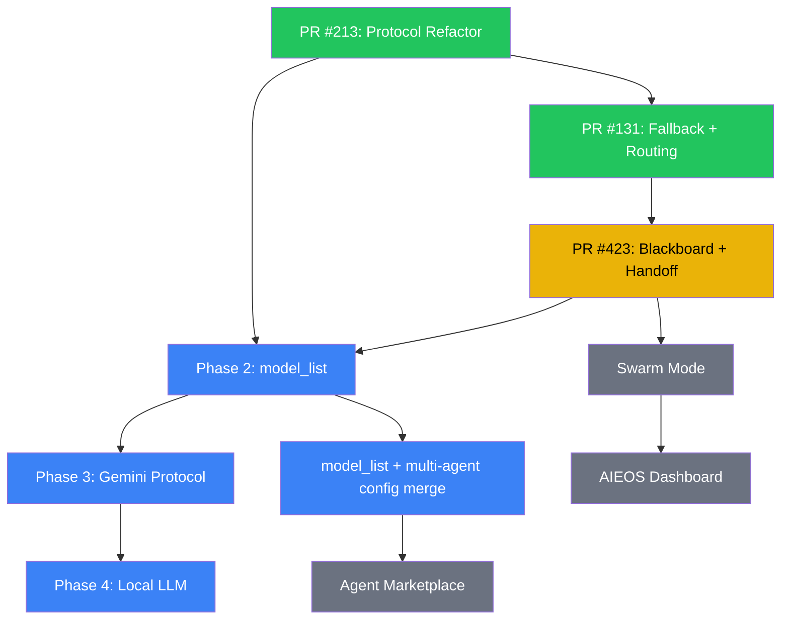

# Multi-Agent Feature Roadmap

Phased implementation plan based on issues #294, #283, and discussion #122.

## Phase Overview

```mermaid
gantt
    title PicoClaw Multi-Agent Roadmap
    dateFormat YYYY-MM-DD
    axisFormat %b %d

    section Provider Refactor (#283)
    Phase 1: Protocol packages (PR #213)      :done, p1, 2026-02-01, 2026-02-18
    Phase 2: model_list + explicit api_type    :active, p2, 2026-02-19, 2026-03-05
    Phase 3: Independent Gemini protocol       :p3, after p2, 7d
    Phase 4: Local LLM + cleanup              :p4, after p3, 5d

    section Multi-Agent (#294)
    Fallback chain + routing (PR #131)         :done, ma1, 2026-02-01, 2026-02-18
    Blackboard + Handoff + Discovery (PR #423) :active, ma2, 2026-02-18, 2026-03-01
    Swarm mode (async agent negotiation)       :ma3, after ma2, 14d
    Visual AIEOS dashboard                     :ma4, after ma3, 14d

    section Integration
    model_list + multi-agent config merge      :int1, after p2, 7d
    Community agent marketplace                :int2, after ma3, 21d
```

## Detailed Status

### Done

| Phase | PR | Description |
|-------|----|-------------|
| Provider Protocol Refactor | [#213](https://github.com/sipeed/picoclaw/pull/213) | `protocoltypes/`, `openai_compat/`, `anthropic/` packages, thin delegates, factory refactor |
| Fallback Chain + Routing | [#131](https://github.com/sipeed/picoclaw/pull/131) | `FallbackChain`, `CooldownTracker`, `ErrorClassifier`, `AgentRegistry`, `RouteResolver`, `AgentInstance`, channel peer metadata |

### In Progress (PR #423)

| Component | Package | Files | Status |
|-----------|---------|-------|--------|
| Agent Config extensions | `pkg/config` | `config.go` | `Role`, `SystemPrompt` fields added |
| Blackboard shared context | `pkg/multiagent` | `blackboard.go`, `blackboard_tool.go` | Complete, 18 tests |
| Agent Handoff | `pkg/multiagent` | `handoff.go`, `handoff_tool.go` | Complete, 10 tests |
| Agent Discovery | `pkg/multiagent` | `list_agents_tool.go` | Complete |
| AgentLoop integration | `pkg/agent` | `loop.go` | Snapshot injection, tool registration, per-session blackboards |
| AgentResolver interface | `pkg/multiagent` | `handoff.go` | Decouples multiagent from agent pkg |

### Next: Provider Phase 2 - `model_list` (#283)

Based on @yinwm's design in [issue #283](https://github.com/sipeed/picoclaw/issues/283#issuecomment-3915867555):

```
model_list config -> model-centric resolution -> protocol prefix routing
```

| Task | Description | Impact |
|------|-------------|--------|
| `ModelConfig` struct | `model_name`, `model` (protocol/id), `api_base`, `api_key` | Eliminates per-vendor code changes |
| Protocol prefix routing | `openai/`, `anthropic/`, `antigravity/` prefixes | Clean protocol selection |
| Backward compatibility | Support both `providers` (deprecated) and `model_list` | Smooth migration |
| Agent model reference | Agents reference `model_name` instead of `provider` + `model` | Simplifies multi-agent config |

### Future: Out of Scope for #294

| Feature | Issue | Depends on |
|---------|-------|------------|
| Intelligent Model Routing (small/large model token saving) | TBD | model_list + multi-agent |
| Swarm Mode (autonomous agent-to-agent negotiation) | TBD | Handoff foundation |
| Visual AIEOS Dashboard | TBD | All above |
| Community Agent Marketplace | TBD | Stable agent interface |

## Dependency Graph



## Key Decisions

| Decision | Choice | Rationale |
|----------|--------|-----------|
| Shared context pattern | Blackboard (key-value) | Simple, auditable, no coupling between agents |
| Handoff mechanism | Synchronous via RunToolLoop | Predictable, debuggable; async deferred to Swarm Mode |
| Circular import avoidance | `AgentResolver` interface in pkg/multiagent | Clean dependency direction: agent -> multiagent, not reverse |
| Multi-agent tool activation | Conditional on `len(agents) > 1` | Zero overhead for single-agent setups |
| Provider abstraction | Protocol-first (openai_compat, anthropic) | Adding new OpenAI-compat providers = config only |
| Config evolution | model_list (LiteLLM-inspired) | Model-centric aligns with multi-agent where agents pick models |
