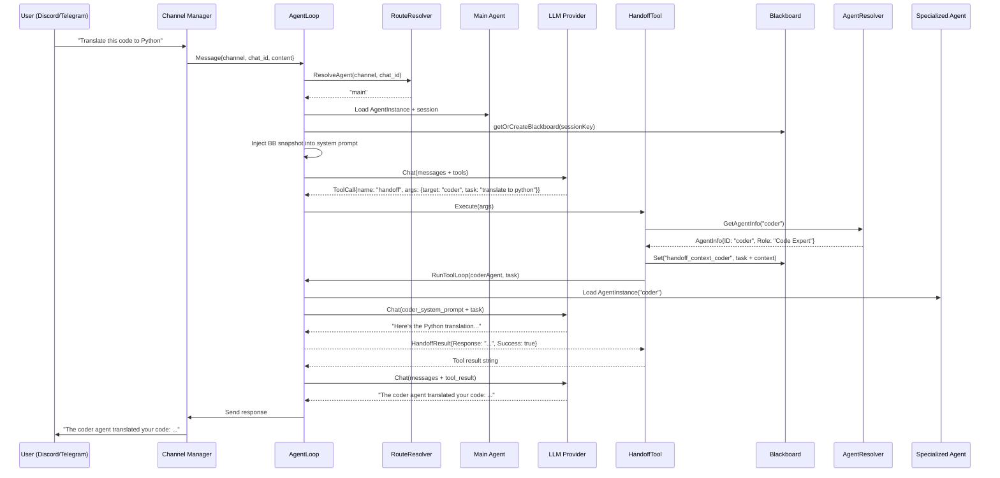
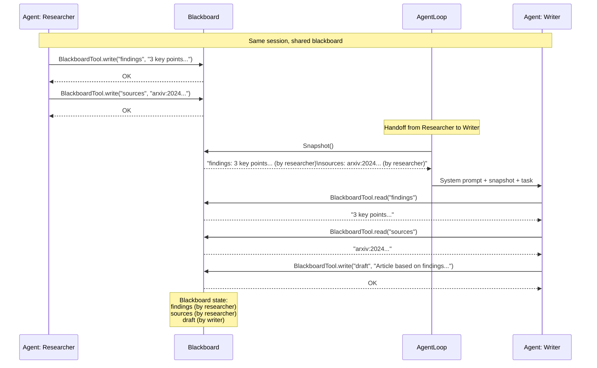
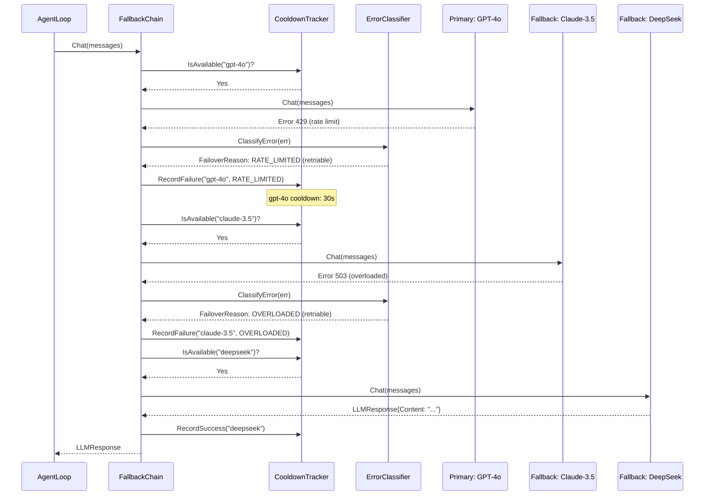
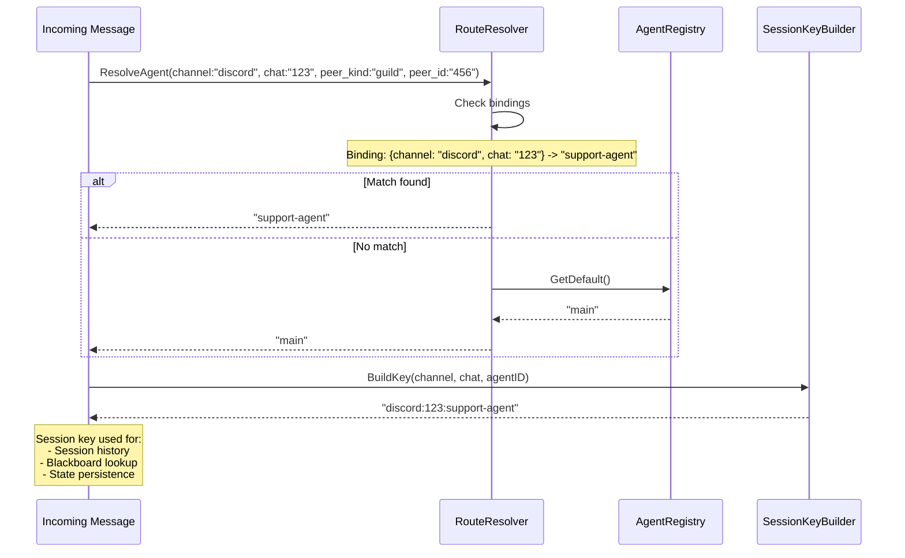

# Sequence Diagrams

Runtime interaction flows for multi-agent collaboration.

## 1. Agent Handoff Flow

A main agent delegates a sub-task to a specialized agent.



## 2. Blackboard Shared Context Flow

Multiple agents share data through the blackboard within a session.



## 3. Model Fallback Chain Flow

Provider resilience with automatic failover.



## 4. Route Resolution Flow

How incoming messages are routed to the correct agent.



## 5. Multi-Agent Configuration Lifecycle

From config.json to running agents.

```mermaid
sequenceDiagram
    participant CFG as config.json
    participant REG as AgentRegistry
    participant INST as AgentInstance
    participant LOOP as AgentLoop
    participant TOOLS as Tool Registry

    CFG->>REG: Parse agents.list[]

    loop For each AgentConfig
        REG->>INST: NewAgentInstance(agentCfg, cfg)
        INST->>INST: Set ID, Name, Role, SystemPrompt
        INST->>INST: Create per-agent tools (shell, file, exec)
        INST-->>REG: Register(instance)
    end

    alt No agents.list configured
        REG->>INST: Create implicit "main" agent
        INST-->>REG: Register as default
    end

    REG-->>LOOP: Registry ready

    LOOP->>LOOP: Check registry.ListAgentIDs()

    alt len(agents) > 1
        LOOP->>TOOLS: Register BlackboardTool
        LOOP->>TOOLS: Register HandoffTool
        LOOP->>TOOLS: Register ListAgentsTool
        Note over TOOLS: Multi-agent tools active
    else Single agent
        Note over TOOLS: No multi-agent tools (zero overhead)
    end
```
