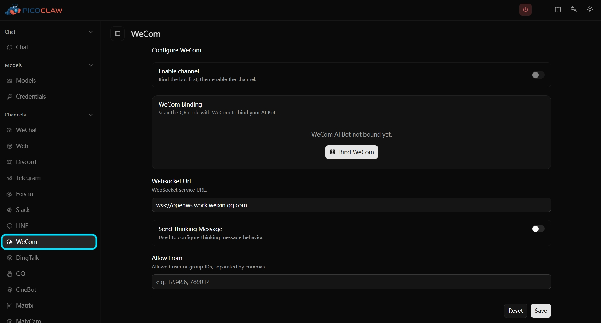

> 回到 [README](../../project/README.zh-tw.md)

# WeCom

PicoClaw 使用官方 WeCom AI Bot WebSocket API，將 WeCom 提供為單一 `channels.wecom` 頻道。
這項變更以統一的設定模型，取代舊版分開提供的 `wecom`、`wecom_app` 及 `wecom_aibot`。

> 不需要公開的 Webhook 回呼 URL。PicoClaw 會建立連往 WeCom 的對外 WebSocket 連線。

## 此頻道支援的功能

- 傳送私人聊天及群組聊天訊息
- 使用 WeCom AI Bot 通訊協定傳送頻道端串流回覆
- 接收文字、語音、圖片、檔案、影片及混合訊息
- 傳送文字及媒體回覆（`image`、`file`、`voice`、`video`）
- 使用 Web UI 或 CLI 掃描 QR Code 完成綁定
- 共用允許清單及 `reasoning_channel_id` 路由

---

## 快速開始

### 選項 1：使用 Web UI 掃描 QR Code 綁定（建議）

開啟 Web UI，前往 [頻道] → [WeCom]，再按一下 QR Code 綁定按鈕。使用 WeCom 掃描 QR Code 並在應用程式中確認後，系統會自動儲存認證資訊。

<p align="center">

</p>

### 選項 2：使用 CLI 掃描 QR Code 登入

請執行：

```bash
picoclaw auth wecom
```

此命令會：
1. 向 WeCom 要求 QR Code，並顯示在終端機中
2. 同時顯示 **QR Code 連結**；如果不易掃描終端機中的 QR Code，可在瀏覽器開啟此連結
3. 輪詢確認狀態；掃描後，還必須在 WeCom 應用程式中**確認登入**
4. 成功後，將 `bot_id` 及 `secret` 寫入 `channels.wecom` 並儲存設定

預設逾時時間為 **5 分鐘**。可使用 `--timeout` 延長：

```bash
picoclaw auth wecom --timeout 10m
```

> ⚠️ 只掃描 QR Code 並不足以完成登入，還必須在 WeCom 應用程式中點選 **[確認]**，否則命令將會逾時。

### 選項 3：手動設定

如果已從 WeCom AI Bot 平台取得 `bot_id` 及 `secret`，可直接設定：

```json
{
  "channel_list": {
    "wecom": {
      "enabled": true,
      "type": "wecom",
      "bot_id": "YOUR_BOT_ID",
      "secret": "YOUR_SECRET",
      "websocket_url": "wss://openws.work.weixin.qq.com",
      "send_thinking_message": true,
      "allow_from": [],
      "reasoning_channel_id": ""
    }
  }
}
```

---

## 設定

| 欄位 | 型別 | 預設值 | 說明 |
| ----- | ---- | ------ | ---- |
| `enabled` | bool | `false` | 啟用 WeCom 頻道。 |
| `bot_id` | string | — | WeCom AI Bot 識別碼。啟用頻道時為必填。 |
| `secret` | string | — | WeCom AI Bot Secret。以加密方式儲存在 `.security.yml`，啟用頻道時為必填。 |
| `websocket_url` | string | `wss://openws.work.weixin.qq.com` | WeCom WebSocket 端點。 |
| `send_thinking_message` | bool | `true` | 在開始串流回覆前傳送 `Processing...` 訊息。 |
| `allow_from` | array | `[]` | 傳送者允許清單。空白清單表示允許所有傳送者。 |
| `reasoning_channel_id` | string | `""` | 選用的聊天 ID，用來將推理／思考內容路由至另一個對話。 |

### 環境變數

所有欄位都能使用以 `PICOCLAW_CHANNELS_WECOM_` 開頭的環境變數覆寫：

| 環境變數 | 對應欄位 |
| -------- | -------- |
| `PICOCLAW_CHANNELS_WECOM_ENABLED` | `enabled` |
| `PICOCLAW_CHANNELS_WECOM_BOT_ID` | `bot_id` |
| `PICOCLAW_CHANNELS_WECOM_SECRET` | `secret` |
| `PICOCLAW_CHANNELS_WECOM_WEBSOCKET_URL` | `websocket_url` |
| `PICOCLAW_CHANNELS_WECOM_SEND_THINKING_MESSAGE` | `send_thinking_message` |
| `PICOCLAW_CHANNELS_WECOM_ALLOW_FROM` | `allow_from` |
| `PICOCLAW_CHANNELS_WECOM_REASONING_CHANNEL_ID` | `reasoning_channel_id` |

---

## 執行階段行為

- PicoClaw 會維持作用中的 WeCom 對話輪次，讓串流回覆盡可能繼續使用同一個串流。
- 串流回覆時間最長為 **5.5 分鐘**，兩次傳送之間至少間隔 **500 ms**。
- 無法繼續使用串流時，PicoClaw 會改用主動推播方式傳送回覆。
- 聊天路由關聯會在閒置 **30 分鐘**後到期。
- 系統會先將收到的媒體下載至本機媒體儲存區，再交給代理人處理。
- 系統會先將要傳送的媒體以暫存檔形式上傳至 WeCom，再傳送媒體訊息。
- 系統會偵測並略過重複訊息（使用最近 1000 個訊息 ID 的環形緩衝區）。

---

## 從舊版 WeCom 設定移轉

| 舊版設定 | 移轉方式 |
| -------- | -------- |
| `channels.wecom`（Webhook Bot） | 改用含有 `bot_id` 及 `secret` 的 `channels.wecom`。 |
| `channels.wecom_app` | 移除，改用 `channels.wecom`。 |
| `channels.wecom_aibot` | 將 `bot_id` 及 `secret` 移至 `channels.wecom`。 |
| `token`、`encoding_aes_key`、`webhook_url`、`webhook_path` | 已不再使用，請從設定中移除。 |
| `corp_id`、`corp_secret`、`agent_id` | 已不再使用，請從設定中移除。 |
| `welcome_message`、`processing_message`、`max_steps` | 已不再屬於 WeCom 頻道設定。 |

---

## 疑難排解

### QR Code 綁定逾時

- 掃描 QR Code 後，還必須在 WeCom 應用程式中**確認登入**；只掃描並不足以完成登入。
- 使用較長的 `--timeout` 重新執行：`picoclaw auth wecom --timeout 10m`
- 如果不易掃描終端機中的 QR Code，請使用顯示在下方的 **QR Code 連結**，改以瀏覽器開啟。

### QR Code 已過期

- QR Code 的有效時間有限。請重新執行 `picoclaw auth wecom` 取得新的 QR Code。

### WebSocket 連線失敗

- 確認 `bot_id` 及 `secret` 是否正確。
- 確認主機能否連線至 `wss://openws.work.weixin.qq.com`（對外 WebSocket，不需要對內連接埠）。

### 未收到回覆

- 檢查 `allow_from` 是否封鎖該傳送者。
- 檢查 `channels.wecom.bot_id` 及 `channels.wecom.secret` 是否已設定且非空值。
