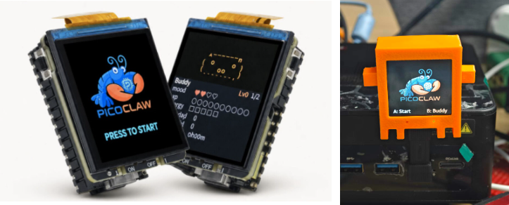

<div align="center">


<h1>PicoClaw：Go 打造的極致輕量 AI 助理</h1>

<h3>$10 硬體 · 10MB 記憶體 · 毫秒啟動 · Let's Go, PicoClaw!</h3>
  <p>
    
    
    
    <br>
    <a href="https://picoclaw.io"></a>
    <a href="https://docs.picoclaw.io/"></a>
    <a href="https://deepwiki.com/sipeed/picoclaw"></a>
    <br>
    <a href="https://x.com/SipeedIO"></a>
    <a href="../../assets/wechat.png"></a>
    <a href="https://discord.gg/V4sAZ9XWpN"></a>
  </p>

[简体中文](README.zh.md) | **繁體中文** | [日本語](README.ja.md) | [한국어](README.ko.md) | [Português](README.pt-br.md) | [Tiếng Việt](README.vi.md) | [Français](README.fr.md) | [Italiano](README.it.md) | [Bahasa Indonesia](README.id.md) | [Malay](README.ms.md) | [English](../../README.md)

</div>

---

> **PicoClaw** 是由 [Sipeed](https://sipeed.com) 發起的獨立開源專案，完全使用 **Go 語言**從零編寫——並非 OpenClaw、NanoBot 或其他專案的分支。

**PicoClaw** 是一款受 [NanoBot](https://github.com/HKUDS/nanobot) 啟發的超輕量個人 AI 助理。它以 **Go 語言**從零重建，歷經「自舉 (self-bootstrapping)」過程——由 AI Agent 自身驅動架構遷移與程式碼優化。

**可在 $10 硬體上以 <10MB 記憶體運行**——比 OpenClaw 節省 99% 記憶體，比 Mac mini 便宜 98%！

<table align="center">
<tr align="center">
<td align="center" valign="top">
<p align="center">

</p>
</td>
<td align="center" valign="top">
<p align="center">

</p>
</td>
</tr>
</table>

> [!CAUTION]
> **安全聲明**
>
> * **無加密貨幣 (NO CRYPTO)：** PicoClaw **未**發行任何官方代幣或虛擬貨幣。所有在 `pump.fun` 或其他交易平台上的相關聲稱均為**詐騙**。
> * **官方網域：** 唯一的官方網站是 **[picoclaw.io](https://picoclaw.io)**，公司官網是 **[sipeed.com](https://sipeed.com)**。
> * **注意：** 許多 `.ai/.org/.com/.net/...` 網域已被第三方搶注，請勿輕信。
> * **注意：** PicoClaw 目前處於早期快速開發階段，可能存在尚未修復的安全性問題。請勿在 v1.0 正式版發布前部署至正式環境。
> * **注意：** PicoClaw 近期合併了大量 PR，近期版本記憶體用量可能達 10–20MB。功能穩定後將進行資源優化。

## 📢 最新消息

2026-05-11 🛒 **LicheeRV-Claw 已上架 AliExpress！** 現在可從 [AliExpress](https://www.aliexpress.com/item/1005006519668532.html) 購買 LicheeRV-Claw，更方便在小型 RISC-V 硬體上體驗 PicoClaw。

<p align="center">
  <a href="https://www.aliexpress.com/item/1005006519668532.html">
    
  </a>
</p>

2026-03-31 📱 **Android 支援！** PicoClaw 現可在 Android 上執行！APK 下載：[picoclaw.io](https://picoclaw.io/download)

2026-03-25 🚀 **v0.2.4 發布！** Agent 架構全面重構（SubTurn、Hooks、Steering、EventBus）、微信／企業微信深度整合、安全體系強化（.security.yml、敏感資料過濾）、新增 Provider（AWS Bedrock、Azure、小米 MiMo），以及 35 項錯誤修復。PicoClaw 已達 **26K Stars**！

2026-03-17 🚀 **v0.2.3 發布！** 系統匣 UI（Windows & Linux）、子 Agent 狀態查詢（`spawn_status`）、實驗性 Gateway 熱重載、Cron 安全門控，以及 2 項安全性修復。PicoClaw 已達 **25K Stars**！

2026-03-09 🎉 **v0.2.1——史上最大更新！** MCP 協定支援、4 個新 Channel（Matrix/IRC/WeCom/Discord Proxy）、3 個新 Provider（Kimi/Minimax/Avian）、視覺管線、JSONL 記憶體存儲、模型路由。

2026-02-28 📦 **v0.2.0** 發布，支援 Docker Compose 與 Web UI 啟動器。

<details>
<summary>更早的消息...</summary>

2026-02-26 🎉 PicoClaw 僅 17 天突破 **20K Stars**！Channel 自動編排與能力介面上線。

2026-02-16 🎉 PicoClaw 一週內突破 12K Stars！社群維護者角色與[路線圖](../../ROADMAP.md)正式發布。

2026-02-13 🎉 PicoClaw 4 天內突破 5000 Stars！專案路線圖與開發者社群籌建中。

2026-02-09 🎉 **PicoClaw 正式發布！** 僅用 1 天構建，將 AI Agent 帶入 $10 硬體與 <10MB 記憶體的世界。Let's Go, PicoClaw!

</details>

## ✨ 特色

🪶 **超輕量：** 核心記憶體用量 <10MB——比 OpenClaw 小 99%。*

💰 **極低成本：** 高效到足以在 $10 硬體上運行——比 Mac mini 便宜 98%。

⚡️ **閃電啟動：** 啟動速度快 400 倍，即使在 0.6GHz 單核處理器上也能在 1 秒內開機。

🌍 **真正可攜：** 跨 RISC-V、ARM、MIPS 與 x86 架構的單一執行檔，一份二進位檔，隨處可跑！

🤖 **AI 自舉：** 純 Go 語言原生實作——95% 的核心程式碼由 Agent 生成，並經由人機回圈 (human-in-the-loop) 審查微調。

🔌 **MCP 支援：** 原生整合 [Model Context Protocol](https://modelcontextprotocol.io/)——連接任意 MCP 伺服器即可擴充 Agent 能力。

👁️ **視覺管線：** 直接向 Agent 傳送圖片與檔案——自動 base64 編碼，對接多模態 LLM。

🧠 **智慧路由：** 基於規則的模型路由——簡單查詢導向輕量模型，節省 API 費用。

_*近期版本因快速合併 PR，記憶體用量可能達 10–20MB，資源優化已列入計畫。啟動速度比較基於 0.8GHz 單核實測（見下方比較表）。_

<div align="center">

|                                | OpenClaw      | NanoBot                  | **PicoClaw**                           |
| ------------------------------ | ------------- | ------------------------ | -------------------------------------- |
| **語言**                       | TypeScript    | Python                   | **Go**                                 |
| **RAM**                        | >1GB          | >100MB                   | **< 10MB***                            |
| **啟動時間**</br>(0.8GHz core) | >500s         | >30s                     | **<1s**                                |
| **成本**                       | Mac Mini $599 | 多數 Linux 開發板 ~$50   | **任意 Linux 開發板**</br>**低至 $10** |


</div>

> **[硬體相容清單](../guides/hardware-compatibility.md)** — 查看所有已測試的板子，從 $5 RISC-V 到 Raspberry Pi 到 Android 手機。您的板子不在清單上？歡迎提交 PR！

<p align="center">

</p>

## 🦾 示範

### 🛠️ 標準助理工作流

<table align="center">
<tr align="center">
<th><p align="center">全端工程師模式</p></th>
<th><p align="center">日誌與規劃管理</p></th>
<th><p align="center">網路搜尋與學習</p></th>
</tr>
<tr>
<td align="center"><p align="center"></p></td>
<td align="center"><p align="center"></p></td>
<td align="center"><p align="center"></p></td>
</tr>
<tr>
<td align="center">開發 · 部署 · 擴展</td>
<td align="center">排程 · 自動化 · 記憶</td>
<td align="center">探索 · 洞察 · 趨勢</td>
</tr>
</table>

### 🐜 創新的低資源占用部署

PicoClaw 幾乎可以部署在任何 Linux 裝置上！

- $9.9 [LicheeRV-Nano](https://www.aliexpress.com/item/1005006519668532.html) E（有線網路）或 W（WiFi6）版，打造極簡家庭助理
- $30~50 [NanoKVM](https://www.aliexpress.com/item/1005007369816019.html)，或 $100 [NanoKVM-Pro](https://www.aliexpress.com/item/1005010048471263.html)，用於自動化伺服器管理
- $50 [MaixCAM](https://www.aliexpress.com/item/1005008053333693.html) 或 $100 [MaixCAM2](https://www.kickstarter.com/projects/zepan/maixcam2-build-your-next-gen-4k-ai-camera)，用於智慧監控

<https://private-user-images.githubusercontent.com/83055338/547056448-e7b031ff-d6f5-4468-bcca-5726b6fecb5c.mp4>

🌟 更多部署案例持續增加中！

## 📦 安裝

### 從 picoclaw.io 下載（推薦）

前往 **[picoclaw.io](https://picoclaw.io)** ——官網自動偵測您的平台並提供一鍵下載，無需手動選擇架構。

### 下載預編譯二進位檔

也可從 [GitHub Releases](https://github.com/sipeed/picoclaw/releases) 頁面手動下載對應平台的二進位檔。

### 從原始碼建置（開發用）

先決條件：

- Go 1.25+
- Node.js 22+ 及 pnpm 10.33.0+（用於 Web UI / launcher 建置）

```bash
git clone https://github.com/sipeed/picoclaw.git

cd picoclaw
make deps

# 安裝前端相依套件
(cd web/frontend && pnpm install --frozen-lockfile)

# 為目前平台建置核心二進位檔
make build

# 建置 Web UI Launcher（WebUI 模式必需）
make build-launcher

# 為 Makefile 管理的所有平台建置核心二進位檔
make build-all

# 為 Raspberry Pi Zero 2 W 建置
# 32 位元：make build-linux-arm
# 64 位元：make build-linux-arm64
make build-pi-zero

# 建置並安裝
make install
```

**Raspberry Pi Zero 2 W：** 請使用與作業系統相符的二進位檔：32 位元 Raspberry Pi OS → `make build-linux-arm`；64 位元 → `make build-linux-arm64`。或執行 `make build-pi-zero` 同時建置兩者。

## 🚀 快速入門

### 🌐 WebUI 啟動器（桌面環境推薦）

WebUI 啟動器提供以瀏覽器為基礎的設定與對話介面，是最簡單的上手方式——無需命令列知識。

**方式一：雙擊啟動（桌面）**

從 [picoclaw.io](https://picoclaw.io) 下載後，雙擊 `picoclaw-launcher`（Windows 上為 `picoclaw-launcher.exe`），瀏覽器將自動開啟 `http://localhost:18800`。

**方式二：命令列**

```bash
picoclaw-launcher
# 在瀏覽器中開啟 http://localhost:18800
```

> [!TIP]
> **遠端存取 / Docker / 虛擬機器：** 加上 `-public` 旗標以監聽所有網路介面：
> ```bash
> picoclaw-launcher -public
> ```

<p align="center">

</p>

**開始使用：**

開啟 WebUI 後：**1)** 設定 Provider（填入 LLM API 金鑰）→ **2)** 設定 Channel（例如 Telegram）→ **3)** 啟動 Gateway → **4)** 開始對話！

詳細 WebUI 文件請參閱 [docs.picoclaw.io](https://docs.picoclaw.io)。

<details>
<summary><b>Docker（備選方案）</b></summary>

```bash
# 1. 複製此儲存庫
git clone https://github.com/sipeed/picoclaw.git
cd picoclaw

# 2. 首次執行——自動產生 docker/data/config.json 後結束
#    （僅在 config.json 和 workspace/ 均不存在時觸發）
docker compose -f docker/docker-compose.yml --profile launcher up
# 容器印出 "First-run setup complete." 後停止。

# 3. 填入 API 金鑰
vim docker/data/config.json

# 4. 啟動
docker compose -f docker/docker-compose.yml --profile launcher up -d
# 開啟 http://localhost:18800
```

> **Docker / 虛擬機器使用者：** Gateway 預設監聽 `127.0.0.1`。設定 `PICOCLAW_GATEWAY_HOST=0.0.0.0` 或使用 `-public` 旗標，以允許從宿主機存取。

```bash
# 查看日誌
docker compose -f docker/docker-compose.yml logs -f

# 停止
docker compose -f docker/docker-compose.yml --profile launcher down

# 更新
docker compose -f docker/docker-compose.yml pull
docker compose -f docker/docker-compose.yml --profile launcher up -d
```

</details>

<details>
<summary><b>macOS — 首次啟動安全性警告</b></summary>

macOS 可能在首次啟動時封鎖 `picoclaw-launcher`，因為它從網際網路下載，且未通過 Mac App Store 公證。

**第一步：** 雙擊 `picoclaw-launcher`，將出現安全性警告：

<p align="center">

</p>

> *無法開啟「picoclaw-launcher」——Apple 無法驗證「picoclaw-launcher」不含可能損害 Mac 或危及隱私的惡意軟體。*

**第二步：** 開啟**系統設定** → **隱私權與安全性** → 向下捲動至**安全性**區段 → 點按**仍要打開** → 在對話框中再次點按**仍要打開**確認。

<p align="center">

</p>

完成這一次操作後，後續啟動 `picoclaw-launcher` 將不再出現警告。

</details>

<a id="-run-on-old-android-phones"></a>
### 📱 Android

讓您閒置多年的舊手機重獲新生！將它變成智慧 AI 助理。

**方式一：APK 安裝**

預覽：

<table>
  <tr>
    <td></td>
    <td></td>
    <td></td>
    <td></td>
  </tr>
</table>

從 [picoclaw.io](https://picoclaw.io/download/) 下載 APK 直接安裝，無需 Termux！

**方式二：Termux**

<details>
<summary><b>Terminal Launcher（適用於資源受限環境）</b></summary>

1. 安裝 [Termux](https://github.com/termux/termux-app)（可從 [GitHub Releases](https://github.com/termux/termux-app/releases) 下載，或在 F-Droid / Google Play 中搜尋）
2. 執行以下指令：

```bash
# 下載最新版本
wget https://github.com/sipeed/picoclaw/releases/latest/download/picoclaw_Linux_arm64.tar.gz
tar xzf picoclaw_Linux_arm64.tar.gz
pkg install proot
termux-chroot ./picoclaw onboard   # chroot 提供標準 Linux 檔案系統佈局
```

然後依照下方的 Terminal Launcher 章節完成設定。


對於只有 `picoclaw` 核心二進位檔的極簡環境（無 Launcher UI），可透過命令列與 JSON 設定檔完成所有配置。

**1. 初始化**

```bash
picoclaw onboard
```

此指令會建立 `~/.picoclaw/config.json` 及工作區目錄。

**2. 設定** (`~/.picoclaw/config.json`)

```json
{
  "agents": {
    "defaults": {
      "model_name": "gpt-5.4"
    }
  },
  "model_list": [
    {
      "model_name": "gpt-5.4",
      "model": "openai/gpt-5.4"
      // api_key 現在從 .security.yml 載入
    }
  ]
}
```

> 完整設定範本請參閱儲存庫中的 `config/config.example.json`，其中包含所有可用選項。
>
> 請注意：config.example.json 為第 0 版格式，內含敏感金鑰，系統會自動遷移至第 1+ 版，遷移後 config.json 僅儲存非敏感資料，敏感金鑰將存放於 .security.yml。如需手動修改金鑰，請參閱 `docs/security/security_configuration.md`。


**3. 開始對話**

```bash
# 單次提問
picoclaw agent -m "What is 2+2?"

# 互動模式
picoclaw agent

# 啟動 Gateway 以整合聊天應用程式
picoclaw gateway
```

</details>

## 🔌 Providers（LLM）

PicoClaw 透過 `model_list` 設定支援 30+ 個 LLM Provider，使用 `協定/模型` 格式：

| Provider | 協定 | API 金鑰 | 備註 |
|----------|------|----------|------|
| [OpenAI](https://platform.openai.com/api-keys) | `openai/` | 必填 | GPT-5.4、GPT-4o、o3 等 |
| [Anthropic](https://console.anthropic.com/settings/keys) | `anthropic/` | 必填 | Claude Opus 4.6、Sonnet 4.6 等 |
| [Google Gemini](https://aistudio.google.com/apikey) | `gemini/` | 必填 | Gemini 3 Flash、2.5 Pro 等 |
| [OpenRouter](https://openrouter.ai/keys) | `openrouter/` | 必填 | 200+ 模型，統一 API |
| [Zhipu (GLM)](https://open.bigmodel.cn/usercenter/proj-mgmt/apikeys) | `zhipu/` | 必填 | GLM-4.7、GLM-5 等 |
| [DeepSeek](https://platform.deepseek.com/api_keys) | `deepseek/` | 必填 | DeepSeek-V3、DeepSeek-R1 |
| [Volcengine](https://console.volcengine.com) | `volcengine/` | 必填 | 豆包、Ark 系列模型 |
| [Qwen](https://dashscope.console.aliyun.com/apiKey) | `qwen/` | 必填 | Qwen3、Qwen-Max 等 |
| [Groq](https://console.groq.com/keys) | `groq/` | 必填 | 快速推理（Llama、Mixtral） |
| [Moonshot (Kimi)](https://platform.moonshot.cn/console/api-keys) | `moonshot/` | 必填 | Kimi 系列模型 |
| [Minimax](https://platform.minimaxi.com/user-center/basic-information/interface-key) | `minimax/` | 必填 | MiniMax 系列模型 |
| [Mistral](https://console.mistral.ai/api-keys) | `mistral/` | 必填 | Mistral Large、Codestral |
| [NVIDIA NIM](https://build.nvidia.com/) | `nvidia/` | 必填 | NVIDIA 託管模型 |
| [Cerebras](https://cloud.cerebras.ai/) | `cerebras/` | 必填 | 快速推理 |
| [Novita AI](https://novita.ai/) | `novita/` | 必填 | 多種開源模型 |
| [Xiaomi MiMo](https://platform.xiaomimimo.com/) | `mimo/` | 必填 | MiMo 系列模型 |
| [Ollama](https://ollama.com/) | `ollama/` | 不需要 | 本地模型，自行託管 |
| [vLLM](https://docs.vllm.ai/) | `vllm/` | 不需要 | 本地部署，相容 OpenAI |
| [LiteLLM](https://docs.litellm.ai/) | `litellm/` | 視情況 | 100+ Provider 的代理 |
| [Azure OpenAI](https://portal.azure.com/) | `azure/` | 必填 | 企業級 Azure 部署 |
| [GitHub Copilot](https://github.com/features/copilot) | `github-copilot/` | OAuth | 裝置碼登入 |
| [Antigravity](https://console.cloud.google.com/) | `antigravity/` | OAuth | Google Cloud AI |
| [AWS Bedrock](https://console.aws.amazon.com/bedrock)* | `bedrock/` | AWS 憑證 | AWS 上的 Claude、Llama、Mistral |

> \* AWS Bedrock 需要加上建置標籤：`go build -tags bedrock`。將 `api_base` 設為區域名稱（例如 `us-east-1`），可自動解析所有 AWS 分區（aws、aws-cn、aws-us-gov）的端點。若改用完整端點 URL，則必須另行透過環境變數或 AWS 設定/設定檔配置 `AWS_REGION`。

<details>
<summary><b>本地部署（Ollama、vLLM 等）</b></summary>

**Ollama：**
```json
{
  "model_list": [
    {
      "model_name": "local-llama",
      "model": "ollama/llama3.1:8b",
      "api_base": "http://localhost:11434/v1"
    }
  ]
}
```

**vLLM：**
```json
{
  "model_list": [
    {
      "model_name": "local-vllm",
      "model": "vllm/your-model",
      "api_base": "http://localhost:8000/v1"
    }
  ]
}
```

完整 Provider 設定詳情請參閱 [Providers & Models](docs/guides/providers.md)。

</details>

## 💬 Channels（聊天應用程式）

透過 19+ 個訊息平台與您的 PicoClaw 對話：

| Channel | 設定難度 | 協定 | 文件 |
|---------|----------|------|------|
| **Telegram** | 簡單（bot token） | 長輪詢 | [指南](docs/channels/telegram/README.md) |
| **Discord** | 簡單（bot token + intents） | WebSocket | [指南](docs/channels/discord/README.md) |
| **WhatsApp** | 簡單（QR 掃描或 bridge URL） | 原生 / Bridge | [指南](docs/guides/chat-apps.md#whatsapp) |
| **Weixin** | 簡單（原生 QR 掃描） | iLink API | [指南](docs/guides/chat-apps.md#weixin) |
| **QQ** | 簡單（AppID + AppSecret） | WebSocket | [指南](docs/channels/qq/README.md) |
| **Slack** | 簡單（bot + app token） | Socket Mode | [指南](docs/channels/slack/README.md) |
| **Matrix** | 中等（homeserver + token） | Sync API | [指南](docs/channels/matrix/README.md) |
| **DingTalk** | 中等（client credentials） | Stream | [指南](docs/channels/dingtalk/README.md) |
| **Feishu / Lark** | 中等（App ID + Secret） | WebSocket/SDK | [指南](docs/channels/feishu/README.md) |
| **LINE** | 中等（credentials + webhook） | Webhook | [指南](docs/channels/line/README.md) |
| **WeCom** | 簡單（QR 登入或手動設定） | WebSocket | [指南](docs/channels/wecom/README.md) |
| **VK** | 簡單（群組 token） | Long Poll | [指南](docs/channels/vk/README.md) |
| **IRC** | 中等（server + nick） | IRC 協定 | [指南](docs/guides/chat-apps.md#irc) |
| **OneBot** | 中等（WebSocket URL） | OneBot v11 | [指南](docs/channels/onebot/README.md) |
| **MQTT** | 簡單（broker + agent_id） | MQTT pub/sub | [指南](docs/channels/mqtt/README.md) |
| **MaixCam** | 簡單（啟用即可） | TCP socket | [指南](docs/channels/maixcam/README.md) |
| **Pico** | 簡單（啟用即可） | 原生協定 | 內建 |
| **Pico Client** | 簡單（WebSocket URL） | WebSocket | 內建 |

> 所有基於 Webhook 的 Channel 共用同一個 Gateway HTTP 伺服器（`gateway.host`:`gateway.port`，預設 `127.0.0.1:18790`）。Feishu 使用 WebSocket/SDK 模式，不使用共享 HTTP 伺服器。

> 日誌詳細程度由 `gateway.log_level` 控制（預設：`warn`）。支援的值：`debug`、`info`、`warn`、`error`、`fatal`。也可透過 `PICOCLAW_LOG_LEVEL` 環境變數設定。詳見[設定指南](docs/guides/configuration.md#gateway-log-level)。

詳細 Channel 設定說明請參閱 [聊天應用程式設定](docs/guides/chat-apps.md)。

## 🔧 Tools（工具）

### 🔍 網路搜尋

PicoClaw 可搜尋網路以提供最新資訊。在 `tools.web` 中設定：

| 搜尋引擎 | API 金鑰 | 免費額度 | 連結 |
|---------|----------|---------|------|
| DuckDuckGo | 不需要 | 無限制 | 內建備援 |
| [Gemini Google Search](https://aistudio.google.com/apikey) | 必填 | 視情況 | Gemini 結合 Google 搜尋基礎 |
| [Baidu Search](https://cloud.baidu.com/doc/qianfan-api/s/Wmbq4z7e5) | 必填 | 1500 次/月（每日配發） | AI 驅動，針對中國大陸優化 |
| [Tavily](https://tavily.com) | 必填 | 1000 次/月 | 針對 AI Agent 優化 |
| [Brave Search](https://brave.com/search/api) | 必填 | 2000 次/月 | 快速且注重隱私 |
| [Perplexity](https://www.perplexity.ai) | 必填 | 付費 | AI 驅動搜尋 |
| [SearXNG](https://github.com/searxng/searxng) | 不需要 | 自行託管 | 免費元搜尋引擎 |
| [GLM Search](https://open.bigmodel.cn/) | 必填 | 視情況 | 智譜網路搜尋 |

### ⚙️ 其他工具

PicoClaw 內建檔案操作、程式碼執行、排程等工具。詳情請參閱[工具設定](docs/reference/tools_configuration.md)。

## 🎯 Skills（技能）

Skills 是擴充 Agent 能力的模組化插件，從工作區的 `SKILL.md` 檔案載入。

**從 ClawHub 安裝 Skills：**

```bash
picoclaw skills search "web scraping"
picoclaw skills install <skill-name>
```

**設定 Skills 儲存庫來源：**

在 `config.json` 中新增：
```json
{
  "tools": {
    "skills": {
      "registries": {
        "clawhub": {
          "auth_token": "your-clawhub-token"
        },
        "github": {
          "base_url": "https://github.com",
          "auth_token": "your-github-token",
          "proxy": ""
        }
      }
    }
  }
}
```

`tools.skills.github.*` 已棄用，請改用 `tools.skills.registries.github.*`。

更多詳情請參閱 [工具設定 - Skills](docs/reference/tools_configuration.md#skills-tool)。

## 🔗 MCP（Model Context Protocol）

PicoClaw 原生支援 [MCP](https://modelcontextprotocol.io/)——連接任意 MCP 伺服器，即可透過外部工具與資料來源擴充 Agent 能力。

```json
{
  "tools": {
    "mcp": {
      "enabled": true,
      "servers": {
        "filesystem": {
          "enabled": true,
          "command": "npx",
          "args": ["-y", "@modelcontextprotocol/server-filesystem", "/tmp"]
        }
      }
    }
  }
}
```

也可直接透過 CLI 管理常用的 MCP 設定，無需手動編輯 JSON：

```bash
picoclaw mcp add filesystem -- npx -y @modelcontextprotocol/server-filesystem /tmp
picoclaw mcp list
picoclaw mcp test filesystem
```

`picoclaw mcp` 是設定管理工具：它更新 `config.json` 中 `tools.mcp.servers` 的內容，但本身不負責維持伺服器程序的運作。

需要 `picoclaw mcp add` 未涵蓋的進階欄位時，請使用 `picoclaw mcp edit`。
例如，`picoclaw mcp add` 支援 `--deferred` 與 `--env-file`，而 `picoclaw mcp edit` 則適合直接編輯 JSON 及不常見的 MCP 設定。

完整 MCP 設定（stdio、SSE、HTTP 傳輸、Tool Discovery），請參閱 [工具設定 - MCP](docs/reference/tools_configuration.md#mcp-tool)。CLI 使用方式與範例請參閱 [MCP Server CLI](docs/reference/mcp-cli.md)。

##  加入 Agent 社交網路

只需透過 CLI 或任何已整合的聊天應用程式傳送一則訊息，即可將 PicoClaw 連接到 Agent 社交網路。

**閱讀 `https://clawdchat.ai/skill.md` 並依照指示加入 [ClawdChat.ai](https://clawdchat.ai)**

## 🖥️ CLI 指令參考

| 指令                      | 說明                          |
| ------------------------- | ----------------------------- |
| `picoclaw onboard`        | 初始化設定與工作區            |
| `picoclaw auth weixin`    | 透過 QR 碼連接微信帳號        |
| `picoclaw agent -m "..."` | 與 Agent 對話                 |
| `picoclaw agent`          | 互動式對話模式                |
| `picoclaw gateway`        | 啟動 Gateway                  |
| `picoclaw status`         | 顯示狀態                      |
| `picoclaw version`        | 顯示版本資訊                  |
| `picoclaw model`          | 查看或切換預設模型            |
| `picoclaw mcp list`       | 列出已設定的 MCP 伺服器       |
| `picoclaw mcp add ...`    | 新增或更新 MCP 伺服器項目     |
| `picoclaw mcp test`       | 測試已設定的 MCP 伺服器       |
| `picoclaw mcp edit`       | 開啟設定以進行進階 MCP 編輯   |
| `picoclaw mcp remove`     | 移除 MCP 伺服器項目           |
| `picoclaw cron list`      | 列出所有排程工作              |
| `picoclaw cron add ...`   | 新增排程工作                  |
| `picoclaw cron disable`   | 停用排程工作                  |
| `picoclaw cron remove`    | 移除排程工作                  |
| `picoclaw skills list`    | 列出已安裝的 Skills           |
| `picoclaw skills install` | 安裝 Skill                    |
| `picoclaw migrate`        | 從舊版本遷移資料              |
| `picoclaw auth login`     | 向 Provider 進行身分驗證      |

### ⏰ 排程工作 / 提醒

PicoClaw 透過 `cron` 工具支援排程提醒與重複工作：

* **一次性提醒：** 「10 分鐘後提醒我」→ 10 分鐘後觸發一次
* **重複工作：** 「每 2 小時提醒我」→ 每 2 小時觸發
* **Cron 表達式：** 「每天早上 9 點提醒我」→ 使用 cron 表達式

目前支援的排程類型、執行模式、指令工作門控與持久性詳情，請參閱 [docs/reference/cron.md](docs/reference/cron.md)。

## 📚 文件

如需 README 以外的詳細指南：

| 主題 | 說明 |
|------|------|
| [Docker 與快速入門](docs/guides/docker.md) | Docker Compose 設定、Launcher/Agent 模式 |
| [聊天應用程式](docs/guides/chat-apps.md) | 全部 18+ 個 Channel 設定指南 |
| [設定指南](docs/guides/configuration.md) | 環境變數、工作區佈局、安全性沙箱 |
| [MCP Server CLI](docs/reference/mcp-cli.md) | 透過 CLI 新增、列出、測試、編輯與移除 MCP 伺服器 |
| [排程工作與 Cron Jobs](docs/reference/cron.md) | Cron 排程類型、交付模式、指令門控、工作儲存 |
| [Providers & Models](docs/guides/providers.md) | 30+ 個 LLM Provider、模型路由、model_list 設定 |
| [Spawn 與非同步工作](docs/guides/spawn-tasks.md) | 快速工作、長時間工作與 spawn、非同步子 Agent 編排 |
| [Hooks](docs/architecture/hooks/README.md) | 事件驅動的 Hook 系統：觀察者、攔截器、審核 Hook |
| [Steering](docs/architecture/steering.md) | 在工具呼叫之間向執行中的 Agent 注入訊息 |
| [SubTurn](docs/architecture/subturn.md) | 子 Agent 協調、並行控制、生命週期管理 |
| [疑難排解](docs/operations/troubleshooting.md) | 常見問題與解決方案 |
| [工具設定](docs/reference/tools_configuration.md) | 各工具啟用/停用、執行策略、MCP、Skills |
| [硬體相容清單](docs/guides/hardware-compatibility.md) | 已測試板子、最低需求 |

## 🤝 貢獻與路線圖

歡迎提交 PR！程式碼庫刻意保持精簡易讀。

請參閱[社群路線圖](https://github.com/sipeed/picoclaw/issues/988)與 [CONTRIBUTING.md](CONTRIBUTING.md)。

開發者社群正在籌建中，加入門檻：至少有 1 個 PR 合併！

使用者社群：

Discord：<https://discord.gg/V4sAZ9XWpN>

WeChat：

