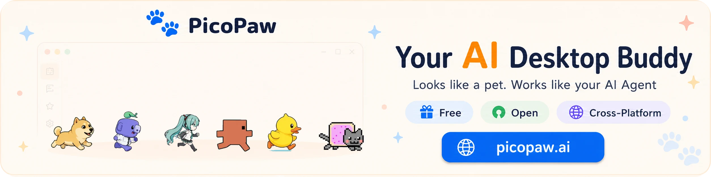
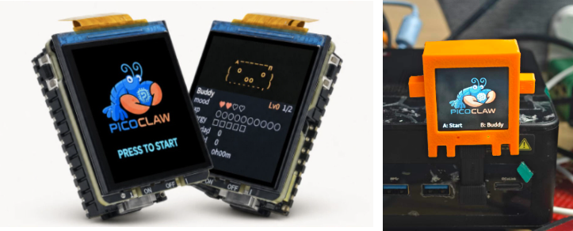
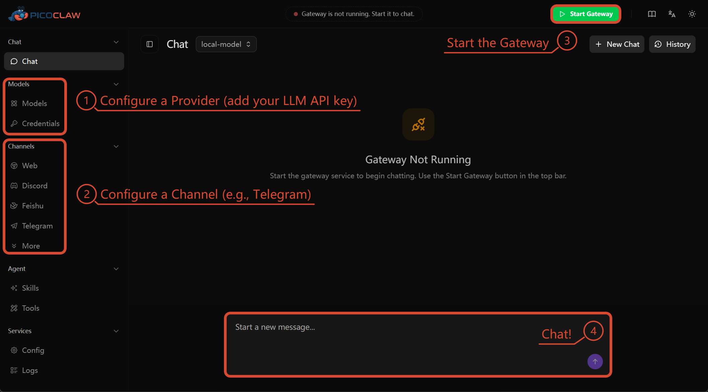
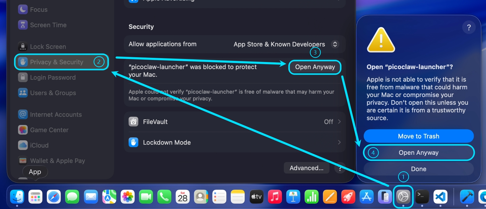
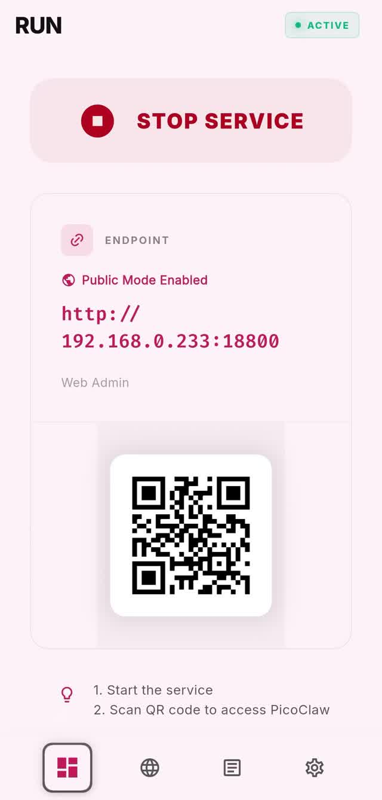
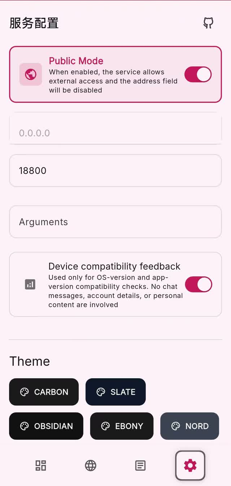
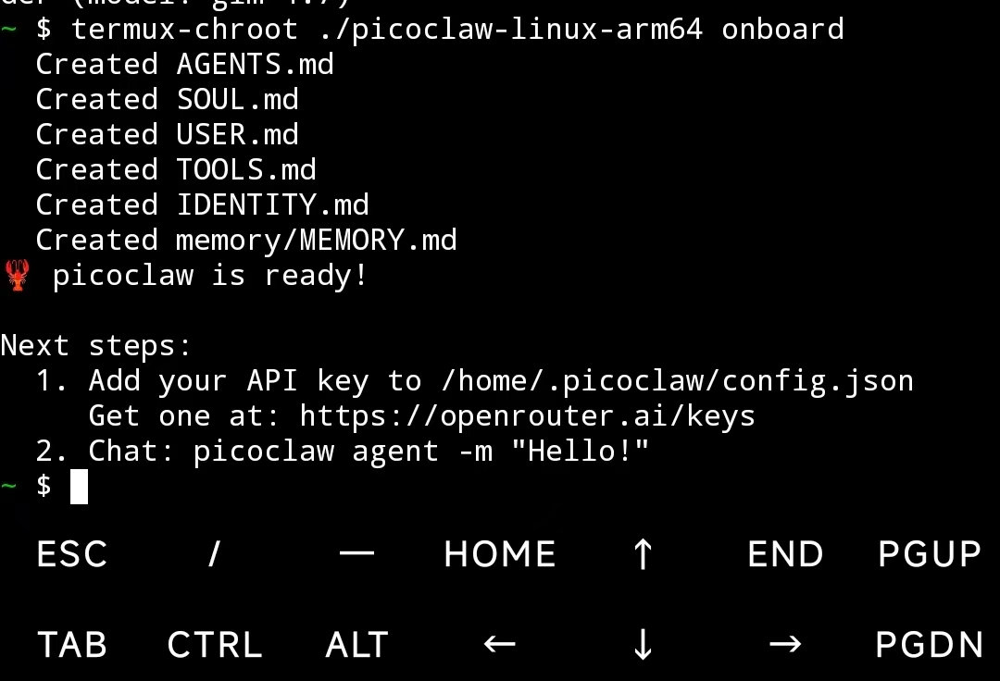

<div align="center">


<h1>PicoClaw：以 Go 打造的超高效率 AI 助理</h1>

<h3>10 美元硬體 · 10 MB RAM · 毫秒級啟動 · Let's Go, PicoClaw!</h3>
  <p>
    
    
    
    <br>
    <a href="https://picoclaw.io"></a>
    <a href="https://docs.picoclaw.io/zh-TW/"></a>
    <a href="https://deepwiki.com/sipeed/picoclaw"></a>
    <br>
    <a href="https://x.com/SipeedIO"></a>
    <a href="../../assets/wechat.png"></a>
    <a href="https://discord.gg/V4sAZ9XWpN"></a>
  </p>

**繁體中文** | [简体中文](README.zh.md) | [日本語](README.ja.md) | [한국어](README.ko.md) | [Português](README.pt-br.md) | [Tiếng Việt](README.vi.md) | [Français](README.fr.md) | [Italiano](README.it.md) | [Bahasa Indonesia](README.id.md) | [Malay](README.ms.md) | [English](../../README.md)

<p>
  <a href="https://picopaw.ai">
    
  </a>
</p>

<p>
  <strong>PicoPaw AI 已在 <a href="https://picopaw.ai">picopaw.ai</a> 正式上線。</strong><br>
  為 PicoClaw 生態系建立、預覽及分享活潑有趣的 AI 夥伴。
</p>

</div>

---

> **PicoClaw** 是由 [Sipeed](https://sipeed.com) 發起的獨立開放原始碼專案，完全以 **Go** 從零開始撰寫，並非 OpenClaw、NanoBot 或其他專案的分支版本。

**PicoClaw** 是受到 [NanoBot](https://github.com/HKUDS/nanobot) 啟發的超輕量個人 AI 助理。專案使用 **Go**，並以「自我啟動」流程從零重建；AI 代理人親自推動架構移轉與程式碼效能調校。

**只要 10 美元的硬體及不到 10 MB RAM 即可執行**，記憶體用量比 OpenClaw 少 99%，成本也比 Mac mini 低 98%！

<table align="center">
<tr align="center">
<td align="center" valign="top">
<p align="center">

</p>
</td>
<td align="center" valign="top">
<p align="center">

</p>
</td>
</tr>
</table>

> [!CAUTION]
> **安全性公告**
>
> * **沒有加密貨幣：** PicoClaw **從未**發行任何官方 Token 或加密貨幣。`pump.fun` 或其他交易平台上的相關宣稱**全是詐騙**。
> * **官方網域：** **[picoclaw.io](https://picoclaw.io)** 是 PicoClaw **唯一**的官方網站，公司網站則是 **[sipeed.com](https://sipeed.com)**。
> * **小心仿冒：** 第三方已註冊許多相似的 `.ai/.org/.com/.net/...` 網域。請只信任此 README 明確列出的網域。
> * **注意：** PicoClaw 尚處於快速開發初期，可能仍有未解決的安全性問題。請勿在 v1.0 之前部署至正式環境。
> * **注意：** PicoClaw 最近合併了許多 PR，近期版本可能會使用 10 至 20 MB RAM。功能穩定後將進行資源效能調校。

## 📢 最新動態

2026-06-11 🐾 **PicoPaw AI 上線了！** 前往 [picopaw.ai](https://picopaw.ai) 體驗全新的 PicoPaw 夥伴功能，其中包含 AI 寵物動態預覽及 PicoClaw 生態系最新動態。

2026-05-11 🛒 **LicheeRV-Claw 已在 AliExpress 上架！** 現在可以從 [AliExpress](https://www.aliexpress.com/item/1005006519668532.html) 購買 LicheeRV-Claw，更輕鬆地在小型 RISC-V 硬體上體驗 PicoClaw。

<p align="center">
  <a href="https://www.aliexpress.com/item/1005006519668532.html">
    
  </a>
</p>

2026-05-28 🚀 **v0.2.9 發布！** Web UI MCP 伺服器管理、可設定的搜狗 Web 搜尋、頻道工具執行回饋動畫、`pretty_print` 與 `disable_escape_html` 預設值，以及多項服務供應商與頻道錯誤修正。

2026-05-14 🚀 **v0.2.8 發布！** MCP CLI 命令（`show`、`add`、`list`、`remove`、`test`、`edit`）、MCP 工具參數改用空物件而非 null，以及建置修正。

2026-05-07 🚀 **v0.2.7 發布！** 可設定的搜狗 Web 搜尋、頻道工具執行回饋動畫及 Linter 修正。

2026-04-23 🚀 **v0.2.6 發布！** 加入具備 respond 動作的 Hook 及完整文件、隔離功能，以及說明橫幅修正。

2026-04-11 🚀 **v0.2.5 發布！** 從 TZ／ZONEINFO 環境變數取得 Zoneinfo、對齊 Matrix CommonMark 轉譯方式，以及讓 `read_file` 可依行讀取。

2026-03-31 📱 **支援 Android！** PicoClaw 現在可以在 Android 上執行！請前往 [picoclaw.io](https://picoclaw.io/download) 下載 APK。

2026-03-25 🚀 **v0.2.4 發布！** 全面翻新代理人架構（SubTurn、Hooks、Steering、EventBus）、整合微信／WeCom、強化安全性（`.security.yml`、敏感資料篩選）、新增服務供應商（AWS Bedrock、Azure、Xiaomi MiMo），並修正 35 個錯誤。PicoClaw 已達到 **26K Stars**！

2026-03-17 🚀 **v0.2.3 發布！** 系統匣 UI（Windows 與 Linux）、子代理人狀態查詢（`spawn_status`）、實驗性閘道服務熱重新載入、Cron 安全性閘門，以及 2 項安全性修正。PicoClaw 已達到 **25K Stars**！

2026-03-09 🎉 **v0.2.1，至今規模最大的更新！** 支援 MCP 通訊協定、新增 4 個頻道（Matrix／IRC／WeCom／Discord Proxy）、3 家服務供應商（Kimi／Minimax／Avian）、視覺處理管線、JSONL 記憶儲存區及模型路由。

2026-02-28 📦 **v0.2.0** 發布，加入 Docker Compose 及 Web UI Launcher。

<details>
<summary>較早的動態...</summary>

2026-02-26 🎉 PicoClaw 僅用 17 天就達到 **20K Stars**！頻道自動協調及 Capability 介面正式推出。

2026-02-16 🎉 PicoClaw 一週內突破 12K Stars！正式推出社群維護者角色及 [發展藍圖](../../ROADMAP.md)。

2026-02-13 🎉 PicoClaw 4 天內突破 5000 Stars！專案發展藍圖與開發人員群組正在籌備中。

2026-02-09 🎉 **PicoClaw 發布！** 僅用 1 天完成，讓 AI 代理人只需不到 10 MB RAM，便能在 10 美元的硬體上執行。Let's Go, PicoClaw!

</details>

## ✨ 功能特色

🪶 **超輕量：** 核心記憶體用量不到 10 MB，比 OpenClaw 少 99%。*

💰 **成本極低：** 效率足以在 10 美元的硬體上執行，比 Mac mini 便宜 98%。

⚡️ **極速啟動：** 啟動速度快 400 倍，即使使用 0.6 GHz 單核心處理器，也能在 1 秒內啟動。

🌍 **真正可攜：** 單一二進位檔即可跨 RISC-V、ARM、MIPS 及 x86 架構執行，一個檔案就能到處執行！

🤖 **由 AI 自我啟動：** 使用純 Go 原生實作；95% 的核心程式碼由代理人撰寫，再經過人工參與審查調校。

🔌 **支援 MCP：** 原生整合 [Model Context Protocol](https://modelcontextprotocol.io/)，可連線至任何 MCP 伺服器來延伸代理人功能。

👁️ **視覺處理管線：** 直接將圖片及檔案傳送給代理人，系統會自動為多模態 LLM 進行 base64 編碼。

🧠 **智慧路由：** 依規則進行模型路由，簡單查詢交給輕量模型處理，節省 API 費用。

_*近期版本因快速合併 PR，可能會使用 10 至 20 MB。後續將進行資源效能調校。啟動速度比較採用 0.8 GHz 單核心基準測試（請參閱下表）。_

<div align="center">

|                                  | OpenClaw      | NanoBot                  | **PicoClaw**                           |
| -------------------------------- | ------------- | ------------------------ | -------------------------------------- |
| **語言**                         | TypeScript    | Python                   | **Go**                                 |
| **RAM**                          | >1 GB         | >100 MB                  | **< 10 MB***                           |
| **啟動時間**</br>（0.8 GHz 核心） | >500 秒       | >30 秒                   | **<1 秒**                              |
| **成本**                         | Mac Mini $599 | 多數 Linux 開發板約 $50  | **任何 Linux 開發板**</br>**最低 $10** |


</div>

> **[硬體相容性清單](../guides/hardware-compatibility.md)**：查看所有已測試的開發板，包括 5 美元的 RISC-V、Raspberry Pi 及 Android 手機。清單中沒有使用的開發板嗎？歡迎提交 PR！

<p align="center">

</p>

## 🦾 功能展示

### 🛠️ 標準助理工作流程

<table align="center">
<tr align="center">
<th><p align="center">全端工程師模式</p></th>
<th><p align="center">記錄與規劃</p></th>
<th><p align="center">Web 搜尋與學習</p></th>
</tr>
<tr>
<td align="center"><p align="center"></p></td>
<td align="center"><p align="center"></p></td>
<td align="center"><p align="center"></p></td>
</tr>
<tr>
<td align="center">開發 · 部署 · 擴充規模</td>
<td align="center">排程 · 自動化 · 記憶</td>
<td align="center">探索 · 洞察 · 趨勢</td>
</tr>
</table>

### 🐜 創新的低資源部署方式

PicoClaw 幾乎可以部署在任何 Linux 裝置上！

- 9.9 美元的 [LicheeRV-Nano](https://www.aliexpress.com/item/1005006519668532.html) E（Ethernet）或 W（WiFi 6）版本，可作為精簡的家庭助理
- 30 至 50 美元的 [NanoKVM](https://www.aliexpress.com/item/1005007369816019.html)，或 100 美元的 [NanoKVM-Pro](https://www.aliexpress.com/item/1005010048471263.html)，可自動執行伺服器操作
- 50 美元的 [MaixCAM](https://www.aliexpress.com/item/1005008053333693.html)，或 100 美元的 [MaixCAM2](https://www.kickstarter.com/projects/zepan/maixcam2-build-your-next-gen-4k-ai-camera)，可用於智慧監控

<https://private-user-images.githubusercontent.com/83055338/547056448-e7b031ff-d6f5-4468-bcca-5726b6fecb5c.mp4>

🌟 還有更多部署方式等著發掘！

## 📦 安裝

### 從 picoclaw.io 下載（建議）

請前往官方網站 **[picoclaw.io](https://picoclaw.io)**。網站會自動偵測使用的平台，並提供按一下即可下載的功能，不需要手動選擇架構。

### 下載預先編譯的二進位檔

也可以從 [GitHub Releases](https://github.com/sipeed/picoclaw/releases) 頁面下載適用於各平台的二進位檔。

### 從原始程式碼建置（開發用途）

必要條件：

- Go 1.25+
- 建置 Web UI／Launcher 需要 Node.js 22+ 及 pnpm 10.33.0+

```bash
git clone https://github.com/sipeed/picoclaw.git

cd picoclaw
make deps

# Install frontend dependencies
(cd web/frontend && pnpm install --frozen-lockfile)

# Build the core binary for the current platform
make build

# Build the Web UI Launcher (required for WebUI mode)
make build-launcher

# Build core binaries for all Makefile-managed platforms
make build-all

# Build for Raspberry Pi Zero 2 W
# 32-bit: make build-linux-arm
# 64-bit: make build-linux-arm64
make build-pi-zero

# Build and install
make install
```

**Raspberry Pi Zero 2 W：** 請使用與作業系統相符的二進位檔：32 位元 Raspberry Pi OS 請執行 `make build-linux-arm`；64 位元請執行 `make build-linux-arm64`。也可以執行 `make build-pi-zero` 同時建置兩者。

## 🚀 快速開始指南

### 🌐 WebUI Launcher（建議桌面環境使用）

WebUI Launcher 提供瀏覽器介面，方便進行設定及對話。這是最簡單的入門方式，不需要任何命令列知識。

**選項 1：按兩下（桌面環境）**

從 [picoclaw.io](https://picoclaw.io) 下載後，按兩下 `picoclaw-launcher`（Windows 請使用 `picoclaw-launcher.exe`）。瀏覽器會自動開啟 `http://localhost:18800`。

**選項 2：命令列**

```bash
picoclaw-launcher
# Open http://localhost:18800 in your browser
```

> [!TIP]
> **遠端存取／Docker／VM：** 加入 `-public` 旗標即可監聽所有介面：
> ```bash
> picoclaw-launcher -public
> ```

<p align="center">

</p>

**開始使用：**

開啟 WebUI，接著：**1)** 設定服務供應商（加入 LLM API 金鑰）→ **2)** 設定頻道（例如 Telegram）→ **3)** 啟動閘道服務 → **4)** 開始對話！

WebUI 詳細文件請參閱 [docs.picoclaw.io](https://docs.picoclaw.io/zh-TW/)。

<details>
<summary><b>Docker（替代方式）</b></summary>

```bash
# 1. Clone this repo
git clone https://github.com/sipeed/picoclaw.git
cd picoclaw

# 2. First run — auto-generates docker/data/config.json then exits
#    (only triggers when both config.json and workspace/ are missing)
docker compose -f docker/docker-compose.yml --profile launcher up
# The container prints "First-run setup complete." and stops.

# 3. Set your API keys
vim docker/data/config.json

# 4. Start
docker compose -f docker/docker-compose.yml --profile launcher up -d
# Open http://localhost:18800
```

> **Docker／VM 使用者：** 閘道服務預設監聽 `127.0.0.1`。設定 `PICOCLAW_GATEWAY_HOST=0.0.0.0` 或使用 `-public` 旗標，即可讓主機存取。

```bash
# Check logs
docker compose -f docker/docker-compose.yml logs -f

# Stop
docker compose -f docker/docker-compose.yml --profile launcher down

# Update
docker compose -f docker/docker-compose.yml pull
docker compose -f docker/docker-compose.yml --profile launcher up -d
```

</details>

<details>
<summary><b>macOS：首次啟動安全性警告</b></summary>

由於 `picoclaw-launcher` 是從網際網路下載，而且未經 Mac App Store 公證，macOS 可能會在首次啟動時加以阻擋。

**步驟 1：** 按兩下 `picoclaw-launcher`，系統會顯示安全性警告：

<p align="center">

</p>

> *無法打開「picoclaw-launcher」— Apple 無法驗證「picoclaw-launcher」是否含有可能傷害 Mac 或危害隱私的惡意軟體。*

**步驟 2：** 開啟 [系統設定] → [隱私權與安全性] → 向下捲動至 [安全性] 區段 → 按一下 [強制打開] → 在對話方塊中再次按一下 [強制打開] 進行確認。

<p align="center">

</p>

這個步驟只需執行一次，後續即可正常開啟 `picoclaw-launcher`。

</details>

<a id="-run-on-old-android-phones"></a>
### 📱 Android

讓使用十年的舊手機重獲新生！使用 PicoClaw 將其變成智慧 AI 助理。

**選項 1：安裝 APK**

預覽：

<table>
  <tr>
    <td></td>
    <td></td>
    <td></td>
    <td></td>
  </tr>
</table>

從 [picoclaw.io](https://picoclaw.io/download/) 下載 APK 並直接安裝，不需要 Termux！

**選項 2：Termux**

完整的命令列設定檢查清單，請參閱 [Android Termux 指南](../guides/android-termux.md)。

<details>
<summary><b>終端機 Launcher（適合資源受限的環境）</b></summary>

1. 安裝 [Termux](https://github.com/termux/termux-app)（從 [GitHub Releases](https://github.com/termux/termux-app/releases) 下載，或在 F-Droid／Google Play 搜尋）
2. 執行下列命令：

```bash
# Download the latest release
wget https://github.com/sipeed/picoclaw/releases/latest/download/picoclaw_Linux_arm64.tar.gz
tar xzf picoclaw_Linux_arm64.tar.gz
pkg install proot
termux-chroot ./picoclaw onboard   # chroot provides a standard Linux filesystem layout
```

接著依照下方的終端機 Launcher 章節完成設定。



若精簡環境只有 `picoclaw` 核心二進位檔（沒有 Launcher UI），可以使用命令列及 JSON 設定檔完成所有設定。

**1. 初始化**

```bash
picoclaw onboard
```

此命令會建立 `~/.picoclaw/config.json` 及工作區目錄。

**2. 設定**（`~/.picoclaw/config.json`）

```json
{
  "agents": {
    "defaults": {
      "model_name": "gpt-5.4"
    }
  },
  "model_list": [
    {
      "model_name": "gpt-5.4",
      "model": "openai/gpt-5.4"
      // api_key is now loaded from .security.yml
    }
  ]
}
```

> 所有可用選項的完整設定範本，請參閱 repo 中的 `config/config.example.json`。
>
> 請注意：config.example.json 採用版本 0 格式，內含敏感值。系統會自動將其移轉至版本 1 以上；此後 config.json 只會儲存非敏感資料，敏感值則儲存在 .security.yml。如需手動修改敏感值，詳細資訊請參閱 `docs/security/security_configuration.md`。


**3. 對話**

```bash
# One-shot question
picoclaw agent -m "What is 2+2?"

# Interactive mode
picoclaw agent

# Start gateway for chat app integration
picoclaw gateway
```

</details>

## 🔌 服務供應商（LLM）

PicoClaw 使用 `model_list` 設定支援 30 多家 LLM 服務供應商。請使用 `protocol/model` 格式：

| 服務供應商 | 通訊協定 | API 金鑰 | 注意事項 |
|------------|----------|----------|----------|
| [OpenAI](https://platform.openai.com/api-keys) | `openai/` | 必填 | GPT-5.4、GPT-4o、o3 等 |
| [Anthropic](https://console.anthropic.com/settings/keys) | `anthropic/` | 必填 | Claude Opus 4.6、Sonnet 4.6 等 |
| [Google Gemini](https://aistudio.google.com/apikey) | `gemini/` | 必填 | Gemini 3 Flash、2.5 Pro 等 |
| [OpenRouter](https://openrouter.ai/keys) | `openrouter/` | 必填 | 200 多種模型、統一 API |
| [Zhipu（GLM）](https://open.bigmodel.cn/usercenter/proj-mgmt/apikeys) | `zhipu/` | 必填 | GLM-4.7、GLM-5 等 |
| [DeepSeek](https://platform.deepseek.com/api_keys) | `deepseek/` | 必填 | DeepSeek-V3、DeepSeek-R1 |
| [Volcengine](https://console.volcengine.com) | `volcengine/` | 必填 | Doubao、Ark 模型 |
| [Qwen](https://dashscope.console.aliyun.com/apiKey) | `qwen/` | 必填 | Qwen3、Qwen-Max 等 |
| [Groq](https://console.groq.com/keys) | `groq/` | 必填 | 快速推論（Llama、Mixtral） |
| [Moonshot（Kimi）](https://platform.moonshot.cn/console/api-keys) | `moonshot/` | 必填 | Kimi 模型 |
| [Minimax](https://platform.minimaxi.com/user-center/basic-information/interface-key) | `minimax/` | 必填 | MiniMax 模型 |
| [Mistral](https://console.mistral.ai/api-keys) | `mistral/` | 必填 | Mistral Large、Codestral |
| [NVIDIA NIM](https://build.nvidia.com/) | `nvidia/` | 必填 | NVIDIA 託管模型 |
| [Cerebras](https://cloud.cerebras.ai/) | `cerebras/` | 必填 | 快速推論 |
| [NEAR AI Cloud](https://near.ai/) | `nearai/` | 必填 | TEE 推論、OpenAI 相容 |
| [Novita AI](https://novita.ai/) | `novita/` | 必填 | 各種開放模型 |
| [Xiaomi MiMo](https://platform.xiaomimimo.com/) | `mimo/` | 必填 | MiMo 模型 |
| [Ollama](https://ollama.com/) | `ollama/` | 不需要 | 本機模型、自行架設 |
| [vLLM](https://docs.vllm.ai/) | `vllm/` | 不需要 | 本機部署、OpenAI 相容 |
| [LiteLLM](https://docs.litellm.ai/) | `litellm/` | 視設定而定 | 可代理 100 多家服務供應商 |
| [Azure OpenAI](https://portal.azure.com/) | `azure/` | API 金鑰或 Entra ID** | 企業 Azure 部署 |
| [GitHub Copilot](https://github.com/features/copilot) | `github-copilot/` | OAuth | 裝置碼登入 |
| [Antigravity](https://console.cloud.google.com/) | `antigravity/` | OAuth | Google Cloud AI |
| [AWS Bedrock](https://console.aws.amazon.com/bedrock)* | `bedrock/` | AWS 認證資訊 | AWS 上的 Claude、Llama、Mistral |

> \* AWS Bedrock 需要建置標記：`go build -tags bedrock`。將 `api_base` 設為區域名稱（例如 `us-east-1`），即可自動解析所有 AWS 分割區（aws、aws-cn、aws-us-gov）的端點。若改用完整端點 URL，還必須使用環境變數或 AWS 設定／Profile 來設定 `AWS_REGION`。
>
> \*\* Azure OpenAI 會在設定 `api_key` 時使用該金鑰。省略 `api_key` 時，服務供應商會改由 `DefaultAzureCredential` 使用 Microsoft Entra ID（環境變數、工作負載身分識別、受控識別、Azure CLI 等）。Entra ID 路徑需要建置標記：`go build -tags azidentity`。

<details>
<summary><b>本機部署（Ollama、vLLM 等）</b></summary>

**Ollama：**
```json
{
  "model_list": [
    {
      "model_name": "local-llama",
      "model": "ollama/llama3.1:8b",
      "api_base": "http://localhost:11434/v1"
    }
  ]
}
```

**vLLM：**
```json
{
  "model_list": [
    {
      "model_name": "local-vllm",
      "model": "vllm/your-model",
      "api_base": "http://localhost:8000/v1"
    }
  ]
}
```

完整的服務供應商設定，請參閱 [服務供應商與模型](../guides/providers.zh-tw.md)。

</details>

## 💬 頻道（聊天應用程式）

可使用 19 種以上的通訊平台與 PicoClaw 對話：

| 頻道 | 設定方式 | 通訊協定 | 文件 |
|------|----------|----------|------|
| **Telegram** | 簡單（Bot Token） | 長輪詢 | [指南](../channels/telegram/README.zh-tw.md) |
| **Discord** | 簡單（Bot Token + Intents） | WebSocket | [指南](../channels/discord/README.zh-tw.md) |
| **WhatsApp** | 簡單（掃描 QR Code 或 Bridge URL） | 原生／Bridge | [指南](../guides/chat-apps.zh-tw.md#whatsapp) |
| **Weixin** | 簡單（原生掃描 QR Code） | iLink API | [指南](../guides/chat-apps.zh-tw.md#weixin) |
| **QQ** | 簡單（AppID + AppSecret） | WebSocket | [指南](../channels/qq/README.zh-tw.md) |
| **Slack** | 簡單（Bot + App Token） | Socket Mode | [指南](../channels/slack/README.zh-tw.md) |
| **Matrix** | 中等（homeserver + Token） | Sync API | [指南](../channels/matrix/README.zh-tw.md) |
| **Delta Chat** | 簡單（帳戶命令稿或電子郵件／密碼） | JSON-RPC（電子郵件／E2EE） | [指南](../channels/deltachat/README.zh-tw.md) |
| **DingTalk** | 中等（Client 認證資訊） | Stream | [指南](../channels/dingtalk/README.zh-tw.md) |
| **Feishu／Lark** | 中等（App ID + Secret） | WebSocket／SDK | [指南](../channels/feishu/README.zh-tw.md) |
| **LINE** | 中等（認證資訊 + Webhook） | Webhook | [指南](../channels/line/README.zh-tw.md) |
| **WeCom** | 簡單（掃描 QR Code 登入或手動設定） | WebSocket | [指南](../channels/wecom/README.zh-tw.md) |
| **VK** | 簡單（群組 Token） | 長輪詢 | [指南](../channels/vk/README.zh-tw.md) |
| **IRC** | 中等（伺服器 + 暱稱） | IRC 通訊協定 | [指南](../guides/chat-apps.zh-tw.md#irc) |
| **OneBot** | 中等（WebSocket URL） | OneBot v11 | [指南](../channels/onebot/README.zh-tw.md) |
| **MQTT** | 簡單（Broker + agent_id） | MQTT 發布／訂閱 | [指南](../channels/mqtt/README.zh-tw.md) |
| **MaixCam** | 簡單（啟用） | TCP Socket | [指南](../channels/maixcam/README.zh-tw.md) |
| **Pico** | 簡單（啟用） | 原生通訊協定 | 內建 |
| **Pico Client** | 簡單（WebSocket URL） | WebSocket | 內建 |

> 所有使用 Webhook 的頻道都會共用同一個閘道 HTTP 伺服器（`gateway.host`:`gateway.port`，預設為 `127.0.0.1:18790`）。Feishu 使用 WebSocket／SDK 模式，不會使用共用 HTTP 伺服器。

> `gateway.log_level` 控制記錄詳細程度（預設：`warn`）。支援的值包括 `debug`、`info`、`warn`、`error`、`fatal`，也可以使用 `PICOCLAW_LOG_LEVEL` 設定。詳細資訊請參閱 [設定指南](../guides/configuration.md#gateway-log-level)。

各頻道的詳細設定步驟，請參閱 [聊天應用程式設定](../guides/chat-apps.zh-tw.md)。

## 🔧 工具

### 🔍 Web 搜尋

PicoClaw 可以搜尋 Web，提供最新資訊。請在 `tools.web` 中設定：

| 搜尋引擎 | API 金鑰 | 免費額度 | 連結 |
|----------|----------|----------|------|
| DuckDuckGo | 不需要 | 不限用量 | 內建備援 |
| [Gemini Google Search](https://aistudio.google.com/apikey) | 必填 | 視方案而定 | 使用 Google Search Grounding 的 Gemini |
| [Baidu Search](https://cloud.baidu.com/doc/qianfan-api/s/Wmbq4z7e5) | 必填 | 每月 1500 次（每日分配） | AI 驅動，針對中國市場調校 |
| [Tavily](https://tavily.com) | 必填 | 每月 1000 次查詢 | 針對 AI 代理人調校 |
| [Brave Search](https://brave.com/search/api) | 必填 | 每月 2000 次查詢 | 快速且重視隱私 |
| [Kagi Search](https://help.kagi.com/kagi/api/search.html) | 必填 | 付費／依 API 設定限制 | 進階搜尋結果 |
| [Perplexity](https://www.perplexity.ai) | 必填 | 付費 | AI 驅動搜尋 |
| [SearXNG](https://github.com/searxng/searxng) | 不需要 | 自行架設 | 免費整合搜尋引擎 |
| [GLM Search](https://open.bigmodel.cn/) | 必填 | 視方案而定 | Zhipu Web 搜尋 |

### ⚙️ 其他工具

PicoClaw 內建檔案操作、程式碼執行、排程等工具。詳細資訊請參閱 [工具設定](../reference/tools_configuration.md)。

## 🎯 技能

技能是用來延伸代理人功能的模組化能力，會從工作區中的 `SKILL.md` 檔案載入。

**從 ClawHub 安裝技能：**

```bash
picoclaw skills search "web scraping"
picoclaw skills install <skill-name>
```

**設定技能登錄來源：**

加入 `config.json`：
```json
{
  "tools": {
    "skills": {
      "registries": {
        "clawhub": {
          "auth_token": "your-clawhub-token"
        },
        "github": {
          "base_url": "https://github.com",
          "auth_token": "your-github-token",
          "proxy": ""
        }
      }
    }
  }
}
```

`tools.skills.github.*` 已淘汰，請改用 `tools.skills.registries.github.*`。

詳細資訊請參閱 [工具設定：技能](../reference/tools_configuration.md#skills-tool)。

## 🔗 MCP（Model Context Protocol）

PicoClaw 原生支援 [MCP](https://modelcontextprotocol.io/)，可連線至任何 MCP 伺服器，利用外部工具及資料來源延伸代理人功能。

```json
{
  "tools": {
    "mcp": {
      "enabled": true,
      "servers": {
        "filesystem": {
          "enabled": true,
          "command": "npx",
          "args": ["-y", "@modelcontextprotocol/server-filesystem", "/tmp"]
        }
      }
    }
  }
}
```

可以直接從 CLI 管理常見 MCP 設定，不必手動編輯 JSON：

```bash
picoclaw mcp add filesystem -- npx -y @modelcontextprotocol/server-filesystem /tmp
picoclaw mcp list
picoclaw mcp test filesystem
```

`picoclaw mcp` 是設定管理工具：它會更新 `config.json` 中的 `tools.mcp.servers`，但不會自行維持伺服器處理程序執行。

如果需要 `picoclaw mcp add` 未涵蓋的進階欄位，請使用 `picoclaw mcp edit`。
例如，`picoclaw mcp add` 支援 `--deferred` 及 `--env-file`；如需直接編輯 JSON 或設定較少使用的 MCP 選項，仍可使用 `picoclaw mcp edit`。

完整 MCP 設定（stdio、SSE、HTTP 傳輸、工具探索）請參閱 [工具設定：MCP](../reference/tools_configuration.md#mcp-tool)。CLI 用法與範例請參閱 [MCP 伺服器 CLI](../reference/mcp-cli.md)。

##  加入代理人社群網路

只要從 CLI 或任何已整合的聊天應用程式傳送一則訊息，即可將 PicoClaw 連線至代理人社群網路。

**請讀取 `https://clawdchat.ai/skill.md` 並依照指示加入 [ClawdChat.ai](https://clawdchat.ai)**

## 🖥️ CLI 參考資料

| 命令                      | 說明                              |
| ------------------------- | --------------------------------- |
| `picoclaw onboard`        | 初始化設定與工作區                |
| `picoclaw auth weixin`    | 掃描 QR Code 連線微信帳戶         |
| `picoclaw agent -m "..."` | 與代理人對話                      |
| `picoclaw agent`          | 互動式對話模式                    |
| `picoclaw gateway`        | 啟動閘道服務                      |
| `picoclaw status`         | 顯示狀態                          |
| `picoclaw version`        | 顯示版本資訊                      |
| `picoclaw model`          | 檢視或切換預設模型                |
| `picoclaw mcp list`       | 列出已設定的 MCP 伺服器           |
| `picoclaw mcp add ...`    | 新增或更新 MCP 伺服器設定         |
| `picoclaw mcp test`       | 測試已設定的 MCP 伺服器           |
| `picoclaw mcp edit`       | 開啟設定以進行進階 MCP 編輯       |
| `picoclaw mcp remove`     | 移除 MCP 伺服器設定               |
| `picoclaw cron list`      | 列出所有排程工作                  |
| `picoclaw cron add ...`   | 新增排程工作                      |
| `picoclaw cron disable`   | 停用排程工作                      |
| `picoclaw cron remove`    | 移除排程工作                      |
| `picoclaw skills list`    | 列出已安裝技能                    |
| `picoclaw skills install` | 安裝技能                          |
| `picoclaw migrate`        | 從舊版移轉資料                    |
| `picoclaw auth login`     | 向服務供應商驗證身分              |

### ⏰ 排程工作／提醒

PicoClaw 使用 `cron` 工具提供排程提醒及週期性工作：

* **單次提醒：** "10 分鐘後提醒我" → 10 分鐘後觸發一次
* **週期性工作：** "每 2 小時提醒我" → 每 2 小時觸發一次
* **Cron 運算式：** "每天上午 9 點提醒我" → 使用 Cron 運算式

目前支援的排程類型、執行模式、命令工作閘門及資料留存細節，請參閱 [docs/reference/cron.md](../reference/cron.md)。

## 📚 文件

此 README 以外的詳細指南：

| 主題 | 說明 |
|------|------|
| [Docker 與快速開始](../guides/docker.md) | Docker Compose 設定、Launcher／代理人模式 |
| [聊天應用程式](../guides/chat-apps.zh-tw.md) | 18 種以上的頻道設定指南 |
| [設定](../guides/configuration.md) | 環境變數、工作區結構、安全沙盒 |
| [MCP 伺服器 CLI](../reference/mcp-cli.md) | 從 CLI 新增、列出、測試、編輯及移除 MCP 伺服器設定 |
| [排程工作與 Cron 工作](../reference/cron.md) | Cron 排程類型、傳送模式、命令閘門、工作儲存區 |
| [服務供應商與模型](../guides/providers.zh-tw.md) | 30 多家 LLM 服務供應商、模型路由、model_list 設定 |
| [Spawn 與非同步工作](../guides/spawn-tasks.md) | 快速工作、使用 Spawn 的長時間工作、非同步子代理人協調 |
| [Hooks](../architecture/hooks/README.md) | 事件驅動的 Hook 系統：觀察者、攔截器、核准 Hook |
| [Steering](../architecture/steering.md) | 在工具呼叫之間，將訊息插入執行中的代理人迴圈 |
| [SubTurn](../architecture/subturn.md) | 子代理人協調、並行控制、生命週期 |
| [疑難排解](../operations/troubleshooting.md) | 常見問題與解決方法 |
| [工具設定](../reference/tools_configuration.md) | 各工具啟用／停用、執行政策、MCP、技能 |
| [硬體相容性](../guides/hardware-compatibility.md) | 已測試的開發板、最低需求 |

## 🤝 貢獻及發展藍圖

歡迎提交 PR！程式碼庫刻意保持精簡且容易閱讀。

貢獻規範請參閱 [社群發展藍圖](https://github.com/sipeed/picoclaw/issues/988) 及 [CONTRIBUTING.md](../../CONTRIBUTING.md)。

開發人員群組正在籌備中，第一個 PR 合併後即可加入！

使用者群組：

Discord：<https://discord.gg/V4sAZ9XWpN>

微信：

