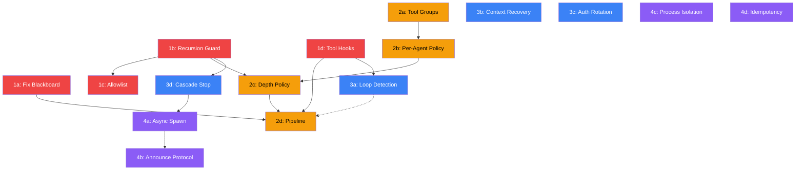

# PRP: Multi-Agent Framework Hardening

## Goal

Harden the picoclaw multi-agent collaboration framework (PR #423) to production-grade quality by porting validated patterns from OpenClaw (moltbot) — the state-of-the-art personal AI gateway whose founder was hired by OpenAI.

**PR**: [#423](https://github.com/sipeed/picoclaw/pull/423)
**Issue**: [#294](https://github.com/sipeed/picoclaw/issues/294)
**Branch**: `feat/multi-agent-framework`
**Reference**: `/home/leeaandrob/Projects/Personal/llm/auto-agents/moltbot`

---

## What

Transform picoclaw's multi-agent framework from a functional prototype (Blackboard + Handoff + Routing) into a production-ready orchestration system with guardrails, tool policy, resilience, and async capabilities — matching and exceeding OpenClaw's patterns in a lightweight Go single-binary.

---

## Success Criteria

### Phase 1: Foundation Fix + Guardrails
- [ ] Blackboard split-brain bug is fixed — tools and system prompt use the same board per session
- [ ] Handoff recursion is bounded — max depth enforced, cycle detection prevents A→B→A loops
- [ ] Handoff respects allowlist — same CanSpawnSubagent check as spawn tool
- [ ] Before-tool-call hook infrastructure exists — extensible for loop detection and policy
- [ ] All existing tests pass + new tests for each fix
- [ ] Zero regression in single-agent mode

### Phase 2: Tool Policy Pipeline
- [ ] Tool groups defined: `group:fs`, `group:web`, `group:exec`, `group:sessions`, `group:memory`
- [ ] Per-agent `tools.allow` / `tools.deny` in config, supports group references
- [ ] Subagent tool restriction by depth (leaf agents can't spawn/handoff)
- [ ] Pipeline composes: global → per-agent → per-depth (each layer narrows, never widens)
- [ ] Config backward-compatible (no tools config = full access, like today)

### Phase 3: Resilience
- [ ] Loop detection: generic repeat (hash-based) + ping-pong detector
- [ ] Context overflow recovery: auto-compaction + tool result truncation + user error
- [ ] Auth profile rotation: round-robin with 2-track cooldown (transient + billing)
- [ ] Cascade stop: context cancellation propagates through handoff/spawn chains

### Phase 4: Async Multi-Agent
- [ ] Async spawn: non-blocking agent invocation via goroutines
- [ ] Announce protocol: result injection into parent session (steer/queue/direct)
- [ ] Scope-keyed process isolation: exec tool scoped by session key
- [ ] Idempotency: dedup map for duplicate message prevention

---

## Current State Analysis

### What exists (PR #423)

| Component | Package | Status | Quality |
|-----------|---------|--------|---------|
| Blackboard | `pkg/multiagent` | Implemented | Good base, has split-brain bug |
| BlackboardTool | `pkg/multiagent` | Implemented | Works but uses wrong board |
| ExecuteHandoff | `pkg/multiagent` | Implemented | No recursion guard, ignores allowlist |
| HandoffTool | `pkg/multiagent` | Implemented | No self-handoff guard |
| ListAgentsTool | `pkg/multiagent` | Implemented | Exposes too little info |
| AgentResolver | `pkg/multiagent` | Implemented | Clean interface |
| RouteResolver | `pkg/routing` | Implemented | 7-tier cascade, complete |
| SessionKeyBuilder | `pkg/routing` | Implemented | DM scope support |
| AgentRegistry | `pkg/agent` | Implemented | CanSpawnSubagent exists |
| AgentLoop integration | `pkg/agent` | Implemented | Snapshot injection, conditional tools |

### Critical Bug: Blackboard Split-Brain

```
registerSharedTools() → creates static `sharedBoard` per agent
runAgentLoop()        → creates per-session board via getOrCreateBlackboard(sessionKey)

BlackboardTool.Execute()  → writes to static sharedBoard  ← WRONG
messages[0].Content       → reads from session board       ← DIFFERENT OBJECT
```

**Impact**: Agents think they're sharing context but they're writing to void. Any multi-agent demo fails silently.

### What's missing vs. OpenClaw

| Feature | OpenClaw | picoclaw | Gap |
|---------|----------|----------|-----|
| Tool policy | 8-layer pipeline | None | Critical |
| Recursion guard | maxSpawnDepth + maxChildren | None | Critical |
| Loop detection | 4 detectors + circuit breaker | None | High |
| Context overflow | 3-tier cascade recovery | Basic forceCompression | High |
| Auth rotation | Round-robin + 2-track cooldown | FallbackChain only | Medium |
| Cascade stop | cascadeKillChildren + abort | None | Medium |
| Before-tool hook | wrapToolWithBeforeToolCallHook | None | Medium |
| Async spawn | Lane-based + announce | None | Low (Phase 4) |
| Process isolation | Scope-keyed | None | Low (Phase 4) |
| Idempotency | Gateway dedup + announce dedup | None | Low (Phase 4) |

---

## Phase 1: Foundation Fix + Guardrails

### 1a. Fix Blackboard Split-Brain

**Problem**: `registerSharedTools` in `loop.go:178` creates one `sharedBoard` per agent at startup. `runAgentLoop` in `loop.go` creates separate per-session blackboards in `AgentLoop.blackboards` sync.Map. Tools write to one, system prompt reads from other.

**Solution**: Make BlackboardTool and HandoffTool session-aware.

**Approach A (Recommended)**: ContextualTool pattern
```go
// BlackboardTool already has agentID — add board setter
type BlackboardTool struct {
    board   *Blackboard
    agentID string
    mu      sync.RWMutex
}

func (t *BlackboardTool) SetBoard(board *Blackboard) {
    t.mu.Lock()
    defer t.mu.Unlock()
    t.board = board
}
```

In `runAgentLoop`, before tool execution:
```go
bb := al.getOrCreateBlackboard(opts.SessionKey)
// Update all session-aware tools with the current session's board
for _, tool := range agent.Tools.List() {
    if setter, ok := tool.(BoardSetter); ok {
        setter.SetBoard(bb)
    }
}
```

**Approach B**: Lazy board resolution via callback
```go
type BlackboardTool struct {
    resolveBoard func() *Blackboard
    agentID      string
}
```

**Files to modify**:
- `pkg/multiagent/blackboard_tool.go` — Add `SetBoard` or callback
- `pkg/multiagent/handoff_tool.go` — Same pattern
- `pkg/agent/loop.go` — Wire session board to tools before execution

**Tests**:
- Verify tool writes are visible in system prompt snapshot
- Verify cross-agent writes via handoff are visible
- Verify session isolation (board A != board B)

### 1b. Recursion Guard

**Problem**: Agent A can hand off to B, which hands off to A, causing infinite recursion.

**Solution**: Add depth tracking and cycle detection to ExecuteHandoff.

```go
// Add to HandoffRequest
type HandoffRequest struct {
    FromAgentID string
    ToAgentID   string
    Task        string
    Context     map[string]string
    Depth       int      // NEW: current nesting depth
    Visited     []string // NEW: agent IDs in the chain
}

// In ExecuteHandoff
const DefaultMaxHandoffDepth = 3

func ExecuteHandoff(ctx context.Context, resolver AgentResolver, board *Blackboard,
    req *HandoffRequest, channel, chatID string, maxDepth int) *HandoffResult {

    // Depth check
    if req.Depth >= maxDepth {
        return &HandoffResult{
            Error:   fmt.Sprintf("handoff depth limit reached (%d/%d)", req.Depth, maxDepth),
            Success: false,
        }
    }

    // Cycle detection
    for _, visited := range req.Visited {
        if visited == req.ToAgentID {
            return &HandoffResult{
                Error:   fmt.Sprintf("handoff cycle detected: %s already in chain %v",
                    req.ToAgentID, req.Visited),
                Success: false,
            }
        }
    }

    // Propagate depth + visited to nested handoffs
    // ... (inject into target agent's tool context)
}
```

**Config**:
```json
{
  "agents": {
    "defaults": {
      "max_handoff_depth": 3
    }
  }
}
```

**Files to modify**:
- `pkg/multiagent/handoff.go` — Depth + cycle detection
- `pkg/multiagent/handoff_tool.go` — Propagate depth/visited
- `pkg/config/config.go` — Add `MaxHandoffDepth` to `AgentDefaults`

**Tests**:
- Direct handoff succeeds (depth 0→1)
- Chain handoff A→B→C succeeds (depth 0→1→2)
- Depth limit exceeded returns error
- Cycle A→B→A returns error
- Self-handoff returns error

### 1c. Handoff Allowlist Enforcement

**Problem**: `CanSpawnSubagent` only checked by spawn tool, not by handoff.

**Solution**: Add allowlist check to `ExecuteHandoff`.

```go
func ExecuteHandoff(...) *HandoffResult {
    // ... depth/cycle checks above ...

    // Allowlist check (new)
    if checker, ok := resolver.(AllowlistChecker); ok {
        if !checker.CanHandoff(req.FromAgentID, req.ToAgentID) {
            return &HandoffResult{
                Error:   fmt.Sprintf("agent %q is not allowed to handoff to %q",
                    req.FromAgentID, req.ToAgentID),
                Success: false,
            }
        }
    }

    // ... rest of execution
}
```

**Files to modify**:
- `pkg/multiagent/handoff.go` — Add `AllowlistChecker` interface + check
- `pkg/agent/loop.go` — Make `registryResolver` implement `AllowlistChecker`

**Tests**:
- Allowed handoff succeeds
- Disallowed handoff returns error
- Wildcard `"*"` allows all

### 1d. Before-Tool-Call Hook Infrastructure

**Problem**: No extensibility point for tool execution. Needed for loop detection (Phase 3) and tool policy (Phase 2).

**Solution**: ToolHook interface wrapping tool execution.

```go
// pkg/tools/hooks.go
type ToolHook interface {
    BeforeExecute(ctx context.Context, toolName string, args map[string]any) (map[string]any, error)
    AfterExecute(ctx context.Context, toolName string, args map[string]any, result *ToolResult, err error)
}

// pkg/tools/registry.go — Add hook chain
func (r *ToolRegistry) SetHooks(hooks []ToolHook) { ... }

func (r *ToolRegistry) ExecuteWithHooks(ctx context.Context, toolName string, args map[string]any) (*ToolResult, error) {
    // Run BeforeExecute hooks in order
    currentArgs := args
    for _, hook := range r.hooks {
        var err error
        currentArgs, err = hook.BeforeExecute(ctx, toolName, currentArgs)
        if err != nil {
            return &ToolResult{Content: err.Error(), IsError: true}, nil
        }
    }

    // Execute tool
    result := tool.Execute(ctx, currentArgs)

    // Run AfterExecute hooks (fire-and-forget)
    for _, hook := range r.hooks {
        hook.AfterExecute(ctx, toolName, currentArgs, result, nil)
    }

    return result, nil
}
```

**Files to create**:
- `pkg/tools/hooks.go` — ToolHook interface + chain execution

**Files to modify**:
- `pkg/tools/registry.go` — Add hooks field and ExecuteWithHooks
- `pkg/agent/loop.go` — Use ExecuteWithHooks in runLLMIteration

**Tests**:
- Hook blocks tool → error returned
- Hook modifies args → tool receives modified args
- AfterExecute called with result
- Multiple hooks execute in order

---

## Phase 2: Tool Policy Pipeline

### 2a. Tool Groups

```go
// pkg/tools/groups.go
var DefaultToolGroups = map[string][]string{
    "group:fs":       {"read_file", "write_file", "edit_file", "append_file", "list_dir"},
    "group:web":      {"web_search", "web_fetch"},
    "group:exec":     {"exec"},
    "group:sessions": {"blackboard", "handoff", "list_agents", "spawn"},
    "group:memory":   {"memory_search", "memory_get"},
    "group:message":  {"message"},
    "group:image":    {"image_generation"},
}

func ResolveToolNames(refs []string, groups map[string][]string) []string {
    var resolved []string
    for _, ref := range refs {
        if tools, ok := groups[ref]; ok {
            resolved = append(resolved, tools...)
        } else {
            resolved = append(resolved, ref)
        }
    }
    return resolved
}
```

### 2b. Per-Agent Allow/Deny Config

```go
// pkg/config/config.go — Add to AgentConfig
type ToolPolicyConfig struct {
    Allow []string `json:"allow,omitempty"` // tool names or group refs
    Deny  []string `json:"deny,omitempty"`  // tool names or group refs
}

type AgentConfig struct {
    // ... existing fields ...
    Tools *ToolPolicyConfig `json:"tools,omitempty"` // NEW
}
```

### 2c. Subagent Deny-by-Depth

```go
// pkg/tools/policy.go
type DepthPolicy struct {
    MaxDepth int
}

func (p *DepthPolicy) DenyListForDepth(depth int) []string {
    if depth == 0 {
        return nil // main agent: full access
    }

    // All subagents lose dangerous tools
    deny := []string{"gateway"}

    if depth >= p.MaxDepth {
        // Leaf workers: no spawning
        deny = append(deny, "spawn", "handoff", "list_agents")
    }
    return deny
}
```

### 2d. Pipeline Composition

```go
// pkg/tools/policy.go
type PolicyStep struct {
    Allow []string
    Deny  []string
    Label string
}

func ApplyPolicyPipeline(tools []Tool, steps []PolicyStep) []Tool {
    remaining := tools
    for _, step := range steps {
        if len(step.Allow) > 0 {
            allowed := toSet(ResolveToolNames(step.Allow, DefaultToolGroups))
            remaining = filter(remaining, func(t Tool) bool {
                return allowed[t.Name()]
            })
        }
        if len(step.Deny) > 0 {
            denied := toSet(ResolveToolNames(step.Deny, DefaultToolGroups))
            remaining = filter(remaining, func(t Tool) bool {
                return !denied[t.Name()]
            })
        }
    }
    return remaining
}
```

**Files to create**:
- `pkg/tools/groups.go` — Tool group definitions
- `pkg/tools/policy.go` — PolicyStep, ApplyPolicyPipeline, DepthPolicy

**Files to modify**:
- `pkg/config/config.go` — ToolPolicyConfig in AgentConfig
- `pkg/agent/loop.go` — Apply policy pipeline in registerSharedTools
- `pkg/multiagent/handoff.go` — Apply depth policy for handoff target

---

## Phase 3: Resilience

### 3a. Loop Detection

```go
// pkg/tools/loop_detector.go
type LoopDetector struct {
    history      []toolCallRecord
    maxHistory   int // default 30
    warnAt       int // default 10
    blockAt      int // default 20
}

type toolCallRecord struct {
    Hash      string
    ToolName  string
    Timestamp time.Time
    Outcome   string // hash of result for no-progress detection
}

func (d *LoopDetector) Check(toolName string, args map[string]any) LoopVerdict {
    hash := hashToolCall(toolName, args)

    // Generic repeat detection
    repeatCount := d.countRepeats(hash)
    if repeatCount >= d.blockAt {
        return LoopVerdict{Blocked: true, Reason: "tool call repeated too many times"}
    }
    if repeatCount >= d.warnAt {
        return LoopVerdict{Warning: true, Reason: "possible loop detected"}
    }

    // Ping-pong detection (A,B,A,B pattern)
    if d.detectPingPong(hash) {
        return LoopVerdict{Blocked: true, Reason: "ping-pong loop detected"}
    }

    return LoopVerdict{}
}

func (d *LoopDetector) Record(toolName string, args map[string]any, result string) {
    // Append to history ring buffer, trim to maxHistory
}
```

**Files to create**: `pkg/tools/loop_detector.go`, `pkg/tools/loop_detector_test.go`

### 3b. Context Overflow Recovery

Enhance existing `forceCompression` in `loop.go`:

```go
func (al *AgentLoop) recoverContextOverflow(ctx context.Context, agent *AgentInstance,
    sessionKey string, err error) RecoveryResult {

    // Tier 1: LLM-based compaction (summarize history)
    for attempt := 0; attempt < 3; attempt++ {
        if al.compactSession(ctx, agent, sessionKey) {
            return RecoveryResult{Recovered: true, Method: "compaction"}
        }
    }

    // Tier 2: Truncate oversized tool results in history
    if al.truncateToolResults(ctx, agent, sessionKey) {
        return RecoveryResult{Recovered: true, Method: "tool_truncation"}
    }

    // Tier 3: Give up with user-facing error
    return RecoveryResult{Recovered: false, Method: "none"}
}
```

**Files to modify**: `pkg/agent/loop.go`

### 3c. Auth Profile Rotation

Enhance existing `FallbackChain`:

```go
// pkg/providers/auth_rotation.go
type AuthProfile struct {
    ID           string
    Provider     string
    APIKey       string
    ErrorCount   int
    CooldownUntil time.Time
    DisabledUntil time.Time // billing track
    LastUsed     time.Time
}

type AuthRotator struct {
    profiles []AuthProfile
    mu       sync.RWMutex
}

func (r *AuthRotator) NextAvailable() *AuthProfile {
    // Round-robin: sort by lastUsed (oldest first), skip cooldown
}

func (r *AuthRotator) MarkFailure(profileID string, reason FailoverReason) {
    // Transient: exponential 1min → 5min → 25min → 1hr
    // Billing: separate disabledUntil track
}

func (r *AuthRotator) MarkSuccess(profileID string) {
    // Reset errorCount, update lastUsed
}
```

**Files to create**: `pkg/providers/auth_rotation.go`

### 3d. Cascade Stop

```go
// pkg/multiagent/cascade.go
type RunRegistry struct {
    active sync.Map // sessionKey -> *ActiveRun
}

type ActiveRun struct {
    SessionKey string
    Cancel     context.CancelFunc
    Children   []string // child session keys
}

func (r *RunRegistry) CascadeStop(sessionKey string) int {
    killed := 0
    if run, ok := r.active.Load(sessionKey); ok {
        ar := run.(*ActiveRun)
        ar.Cancel()
        killed++
        for _, child := range ar.Children {
            killed += r.CascadeStop(child)
        }
        r.active.Delete(sessionKey)
    }
    return killed
}
```

**Files to create**: `pkg/multiagent/cascade.go`

---

## Phase 4: Async Multi-Agent

### 4a. Async Spawn

```go
// pkg/multiagent/spawn.go
type SpawnResult struct {
    RunID      string
    SessionKey string
}

func AsyncSpawn(ctx context.Context, resolver AgentResolver, board *Blackboard,
    req *HandoffRequest, channel, chatID string) *SpawnResult {

    runID := uuid.New().String()
    childKey := fmt.Sprintf("agent:%s:subagent:%s", req.ToAgentID, runID)

    go func() {
        result := ExecuteHandoff(ctx, resolver, board, req, channel, chatID, maxDepth)
        // Announce result back to parent
        announceResult(req.FromAgentID, result, childKey)
    }()

    return &SpawnResult{RunID: runID, SessionKey: childKey}
}
```

### 4b. Announce Protocol

```go
// pkg/multiagent/announce.go
type AnnounceMode string

const (
    AnnounceSteer  AnnounceMode = "steer"  // inject into active LLM call
    AnnounceQueue  AnnounceMode = "queue"  // hold until idle
    AnnounceDirect AnnounceMode = "direct" // send immediately
)

type Announcement struct {
    FromSessionKey string
    ToSessionKey   string
    Content        string
    Mode           AnnounceMode
    RunID          string
}
```

### 4c. Scope-Keyed Process Isolation

Scope the exec tool's process visibility by session key:

```go
// In exec tool construction
type ScopedExecTool struct {
    scopeKey string
    // processes only visible within this scope
}
```

### 4d. Idempotency

```go
// pkg/gateway/dedup.go
type DedupCache struct {
    entries sync.Map // key -> *DedupEntry
    ttl     time.Duration // default 5min
    maxSize int          // default 1000
}
```

---

## Dependencies

```
Phase 1a (blackboard fix) ← no deps, start immediately
Phase 1b (recursion guard) ← no deps
Phase 1c (allowlist) ← 1b (uses same HandoffRequest changes)
Phase 1d (tool hooks) ← no deps

Phase 2a (groups) ← no deps
Phase 2b (per-agent policy) ← 2a
Phase 2c (depth policy) ← 2b + 1b (needs depth tracking)
Phase 2d (pipeline) ← 2a + 2b + 2c + 1d (hooks infrastructure)

Phase 3a (loop detection) ← 1d (hooks)
Phase 3b (context recovery) ← no deps
Phase 3c (auth rotation) ← no deps (enhances existing FallbackChain)
Phase 3d (cascade stop) ← 1b (depth tracking)

Phase 4a (async spawn) ← 1b + 3d (depth + cascade)
Phase 4b (announce) ← 4a
Phase 4c (process isolation) ← no deps
Phase 4d (idempotency) ← no deps
```



---

## File Inventory

### New Files

| File | Phase | Description |
|------|-------|-------------|
| `pkg/tools/hooks.go` | 1d | ToolHook interface, chain execution |
| `pkg/tools/groups.go` | 2a | Tool group definitions |
| `pkg/tools/policy.go` | 2b-d | PolicyStep, pipeline, DepthPolicy |
| `pkg/tools/policy_test.go` | 2 | Policy pipeline tests |
| `pkg/tools/loop_detector.go` | 3a | Loop detection (repeat + ping-pong) |
| `pkg/tools/loop_detector_test.go` | 3a | Loop detection tests |
| `pkg/providers/auth_rotation.go` | 3c | Auth profile rotation + cooldown |
| `pkg/providers/auth_rotation_test.go` | 3c | Auth rotation tests |
| `pkg/multiagent/cascade.go` | 3d | RunRegistry, CascadeStop |
| `pkg/multiagent/cascade_test.go` | 3d | Cascade stop tests |
| `pkg/multiagent/spawn.go` | 4a | AsyncSpawn |
| `pkg/multiagent/announce.go` | 4b | Announce protocol |
| `pkg/gateway/dedup.go` | 4d | Idempotency cache |

### Modified Files

| File | Phase | Changes |
|------|-------|---------|
| `pkg/multiagent/blackboard_tool.go` | 1a | Add SetBoard / BoardSetter interface |
| `pkg/multiagent/handoff_tool.go` | 1a, 1b | SetBoard + depth propagation |
| `pkg/multiagent/handoff.go` | 1b, 1c | Depth/cycle guard + allowlist check |
| `pkg/agent/loop.go` | 1a, 1d, 2d | Wire session board, hook chain, policy pipeline |
| `pkg/config/config.go` | 1b, 2b | MaxHandoffDepth, ToolPolicyConfig |
| `pkg/tools/registry.go` | 1d | Add hooks field, ExecuteWithHooks |

---

## OpenClaw Reference Map

For each phase, the OpenClaw file to study:

| Phase | picoclaw Target | OpenClaw Reference |
|-------|-----------------|-------------------|
| 1d | `pkg/tools/hooks.go` | `src/agents/pi-tools.before-tool-call.ts` |
| 2a | `pkg/tools/groups.go` | `src/agents/tool-policy.ts` (TOOL_GROUPS) |
| 2b-d | `pkg/tools/policy.go` | `src/agents/tool-policy-pipeline.ts` |
| 2c | depth deny | `src/agents/pi-tools.policy.ts` (resolveSubagentDenyList) |
| 3a | `pkg/tools/loop_detector.go` | `src/agents/tool-loop-detection.ts` |
| 3b | context recovery | `src/agents/pi-embedded-runner/run.ts` (overflow cascade) |
| 3c | `pkg/providers/auth_rotation.go` | `src/agents/auth-profiles/order.ts` + `usage.ts` |
| 3d | `pkg/multiagent/cascade.go` | `src/agents/tools/subagents-tool.ts` (cascadeKillChildren) |
| 4a | `pkg/multiagent/spawn.go` | `src/agents/subagent-spawn.ts` |
| 4b | `pkg/multiagent/announce.go` | `src/agents/subagent-announce.ts` |

---

## Risk Assessment

| Risk | Impact | Mitigation |
|------|--------|------------|
| Blackboard fix breaks existing tests | Medium | Fix is additive — SetBoard is optional, existing behavior preserved if not called |
| Tool policy breaks single-agent mode | High | Default: no policy config = full access (backward compatible) |
| Loop detection false positives | Medium | Start with high thresholds (warn=10, block=20), tune based on real usage |
| Auth rotation race conditions | High | Use sync.Mutex for profile state, file lock for cross-session (like OpenClaw) |
| Async spawn goroutine leaks | High | Always use context.WithTimeout, track in RunRegistry |

---

## Non-Goals

- Visual AIEOS dashboard (future)
- Community agent marketplace (future)
- A2A protocol compatibility (future — after Phase 4)
- SOUL.md bootstrap enhancement (separate PR, handled by other developer)
- model_list / provider Phase 2-4 (separate track per issue #283)
