# PicoClaw Swarm Mode Architecture

## Overview

PicoClaw Swarm Mode enables multiple PicoClaw instances to work together as a distributed system, providing:
- **Node Discovery**: Automatic peer discovery via UDP gossip protocol
- **Health Monitoring**: Periodic heartbeat and failure detection
- **Load Balancing**: Intelligent task distribution based on node load
- **Handoff Mechanism**: Dynamic task delegation between nodes

## Architecture

The swarm architecture is divided into two distinct planes:

```
┌──────────────────────────────────────────────────────────────���──┐
│                        PicoClaw Swarm                          │
├─────────────────────────────────────────────────────────────────┤
│  Control Plane                   │  Data Plane                  │
│  ├─ Node Discovery              │  ├─ Task Execution           │
│  ├─ Membership Management       │  ├─ Session Transfer         │
│  ├─ Health Monitoring           │  └─ Message Routing          │
│  └─ Load Monitoring             │                              │
└─────────────────────────────────────────────────────────────────┘
```

## Control Plane

The control plane manages cluster state, node membership, and coordination.

### 1. Node Discovery

Nodes discover each other using a lightweight UDP gossip protocol:

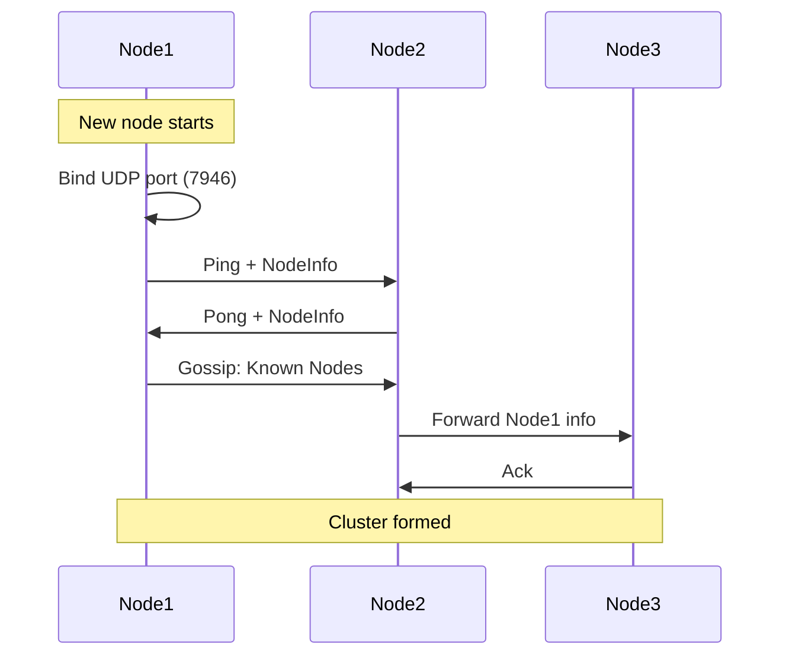

**Gossip Protocol Flow:**

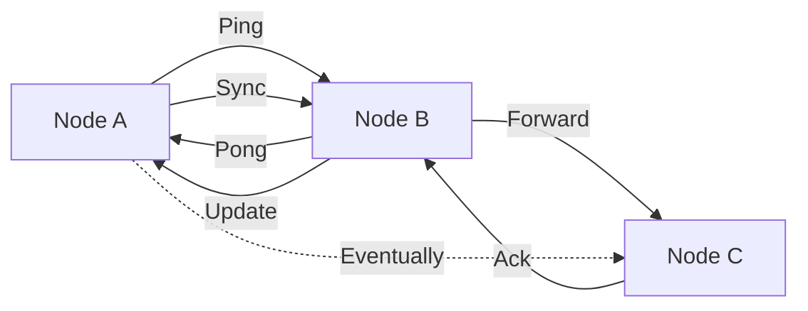

**Key Parameters:**

| Parameter | Default | Description |
|-----------|---------|-------------|
| `gossip_interval` | 1s | Frequency of gossip messages |
| `push_pull_interval` | 30s | Full state sync interval |
| `node_timeout` | 5s | Time before marking node suspect |
| `dead_node_timeout` | 30s | Time before removing dead node |

### 2. Membership Management

Each node maintains a view of the cluster:

```go
type ClusterView struct {
    sync.RWMutex
    localNode  *NodeInfo
    members    map[string]*NodeInfo  // node_id -> NodeInfo
    stateMap   map[string]NodeState   // node_id -> State
}
```

**Node State Machine:**

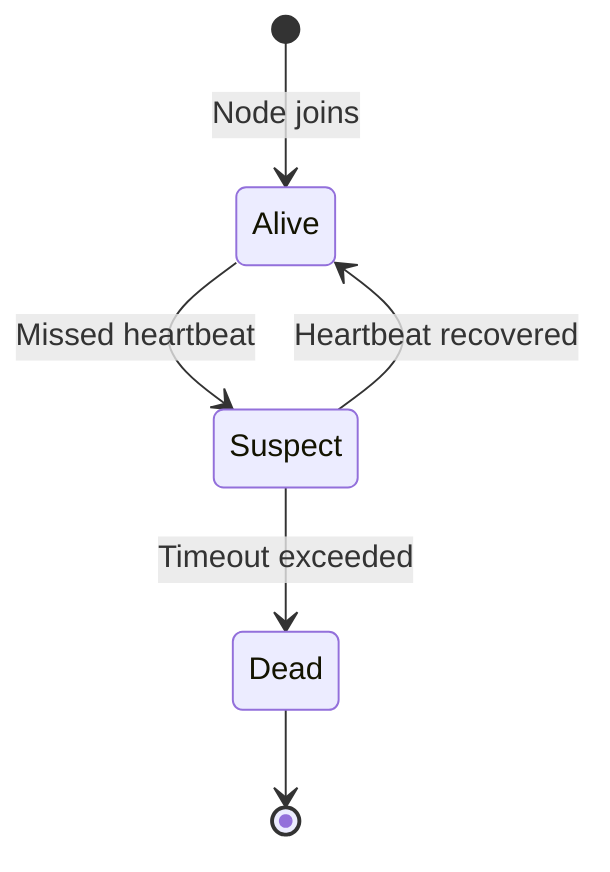

**Node Information:**

```go
type NodeInfo struct {
    ID        string                 // Unique node identifier
    Addr      string                 // IP address
    Port      int                    // Discovery port
    AgentCaps map[string]string      // Capabilities (models, tools)
    LoadScore float64                // Current load (0.0-1.0)
    Labels    map[string]string      // Custom labels
    Timestamp int64                  // Last update time
    Version   string                 // Protocol version
}
```

### 3. Health Monitoring

**Heartbeat Flow:**

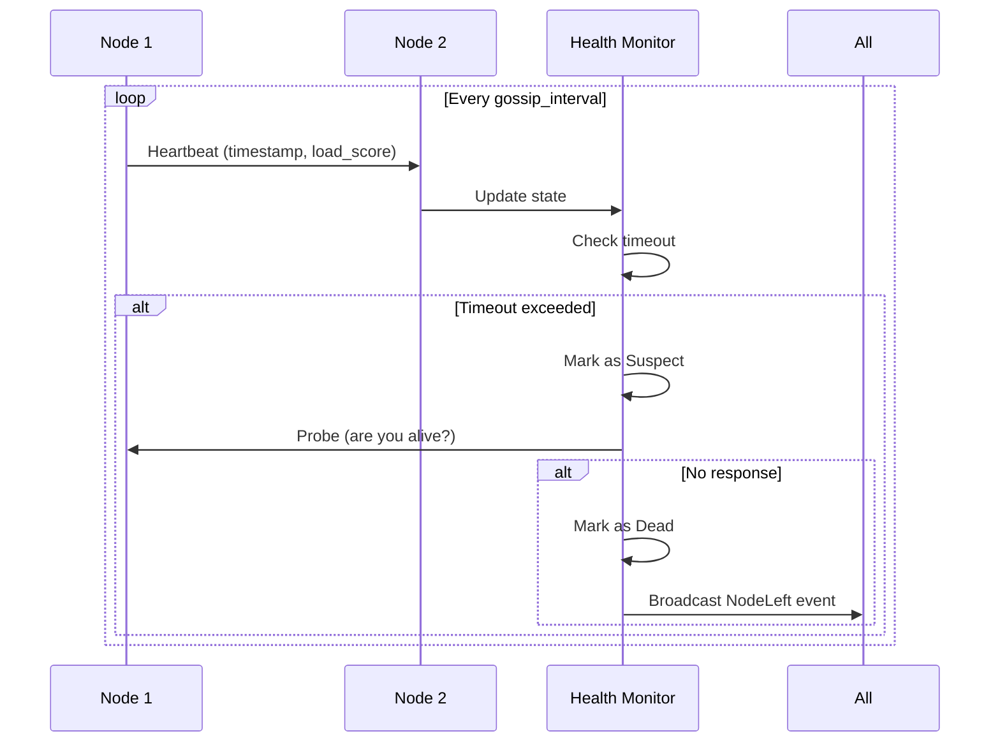

### 4. Load Monitoring

Each node continuously monitors its resource usage:

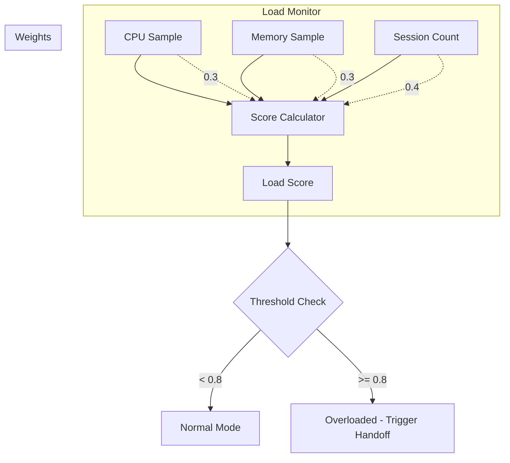

**Load Score Formula:**

```
LoadScore = (CPUUsage × cpu_weight) +
            (MemoryUsage × memory_weight) +
            (SessionRatio × session_weight)

Where:
- CPUUsage = current CPU usage (0.0-1.0)
- MemoryUsage = current memory usage (0.0-1.0)
- SessionRatio = current_sessions / max_sessions
- Default weights: cpu=0.3, memory=0.3, session=0.4
```

## Data Plane

The data plane handles actual task execution and session state transfer.

### 1. Request Flow

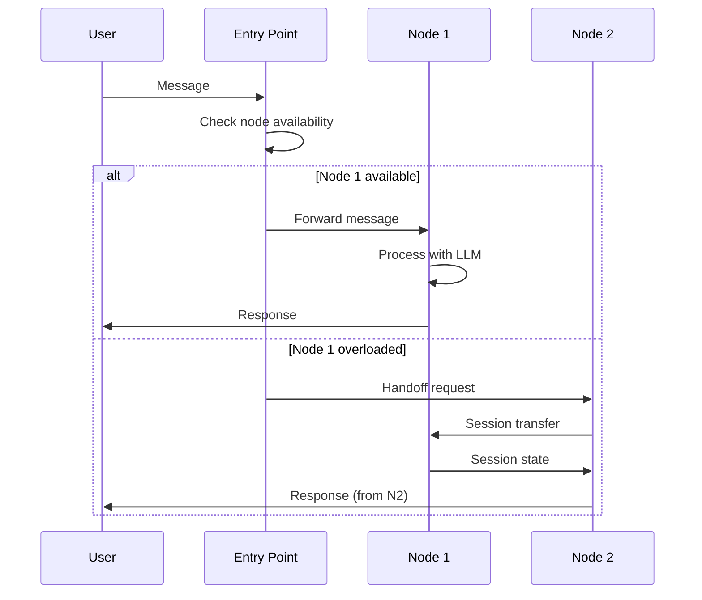

### 2. Handoff Mechanism

**Handoff Decision Flow:**

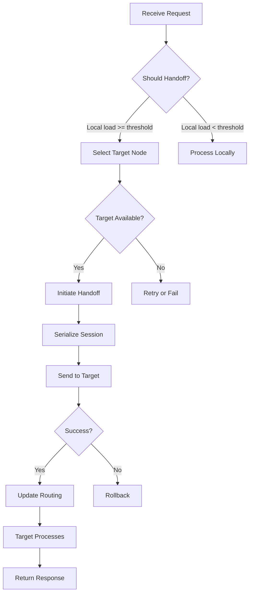

**Handoff Protocol:**

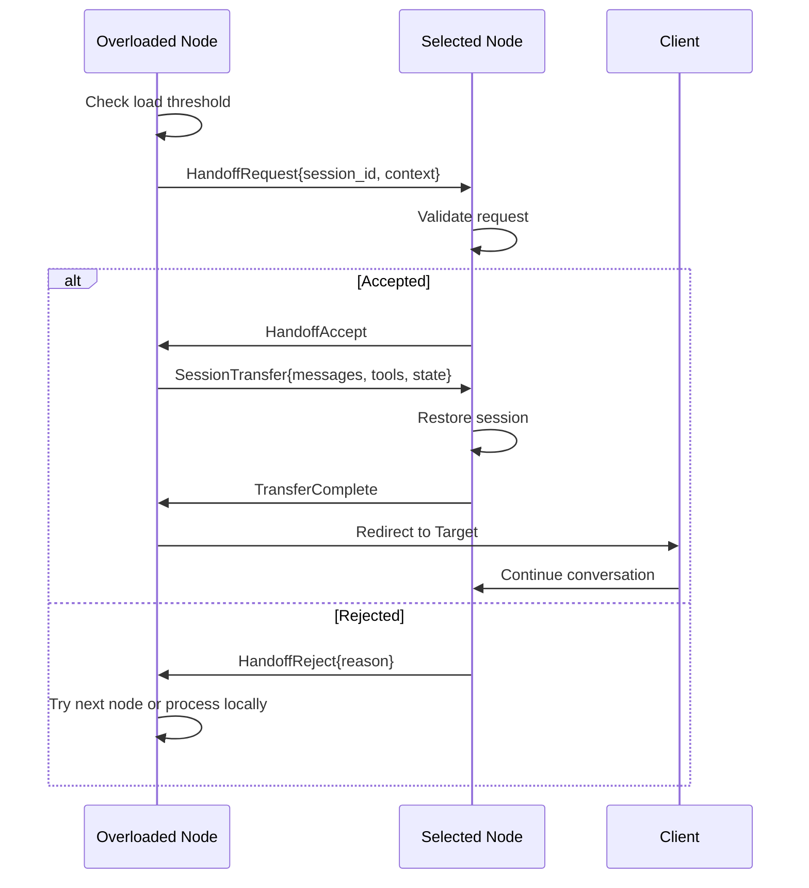

### 3. Session Transfer

**Session State Structure:**

```go
type SessionState struct {
    SessionID   string
    Messages    []Message      // Conversation history
    Context     map[string]any // Shared context
    Tools       []ToolCall     // Pending tool calls
    Metadata    SessionMeta    // Timestamp, user info, etc.
}
```

**Transfer Flow:**

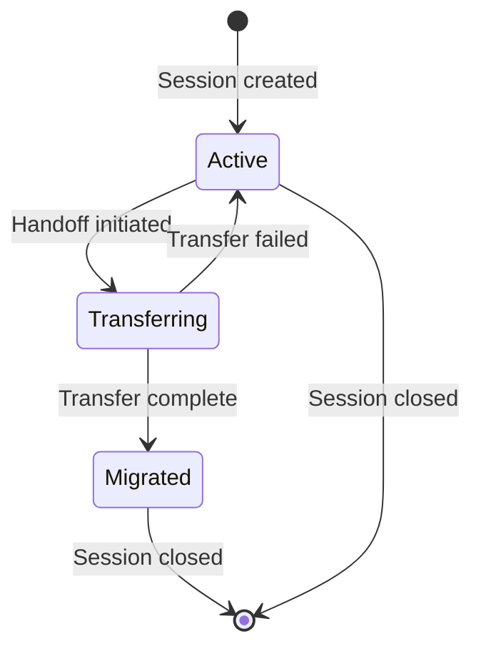

## System Architecture

### Component Overview

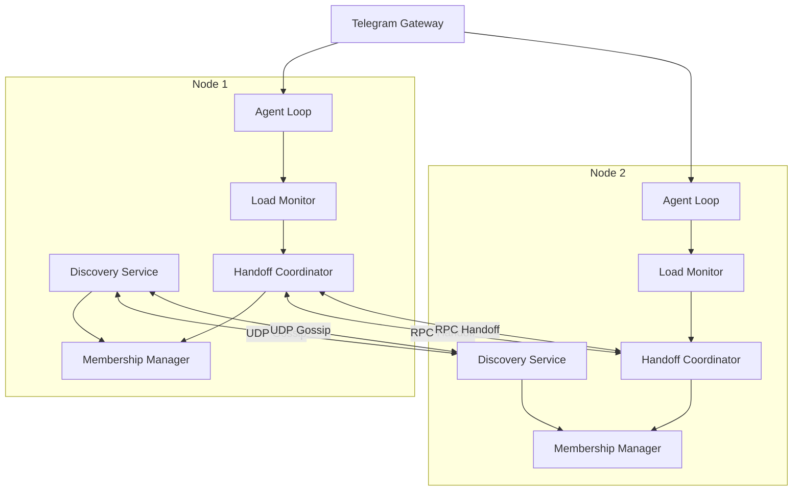

### Communication Channels

| Channel | Protocol | Purpose |
|---------|----------|---------|
| Discovery | UDP | Node gossip, heartbeat |
| Handoff RPC | UDP | Session transfer coordination |
| Session Data | UDP | Serialized session state |

## Configuration

### Example Configuration

```json
{
  "swarm": {
    "enabled": true,
    "node_id": "picoclaw-node-1",
    "bind_addr": "127.0.0.1",
    "bind_port": 7946,

    "discovery": {
      "join_addrs": ["127.0.0.1:7946"],
      "gossip_interval": 1,
      "push_pull_interval": 30,
      "node_timeout": 5,
      "dead_node_timeout": 30
    },

    "handoff": {
      "enabled": true,
      "load_threshold": 0.8,
      "timeout": 30,
      "max_retries": 3,
      "retry_delay": 5
    },

    "rpc": {
      "port": 7947,
      "timeout": 10
    },

    "load_monitor": {
      "enabled": true,
      "interval": 5,
      "sample_size": 60,
      "cpu_weight": 0.3,
      "memory_weight": 0.3,
      "session_weight": 0.4
    }
  }
}
```

### Deployment Modes

**Single Entry Point:**

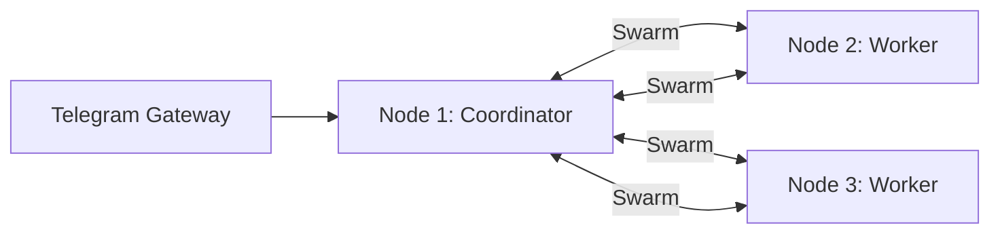

**Multi-Entry Point (with load balancer):**

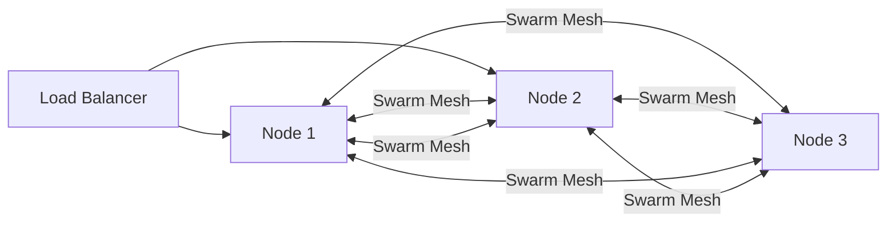

## Event System

The swarm publishes events for monitoring and integration:

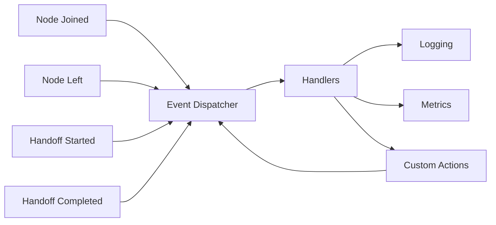

**Event Types:**

| Event | Description | Payload |
|-------|-------------|---------|
| `NodeJoined` | New node discovered | NodeInfo |
| `NodeLeft` | Node removed | NodeID |
| `NodeSuspect` | Node marked suspect | NodeID |
| `NodeAlive` | Node recovered | NodeInfo |
| `HandoffStarted` | Handoff initiated | HandoffOperation |
| `HandoffCompleted` | Handoff finished | HandoffResult |
| `HandoffFailed` | Handoff error | Error |

## Error Handling

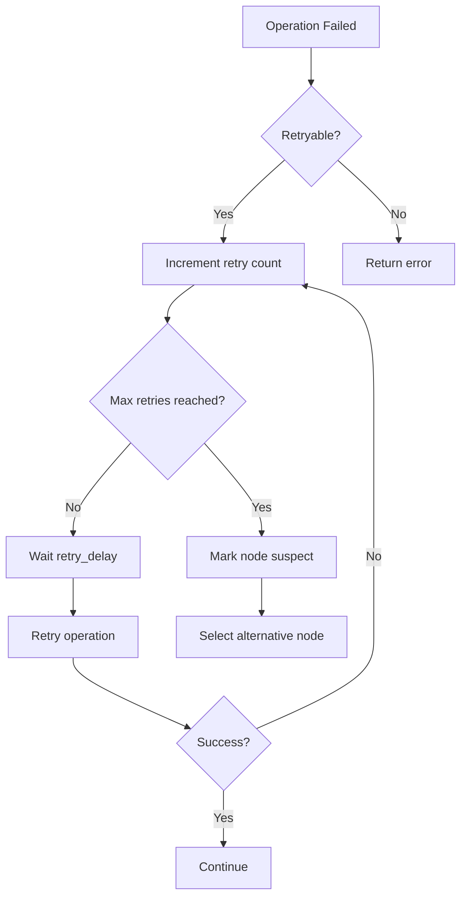

## Security Considerations

1. **Discovery**: UDP gossip is unencrypted - use in trusted networks only
2. **Handoff**: Session data transferred without encryption
3. **Authentication**: No node authentication implemented
4. **Recommendation**: Use VPN or private network for production

## Future Enhancements

1. **Secure Discovery**: Add mTLS for node communication
2. **Consistent Hashing**: Replace random selection with consistent hashing
3. **Session Affinity**: Sticky sessions for better performance
4. **Leader Election**: Automatic coordinator election
5. **Multi-Region**: Geo-distributed cluster support
