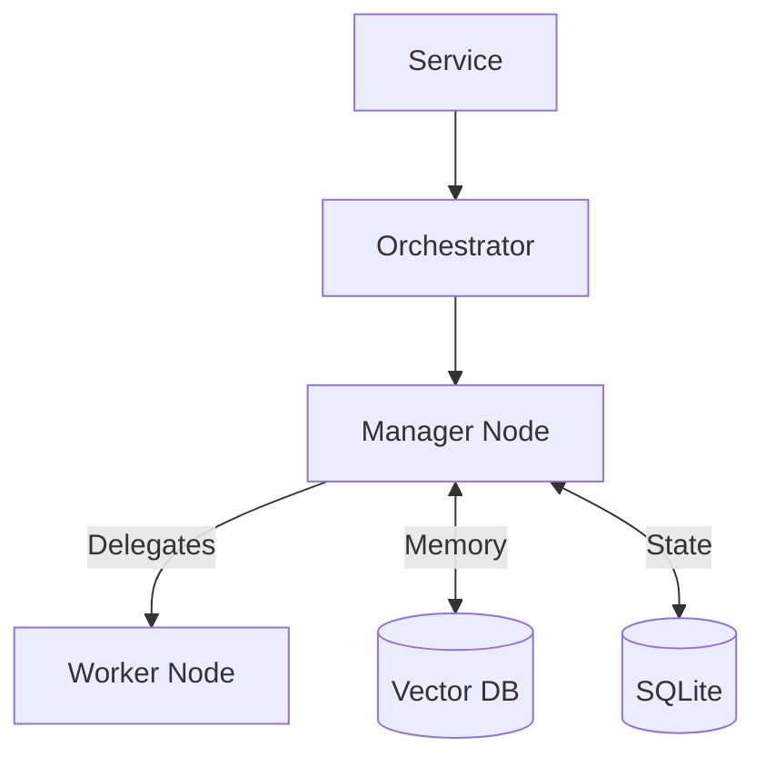

# PicoClaw Swarm Engine

This package implements the **Swarm Agents** architecture: a lightweight, hierarchical, multi-agent system designed for the edge.

For a detailed deep-dive into the architecture, workflow, and components, please read [SWARM_ARCHITECTURE.md](../../SWARM_ARCHITECTURE.md).

## Features

*   **Hierarchical Swarms:** Manager nodes can delegate tasks to specialized workers (Researchers, Writers, etc.).
*   **Vector Memory:** Integrated `Chromem-go` vector database for long-term semantic memory.
*   **Resilient:** Built-in retry mechanisms, context pruning, and crash recovery via SQLite checkpoints.
*   **Secure:** Configurable Role-Based Access Control (RBAC) for tools.
*   **Lightweight:** Built on Go Goroutines (Actor Model) and Channels, efficient enough for small VPS or local devices.

## Usage

The Swarm Engine is integrated into the PicoClaw CLI.

### Basic Commands

```bash
# Spawn a new swarm to perform a task
/swarm spawn "Analyze the latest trends in Rust vs Go performance"

# List active swarms
/swarm list

# Check detailed status of a specific swarm (including node progress)
/swarm status <swarm_id>

# Visualize the swarm topology (Mermaid diagram)
/swarm viz <swarm_id>

# Stop a running swarm
/swarm stop <swarm_id>

# Stop all active swarms
/swarm stopall
```

### Configuration

You can configure the Swarm behavior, Roles, and Policies in your `config.json`.

```json
{
  "swarm": {
    "limits": {
      "max_nodes": 10,
      "global_timeout": 600000000000, 
      "max_iterations": 15
    },
    "roles": {
      "Manager": {
        "description": "Orchestrates tasks",
        "system_prompt": "You are a Manager...",
        "tools": ["delegate_task", "save_memory", "search_memory"]
      }
    },
    "policies": [
      {
        "role": "Manager",
        "allowed": ["*"]
      }
    ]
  }
}
```

## Architecture Overview

